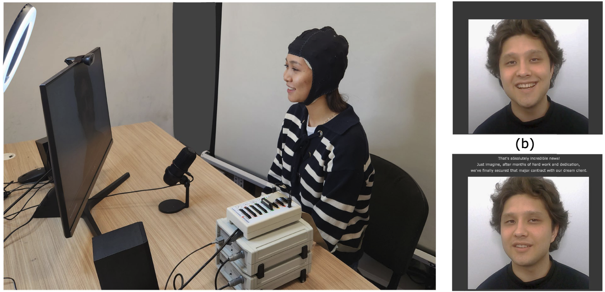
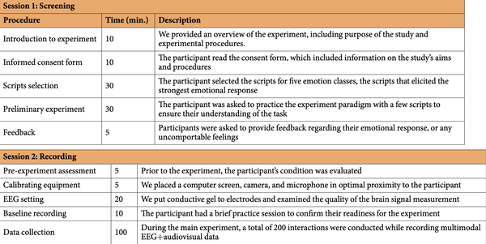
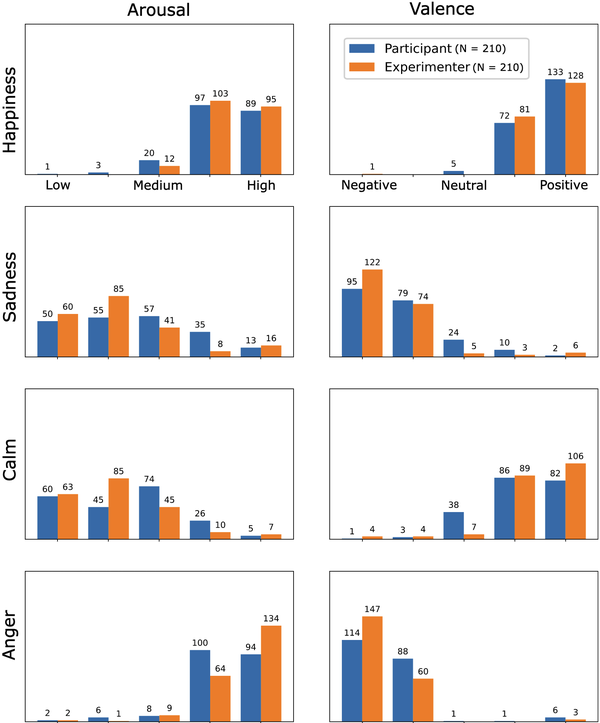
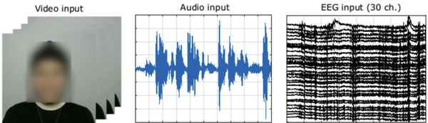

# EAV

<div align="center">
    <a href="https://github.com/openmedlab/"></a>
</div>
<p style="text-align:center;font-size:10px;"><em></em></p>

## Dataset Information

The **EAV (EEG-Audio-Video) Dataset** is a multimodal dataset designed for emotion recognition, combining 30-channel EEG (electroencephalography), audio, and video recordings. The dataset was collected from 42 participants engaged in prompt-based conversational scenarios designed to elicit five different emotions: **Neutral**, **Anger**, **Happiness**, **Sadness**, and **Calmness**. Each participant took part in 200 interactions, involving listening to and responding to conversational scenarios, resulting in a total of 8,400 interaction records.  

Baseline performance for emotion recognition using each modality was evaluated with deep neural network (DNN) approaches. The EAV dataset is the first publicly available emotion recognition dataset that integrates EEG, brain activity, audio, and video signals within conversational contexts. It aims to advance the understanding of human emotional processes and foster research in neuroscience and machine learning.  

## Experimental Design

The experiment consisted of two phases:  
1. **Screening Phase**: Participants selected the most emotion-evoking dialogue scripts based on prompts, screening dialogues suited to their emotional responses.  
2. **Main Experiment**: Participants watched pre-recorded videos and responded according to the prompts. Each interaction lasted 20 seconds. Each round of the experiment included 20 interactions corresponding to different emotional categories.  

<div align="center">
    <a href="https://github.com/openmedlab/"></a>
</div>
<p style="text-align:center;font-size:10px;"><em></em></p>

## Dataset Meta Information

| Task Type             | Language   | EEG Sampling Rate | Data Formats     | EEG Format |
|-----------------------|------------|-------------------|------------------|------------|
| Emotion Recognition   | English    | 500 Hz            | .wav, .mp4       | .mat       |

### Resolution Details

The experiments covered the following five emotion categories:

| Label | Label Name   | Chinese Translation |
|-------|--------------|---------------------|
| A     | Anger        | 愤怒                  |
| H     | Happiness    | 快乐                  |
| S     | Sadness      | 悲伤                  |
| C     | Calmness     | 平静                  |
| N     | Neutral      | 中性                  |

<div align="center">
    <a href="https://github.com/openmedlab/"></a>
</div>
<p style="text-align:center;font-size:10px;"><em>The chart shows the differences in the participants' and the experimenters' ratings of emotional arousal and valence under different emotional states.</em></p>

## Dataset Example

<div align="center">
    <a href="https://github.com/openmedlab/"></a>
</div>
<p style="text-align:center;font-size:10px;"><em></em></p>

## File Structure

``` 
/EAV
│
├── subjects.tsv
├── meta_data.tsv
├── questionnaire.xlsx
│
├── subject1
│   ├── EEG
│   │   ├── subject1_eeg.mat
│   │   ├── subject1_eeg_label.mat
│   │
│   ├── Video
│   │   ├── 001_Trial_01_Listening_Neutral.mp4
│   │   ├── 002_Trial_02_Speaking_Neutral.mp4
│   │   ├── 003_Trial_03_Listening_Anger.mp4
│   │   ├── 004_Trial_04_Speaking_Anger.mp4
│   │   ├── ...
│   │   ├── 199_Trial_19_Listening_Sadness.mp4
│   │   ├── 200_Trial_20_Speaking_Sadness.mp4
│   │
│   ├── Audio
│   │   ├── 002_Trial_02_Speaking_Neutral_Aud.wav
│   │   ├── 004_Trial_02_Speaking_Anger_Aud.wav
│   │   ├── 006_Trial_02_Speaking_Anger_Aud.wav
│   │   ├── ...
│   │   ├── 200_Trial_10_Speaking_Sadness_Aud.wav
│   │
├── subject42
│   ├── EEG
│   ├── Video
│   ├── Audio
```

## Authors and Institutions

Min-Ho Lee (Nazarbayev University)

Adai Shomanov (Nazarbayev University)

Balgyn Begim (Nazarbayev University)

Zhuldyz Kabidenova (Nazarbayev University)

Aruna Nyssanbay (Nazarbayev University)

Adnan Yazici (Nazarbayev University)

Seong-Whan Lee (Korea University)

## Source Information

Official Website: https://github.com/nubcico/EAV

Download Link: https://zenodo.org/records/10205702

Article Address: https://www.nature.com/articles/s41597-024-03838-4

Publication Date: 2024-09

## Citation

``` 
@article{lee2024eav,
  title={EAV: EEG-Audio-Video Dataset for Emotion Recognition in Conversational Contexts},
  author={Lee, Min-Ho and Shomanov, Adai and Begim, Balgyn and Kabidenova, Zhuldyz and Nyssanbay, Aruna and Yazici, Adnan and Lee, Seong-Whan},
  journal={Scientific Data},
  volume={11},
  number={1},
  pages={1026},
  year={2024},
  publisher={Nature Publishing Group UK London}
}
```

Original introduction article is [here](https://zhuanlan.zhihu.com/p/740086913).