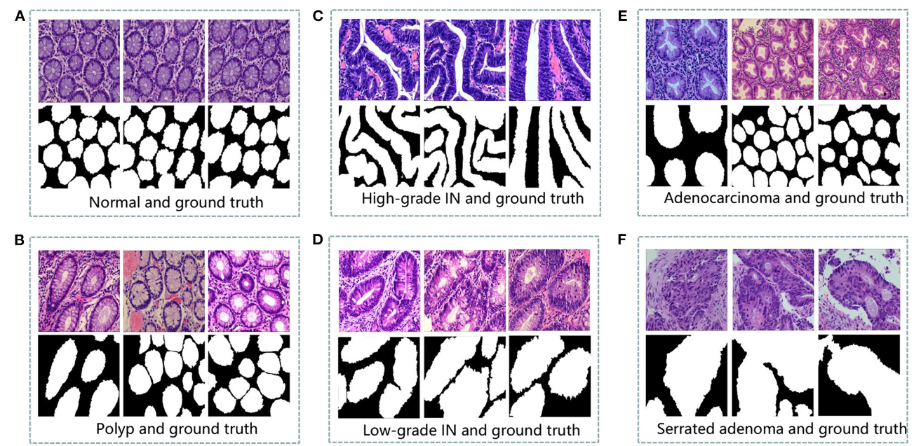

# EBHI-Seg

<div align="center">
    <a href="https://github.com/openmedlab/"></a>
</div>
<p style="text-align:center;font-size:10px;"><em></em></p>

## Dataset Information

The EBHI-Seg dataset is an endoscopic biopsy histopathology dataset designed for image segmentation tasks. It includes 4,456 H&E-stained images with annotations for six types of histopathological sections.

This dataset is clinically significant for assessing image segmentation technologies in early colorectal cancer detection. Colorectal cancer is the fourth most common malignant tumor in men and the third in women globally. Early detection is crucial for effective treatment. The availability of the EBHI-Seg dataset, by providing researchers with high-quality, precisely annotated images, significantly advances this field, helping to improve image segmentation algorithms and enhancing the generalizability and diagnostic efficiency of models.

## Dataset Meta Information

| Dimensions | Modality  | Task Type    | Anatomical Structures | Anatomical Area | Number of Categories | Data Volume | File Format |
|------------|-----------|--------------|-----------------------|-----------------|----------------------|-------------|-------------|
| 2D         | Pathology | Segmentation | Colon                 | Colon           | 6                    | 4456        | .png        |


### Resolution Details

| Dataset Statistics | size       |
|--------------------|------------|
| min                | (224, 224) |
| median             | (224, 224) |
| max                | (224, 224) |

## Label Information Statistics

| Category           | Normal  | Polyp   | Low-grade IN   | High-grade IN  | Serrated adenoma  | Adenocarcinoma   |
|--------------------|---------|---------|----------------|----------------|-------------------|------------------|
| Number of Images   | 152     | 948     | 1278           | 372            | 116               | 1590             |
| Percentage         | 3.41%   | 21.27%  | 28.68%         | 8.35%          | 2.60%             | 35.68%           |


## Visualization

<div align="center">
    <a href="https://github.com/openmedlab/"></a>
</div>
<p style="text-align:center;font-size:10px;"><em>6 types of histopathological image examples (from the original article).</em></p>

## File Structure

``` 
Dataset
│
├── Adenocarcinoma
│   ├── image
│   │   ├── GT2001837-1-400-001.png
│   │   ├── GT2001837-1-400-002.png
│   │   ├── GT2001837-1-400-003.png
│   │   ├── ...
│   ├── label
│   │   ├── GT2001837-1-400-001.png
│   │   ├── GT2001837-1-400-002.png
│   │   ├── GT2001837-1-400-003.png
│   │   ├── ...
├── High-grade IN
├── Low-grade IN
├── Normal
├── Polyp
├── Serrated adenoma
```

## Authors and Institutions

(As there are many authors, here are the first three and the corresponding author)

Liyu Shi (Northeastern University, School of Medicine and Bioinformatics Engineering, Microscopic Imaging and Medical Image Analysis Group)

Xiaoyan Li (Liaoning Cancer Hospital and Institute, Department of Pathology, China Medical University Cancer Hospital)

Weiming Hu (Northeastern University, School of Medicine and Bioinformatics Engineering, Microscopic Imaging and Medical Image Analysis Group)

...

Chen Li (Northeastern University, School of Medicine and Bioinformatics Engineering, Microscopic Imaging and Medical Image Analysis Group)

## Source Information

Official Website: https://figshare.com/articles/dataset/EBHI-SEG/21540159/1

Download Link: https://figshare.com/articles/dataset/EBHI-SEG/21540159/1

Article Address: https://www.frontiersin.org/journals/medicine/articles/10.3389/fmed.2023.1114673/full

Publication Date: 2023-01

## Citation

``` 
@ARTICLE{10.3389/fmed.2023.1114673,
AUTHOR={Shi, Liyu  and Li, Xiaoyan  and Hu, Weiming  and Chen, Haoyuan  and Chen, Jing  and Fan, Zizhen  and Gao, Minghe  and Jing, Yujie  and Lu, Guotao  and Ma, Deguo  and Ma, Zhiyu  and Meng, Qingtao  and Tang, Dechao  and Sun, Hongzan  and Grzegorzek, Marcin  and Qi, Shouliang  and Teng, Yueyang  and Li, Chen },
TITLE={EBHI-Seg: A novel enteroscope biopsy histopathological hematoxylin and eosin image dataset for image segmentation tasks},
JOURNAL={Frontiers in Medicine},
VOLUME={10},
YEAR={2023}}
```

Original introduction article is [here](https://zhuanlan.zhihu.com/p/708870848).