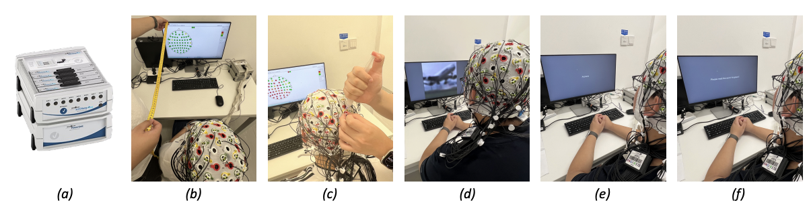
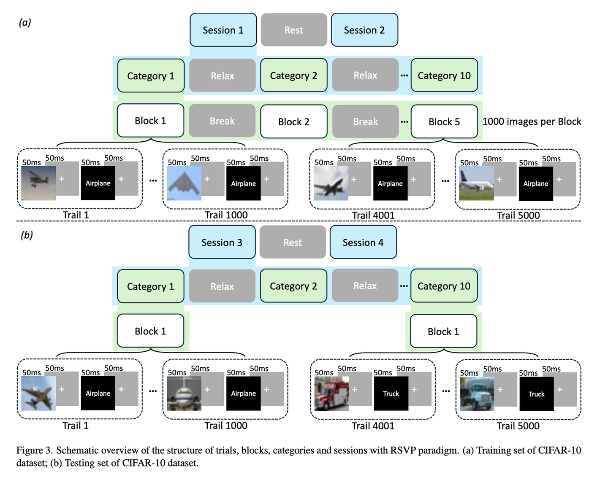
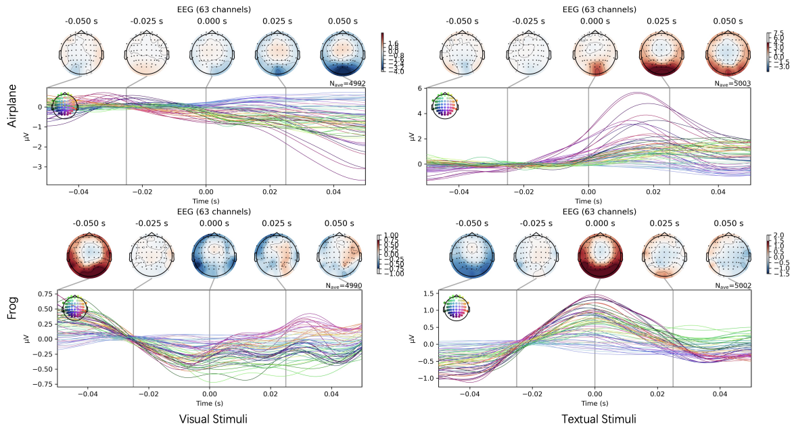

# EIT-1M

<div align="center">
    <a href="https://github.com/openmedlab/"></a>
</div>
<p style="text-align:center;font-size:10px;"><em></em></p>

## Dataset Information

EIT-1M is a multimodal dataset combining electroencephalography (EEG), images, and text, aimed at studying human brain responses to visual and textual stimuli. By recording EEG signals from participants exposed to simultaneous visual and text stimuli, EIT-1M provides valuable data for multimodal machine learning and neuroscience research. This dataset contains over one million EEG-image-text data pairs, suitable for EEG signal decoding tasks such as decoding semantics from visual or textual stimuli.

The multimodal design of the EIT-1M dataset enables the training of high-performance multimodal AI models and advances the fields of brain-computer interfaces (BCI) and cognitive neuroscience.

## Experiment Setting

<div align="center">
    <a href="https://github.com/openmedlab/"></a>
</div>
<p style="text-align:center;font-size:10px;"><em>a,b are the training set and test set of CIFAR-10 dataset respectively.</em></p>

The diagram in the figure illustrates the structure of trials, blocks, categories, and sessions during the experiment, utilizing the Rapid Serial Visual Presentation (RSVP) paradigm. The experiment maintains continuous attention of the participants on objects and concepts by alternating visual and textual stimuli. Specifically, images and text are presented in succession to ensure that the brain processes multimodal information simultaneously. For detailed setup, please refer to the paper.

## Dataset Meta Information

| Dataset    | Type | EEG Sampling Rate | Channels | EEG Format            | Sample Size   |
|------------|------|-------------------|----------|-----------------------|---------------|
| Visual-EEG | EEG  | 1000 Hz           | 10       | vhdr, vmrk, eeg       | 1,200,000 ^  |

- The categories of this dataset originate from the CIFAR-10 dataset, which includes: Airplane, Automobile, Bird, Cat, Deer, Dog, Frog, Horse, Ship, and Truck. 
- An 'event' refers to a complete presentation of a stimulus followed by the recording of the electroencephalogram (EEG) response, encompassing both the stimulus information and the participant's brain response to it. Therefore, in EEG data analysis, an event can be considered as a single data entry."

## Dataset Information Statistics

Overview of EIT-1M(EGG-Image-Text) dataset. 

| Item             | Description                  | Details                                                                |
|------------------|------------------------------|------------------------------------------------------------------------|
| Participants     | Number                       | 5                                                                      |
|                  | Age Range                    | 20-30 years                                                            |
|                  | Gender Distribution          | 1 female, 4 males                                                      |
| Sessions         | Number per Participant       | 2                                                                      |
|                  | Duration                     | 4 hours each                                                           |
| Total Events     | Total                        | 1,200,000                                                              |
|                  | Visual Stimuli               | 600,000                                                                |
|                  | Text Stimuli                 | 600,000                                                                |
| Stimuli          | Categories                   | 10 from CIFAR-10                                                       |
|                  | Description                  | Visual: Images from CIFAR-10; Text: category names                     |
| Recording Details| Sampling Rate                | 1000 Hz                                                                |
|                  | EEG Channels                 | 64                                                                     |
|                  | Equipment                    | actiCHamp Plus                                                         |
| Data Quality     | Impedance Levels             | ≤ 20 kΩ                                                                |
| Event Details    | Average Events/Session       | 120,000                                                                |
|                  | Event Duration               | 50 ms                                                                  |
|                  | Inter-event Interval         | 50 ms                                                                  |
| Preprocessing    | Filtering                    | 1-40 Hz band-pass                                                      |
|                  | Epoching                     | -50 to 50 ms relative to stimulus onset, baseline correction at -50 ms |

The dataset records the brain activity of five participants aged between 20 and 30 years during exposure to visual and textual stimuli. Each participant took part in two sessions, each lasting four hours, accumulating a total of 1,200,000 events (600,000 visual stimuli and 600,000 textual stimuli). The data was captured using a 64-channel EEG device (actiCHamp Plus) at a sampling rate of 1000 Hz, with data quality ensured by maintaining impedance levels below 20 kΩ.

Please refer to the official website for the most up-to-date dataset statistics: https://eit-1m.github.io/EIT-1M/.

## Dataset Example

<div align="center">
    <a href="https://github.com/openmedlab/"></a>
</div>
<p style="text-align:center;font-size:10px;"><em>The EEG brain topography maps and their corresponding signals while participants were viewing visual stimuli (left column) and textual stimuli (right column). The images illustrate two categories of stimuli: Airplane and Frog.</em></p>

## File Structure

Currently, only the dataset of one participant is displayed. The filenames indicate the category names corresponding to the EEG signals.

``` 
Participant4_Session1_Visual_Textual/
├── airplne_train.eeg
├── airplne_train.vhdr
├── airplne_train.vmrk
├── automobile_train.eeg
├── automobile_train.vhdr
├── automobile_train.vmrk
├── bird_train.eeg
├── bird_train.vhdr
├── bird_train.vmrk
├── cat_train.eeg
├── cat_train.vhdr
├── cat_train.vmrk
├── deer_train.eeg
├── deer_train.vhdr
├── deer_train.vmrk
├── dog_train.eeg
├── dog_train.vhdr
├── dog_train.vmrk
├── frog_train.eeg
├── frog_train.vhdr
├── frog_train.vmrk
├── horse_train.eeg
├── horse_train.vhdr
├── horse_train.vmrk
├── ship_train.eeg
├── ship_train.vhdr
├── ship_train.vmrk
├── truck_train.eeg
├── truck_train.vhdr
├── truck_train.vmrk
```

## Authors and Institutions

Xu Zheng (AI Thrust, HKUST(GZ))

Ling Wang (AI Thrust, HKUST(GZ))

Kanghao Chen (AI Thrust, HKUST(GZ))

Yuanhuiyi Lyu (AI Thrust, HKUST(GZ))

Jiazhou Zhou (AI Thrust, HKUST(GZ))

Lin Wang (AI Thrust, HKUST(GZ); Dept. of CSE, HKUST)

## Source Information

Official Website: https://eit-1m.github.io/EIT-1M/

Download Link: https://huggingface.co/datasets/eit-1m/EIT-1M

Article Address: https://arxiv.org/pdf/2407.01884

Publication Date: 2025-07

## Citation

``` 
@article{zheng2024eit,
  title={EIT-1M: One Million EEG-Image-Text Pairs for Human Visual-textual Recognition and More},
  author={Zheng, Xu and Wang, Ling and Chen, Kanghao and Lyu, Yuanhuiyi and Zhou, Jiazhou and Wang, Lin},
  journal={arXiv preprint arXiv:2407.01884},
  year={2024}
}
```

Original introduction article is [here](https://zhuanlan.zhihu.com/p/718995264).