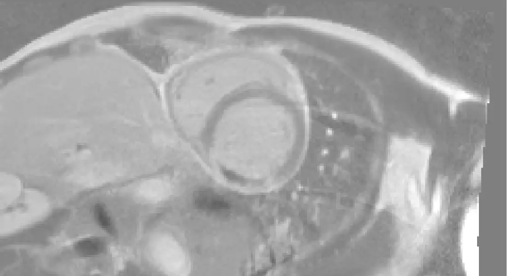
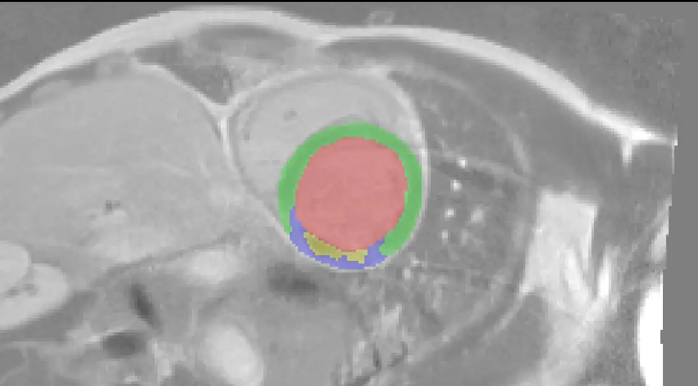

# EMIDEC

<div align="center">
    <a href="https://github.com/openmedlab/"></a>
</div>
<p style="text-align:center;font-size:10px;"><em></em></p>

## Dataset Information

EMIDEC (Evaluation of Myocardial Infarction from Delayed-Enhancement Cardiac MRI) is a dataset aimed at assessing the extent of myocardial infarction. This dataset includes delayed-enhancement magnetic resonance imaging (DE-MRI) of multiple patients taken minutes after contrast injection, manually annotated to identify several myocardial infarction-related areas including the myocardial outline, infarction regions, and permanent microvascular obstruction areas (no reflow zones), forming a segmentation dataset. It comprises 150 cases (all from different patients), including 50 cases with normal MRI post-contrast injection and 100 cases of myocardial infarction (appearing as enhanced areas on DE-MRI). The dataset includes 100 training cases and 50 test cases.

The dataset, with 150 clinical MRI images and associated clinical features of myocardial infarction, holds significant research value. It provides a foundation for assessing and automatically detecting myocardial infarctions, aiding in the development of automated algorithms to identify areas of myocardial damage, and supporting the development of diagnostic tools based on imaging and clinical data. Due to its large number of cases and comprehensive information, this dataset has significant potential for application in the diagnosis and treatment of myocardial infarction.

## Dataset Meta Information

| Dimensions | Modality | Task Type     | Anatomical Area       | Number of Categories | Data Volume | File Format |
|------------|----------|---------------|-----------------------|----------------------|-------------|-------------|
| 3D         | DE-MRI   | Segmentation  | Heart                 | 4                    | 150         | .nii.gz     |


### Resolution Details

| Dataset Statistics | spacing (mm)           | size            |
|--------------------|------------------------|-----------------|
| min                | (1.367, 1.367, 8.0)    | (139, 120, 4)   |
| median             | (1.458, 1.458, 10.0)   | (240, 256, 7)   |
| max                | (1.875, 1.875, 13.04)  | (305, 308, 10)  |

Number of 2D slices in the dataset: 708.

## Label Information Statistics

Only 100 examples in the training set are counted.

| Region               | Number of Cases | Completion Rate | Minimum Volume (cm³) | Median Volume (cm³) | Maximum Volume (cm³) |
|----------------------|-----------------|-----------------|----------------------|---------------------|----------------------|
| Left Ventricle       | 100             | 100%            | 49.28                | 105.46              | 280.77               |
| Myocardium           | 100             | 100%            | 53.81                | 96.5                | 153.83               |
| Myocardial Infarction| 67              | 67%             | 2.39                 | 20.26               | 80.1                 |
| No Reflow            | 40              | 40%             | 0.32                 | 2.35                | 36.74                |

## Visualization

The following figure shows the original image and the corresponding label information:

Red: left ventricle

Green: myocardium

Blue: myocardial infarction

Yellow: no reflow area

<div align="center">
    <a href="https://github.com/openmedlab/"></a>
</div>
<p style="text-align:center;font-size:10px;"><em>Raw image.</em></p>

<div align="center">
    <a href="https://github.com/openmedlab/"></a>
</div>
<p style="text-align:center;font-size:10px;"><em>Contains images with corresponding annotations.</em></p>

## File Structure

``` 
emidec-dataset-1.0.1
├── Case_N006
│   ├── Contours
│   │   └── Case_N006.nii.gz
│   └── Images
│       └── Case_N006.nii.gz
├── Case_N012
│   ├── Contours
│   │   └── Case_N012.nii.gz
│   └── Images
│       └── Case_N012.nii.gz
└── ...
```

## Authors and Institutions

- Alain Lalande (University of Burgundy, ImViA Laboratory)
- Zhihao Chen (University of Burgundy, FEMTO-ST Institute, Franche-Comté)
- Thomas Decourselle (CASIS Company)
- Abdul Qayyum (University of Burgundy, ImViA Laboratory)
- Thibaut Pommier (University Hospital of Dijon, Department of Medical Imaging)
- Luc Lorgis (University Hospital of Dijon, Department of Medical Imaging)
- Ezequiel de la Rosa (University of Burgundy, ImViA Laboratory)
- Alexandre Cochet (University of Burgundy, ImViA Laboratory)
- Yves Cottin (University Hospital of Dijon, Department of Medical Imaging)
- Dominique Ginhac (University of Burgundy, FEMTO-ST Institute, Franche-Comté)
- Michel Salomon (University of Burgundy, FEMTO-ST Institute, Franche-Comté)
- Raphaël Couturier (University of Burgundy, FEMTO-ST Institute, Franche-Comté)
- Fabrice Meriaudeau (University of Burgundy, ImViA Laboratory)

## Source Information

Official Website: https://emidec.com/

Download Link: https://emidec.com/

Article Address: https://www.mdpi.com/2306-5729/5/4/89

Publication Date: 2020-04

## Citation

``` 
@article{lalande2020emidec,
  title={Emidec: a database usable for the automatic evaluation of myocardial infarction from delayed-enhancement cardiac MRI},
  author={Lalande, Alain and Chen, Zhihao and Decourselle, Thomas and Qayyum, Abdul and Pommier, Thibaut and Lorgis, Luc and de la Rosa, Ezequiel and Cochet, Alexandre and Cottin, Yves and Ginhac, Dominique and others},
  journal={Data},
  volume={5},
  number={4},
  pages={89},
  year={2020},
  publisher={MDPI}
}
```

Original introduction article is [here](https://zhuanlan.zhihu.com/p/716504375).