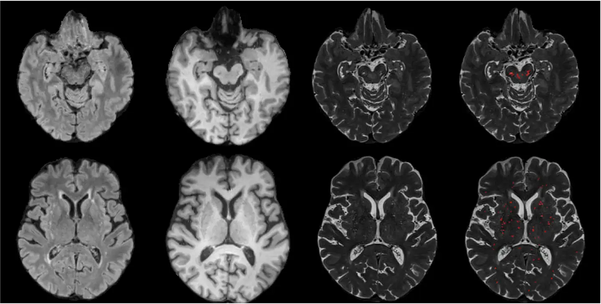

# EPVS

<div align="center">
    <a href="https://github.com/openmedlab/"></a>
</div>
<p style="text-align:center;font-size:10px;"><em></em></p>

## Dataset Information

EPVS is a segmentation challenge for enlarged perivascular spaces (EPVS) in brain MRI images, part of MICCAI 2024. EPVS is a significant marker of cerebrovascular disease and an early indicator of neurodegenerative diseases. This challenge aims to advance algorithms' accuracy in EPVS quantification by providing a diverse global dataset. The dataset for this challenge mainly comes from the University of Edinburgh, the SG70 dataset from the National University of Singapore, the MACC dataset from the National University of Singapore, and the dataset from the Shanghai University of Traditional Chinese Medicine. The entire dataset includes 230 cases, consisting of 110 for training, 50 for validation, and 70 for testing. These datasets cover T1-weighted, T2-weighted, and FLAIR sequences to ensure the robustness and effectiveness of algorithms under various imaging conditions.

The dataset for this challenge aims to promote the development of EPVS segmentation algorithms. The provided multi-site, multi-scanner data will help researchers develop generalized models capable of spanning different imaging protocols and demographic characteristics. Successful algorithms will provide significant support for the early detection and intervention of cerebrovascular and neurodegenerative diseases.

## Dataset Meta Information

| Dimensions | Modality | Task Type     | Anatomical Structures               | Anatomical Area  | Number of Categories | Data Volume                 | File Format |
|------------|----------|---------------|-------------------------------------|------------------|----------------------|-----------------------------|-------------|
| 2D/3D      | MRI      | Segmentation  | Enlarged Perivascular Spaces (EPVS) | Head and Neck    | 1                    | 100(train)+50(val)+70(test) | .nii.gz     |


### Resolution Details

| Dataset Statistics | spacing (mm)    |
|--------------------|-----------------|
| min                | (0.5, 0.5, 0.5) | 
| median             | (1, 1, 1)       |
| max                | (1, 1, 5)       | 

## Label Information Statistics

| Data Source                        | University of Edinburgh           | NUS-SG70                           | NUS-MACC                          | Shanghai TCM |
|------------------------------------|-----------------------------------|------------------------------------|-----------------------------------|--------------|
| Number of Occurrences              | 60 (train) + 30 (val) + 10 (test) | 20 (train) + 10 (val) + 10 (test)  | 20 (train) + 10 (val) + 10 (test) | 20 (test)    |
| Percentage of Occurrences          | 50%                               | 20%                                | 20%                               | 10%          |
| Minimum Volume (cm³)               | 0.5 x 0.5 x 0.5                   | 1 x 1 x 1                          | 1 x 1 x 1                         | 1 x 1 x 5    |
| Median Volume (cm³)                | 1 x 1 x 1                         | 1 x 1 x 3                          | 1 x 1 x 3                         | 1 x 1 x 5    |
| Maximum Volume (cm³)               | 1 x 1 x 4                         | 1 x 1 x 3                          | 1 x 1 x 3                         | 1 x 1 x 5    |

## Visualization

<div align="center">
    <a href="https://github.com/openmedlab/"></a>
</div>
<p style="text-align:center;font-size:10px;"><em>Visualization of the EPVS dataset, where the red areas represent the EPVS segmentation mask.</em></p>

## File Structure

``` 
EPVS_challenge_data
├── ED
│   ├── ED_01_01
│   │   ├── ED_01_01_T1w.nii.gz
│   │   ├── ED_01_01_T2w.nii.gz
│   │   ├── ED_01_01_FLAIR.nii.gz
│   │   └── ED_01_01_PVS.nii.gz (manual_mask)
│   ├── ED_01_02
│   │   ├── ED_01_02_T1w.nii.gz
│   │   ├── ED_01_02_T2w.nii.gz
│   │   ├── ED_01_02_FLAIR.nii.gz
│   │   └── ED_01_02_PVS.nii.gz (manual_mask)
│   └── ...
├── MACC
└── SG70
```

## Authors and Institutions

- Juan Helen Zhou (National University of Singapore)
- Christopher Chen (National University of Singapore; National University Hospital, Singapore)
- Yilei Wu (National University of Singapore)
- Zijiao Chen (National University of Singapore)
- Zijian Dong (National University of Singapore)
- Fang Ji (National University of Singapore)
- Huijuan Chen (National University of Singapore)
- Gifford Tan (National University Hospital, Singapore)
- An Sen Tan (National University Hospital, Singapore)
- Sizhao Tang (National University Hospital, Singapore)
- Joanna M. Wardlaw (Centre for Clinical Brain Sciences, University of Edinburgh)
- Maria del C. Valdés Hernández (Centre for Clinical Brain Sciences, University of Edinburgh)
- Roberto Duarte Coello (Centre for Clinical Brain Sciences, University of Edinburgh)
- John McFadden (Centre for Clinical Brain Sciences, University of Edinburgh)
- José Bernal Moyano (Centre for Clinical Brain Sciences, University of Edinburgh; German Center for Neurodegenerative Diseases)
- Hongwei Bran Li (Harvard Medical School)
- Xin Chen (Longhua Hospital, Shanghai University of Traditional Chinese Medicine)
- Benedikt Wiestler (Technical University of Munich)
- Zhenyu Gong (Technical University of Munich)

## Source Information

Official Website: https://www.synapse.org/Synapse:syn54100278/wiki/626542

Download Link: https://www.synapse.org/Synapse:syn54100278/wiki/626542

Article Address: TBD

Publication Date: 2024-05

## Citation

``` 
TBD
```

Original introduction article is [here](https://zhuanlan.zhihu.com/p/713616006).