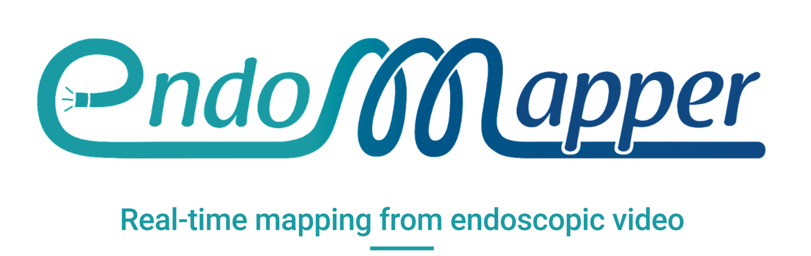
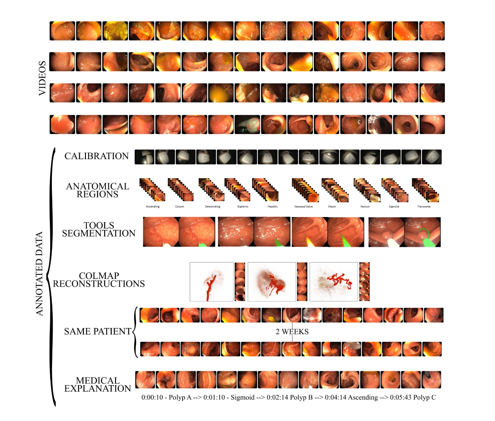
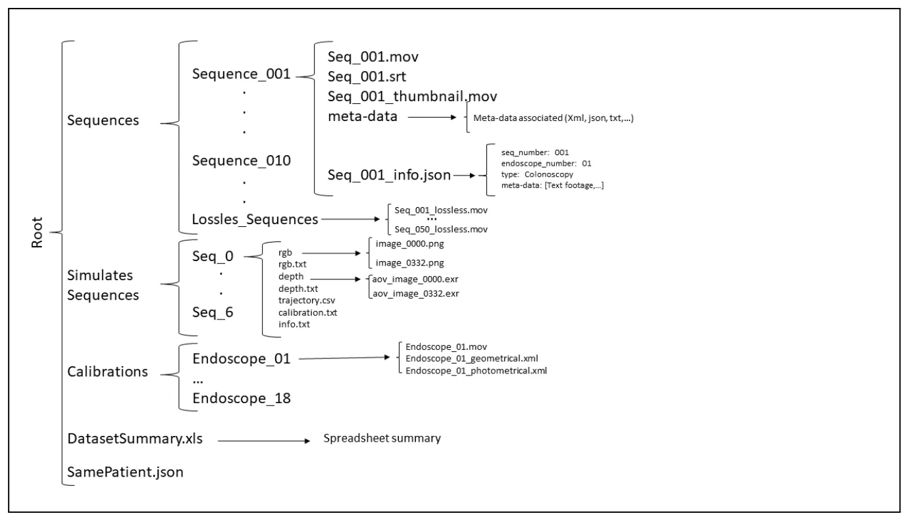

# EndoMapper

<div align="center">
    <a href="https://github.com/openmedlab/"></a>
</div>
<p style="text-align:center;font-size:10px;"><em></em></p>

## Dataset Information

Endomapper is a dataset for developing and evaluating 3D reconstruction and VSLAM in real endoscopic data. Its initially released dataset consists of 59 high-quality, full endoscopic examination videos, with a total duration of over 15 hours. This is also the first endoscopic dataset that includes both computational geometry and photometric endoscopic calibration, as well as the original calibrated videos, with labels of metadata related to special cases (such as from the same patient) also listed.

## Dataset Meta Information

| Dimensions | Modality | Task Type | Anatomical Structures          | Anatomical Area | Number of Categories       | Data Volume | File Format |
|------------|----------|-----------|--------------------------------|-----------------|----------------------------|-------------|-------------|
| 2D         | Endoscopy       | Segmentation | 3D reconstruction, VSLAM | digestive tract       | Real data / simulated data | 59 videos ( ~15h)        | mov         |


### Resolution Details

| Dataset Statistics | size        |
|--------------------|-------------|
| min                | 320 × 240   |
| max                | 1440 × 1080 |

## Label Information Statistics

| Sections | Total | Rectum | Sigmoid | Descending | Esplenic | Transverse | Hepatic | Ascending | Ileocecal | Ileum | Cecum |
|----------|-------|--------|---------|------------|----------|------------|---------|-----------|-----------|-------|-------|
| Seq_003  | 39220 | 760    | 1420    | 3820       | 160      | 1720       | 920     | 29360     | 160       | 900   | 0     |
| Seq_011  | 12920 | 740    | 5960    | 2220       | 1100     | 1660       | 1240    | 0         | 0         | 0     | 0     |
| Seq_012  | 16680 | 180    | 1360    | 1800       | 1100     | 2100       | 1180    | 6700      | 760       | 0     | 1500  |
| Total    | 68820 | 1680   | 8740    | 7840       | 2360     | 5480       | 3340    | 36060     | 920       | 900   | 1500  |
| Ratio    | -     | 2.44%  | 12.70%  | 11.39%     | 3.43%    | 7.96%      | 4.85%   | 52.40%    | 1.34%     | 1.31% | 2.18% |


## Visualization

<div align="center">
    <a href="https://github.com/openmedlab/"></a>
</div>
<p style="text-align:center;font-size:10px;"><em></em></p>

## File Structure

The official file structure is as follows, which is relatively complex, as shown in the figure below:

<div align="center">
    <a href="https://github.com/openmedlab/"></a>
</div>
<p style="text-align:center;font-size:10px;"><em></em></p>

## Authors and Institutions

Pablo Azagra (Instituto de Investigacion en Ingeniería de Aragon (I3A) & University of Zaragoza, Spain)

Carlos Sostres (Hospital Clínico Universitario Lozano Blesa, Zaragoza, Spain & IIS Aragon & Ciberhd & University of Zaragoza, Spain)

Angel Ferrandez (Hospital Clínico Universitario Lozano Blesa, Zaragoza, Spain & IIS Aragon & Ciberhd & University of Zaragoza, Spain)

Luis Riazuelo (Instituto de Investigacion en Ingeniería de Aragon (I3A) & University of Zaragoza, Spain)

Clara Tomasini (Instituto de Investigacion en Ingeniería de Aragon (I3A) & University of Zaragoza, Spain)

Oscar León Barbed (Instituto de Investigacion en Ingeniería de Aragon (I3A) & University of Zaragoza, Spain)

Javier Morlana (Instituto de Investigacion en Ingeniería de Aragon (I3A) & University of Zaragoza, Spain)

David Recasens (Instituto de Investigacion en Ingeniería de Aragon (I3A) & University of Zaragoza, Spain)

Víctor M. Batlle (Instituto de Investigacion en Ingeniería de Aragon (I3A) & University of Zaragoza, Spain)

Juan J. Gomez-Rodríguez (Instituto de Investigacion en Ingeniería de Aragon (I3A) & University of Zaragoza, Spain)

Richard Elvira (Instituto de Investigacion en Ingeniería de Aragon (I3A) & University of Zaragoza, Spain)

Julia Lopez (Hospital Clínico Universitario Lozano Blesa, Zaragoza, Spain & University of Zaragoza, Spain)

Cristina Oriol (Instituto de Investigacion en Ingeniería de Aragon (I3A) & University of Zaragoza, Spain)

Javier Civera (Instituto de Investigacion en Ingeniería de Aragon (I3A) & University of Zaragoza, Spain)

Juan D. Tardos (Instituto de Investigacion en Ingeniería de Aragon (I3A) & University of Zaragoza, Spain)

Ana C. Murillo (Instituto de Investigacion en Ingeniería de Aragon (I3A) & University of Zaragoza, Spain)

Angel Lanas (Hospital Clínico Universitario Lozano Blesa, Zaragoza, Spain & IIS Aragon & Ciberhd & University of Zaragoza, Spain)

Jose M.M. Montiel (Instituto de Investigacion en Ingeniería de Aragon (I3A) & University of Zaragoza, Spain)


## Source Information

Official Website: https://www.synapse.org/#!Synapse:syn26707219/wiki/615178

Download Link: https://www.synapse.org/#!Synapse:syn26707219/wiki/615178

Article Address: https://arxiv.org/abs/2204.14240

Publication Date: 2022-04

## Citation

``` 
@misc{azagra2022endomapper,
    title={EndoMapper dataset of complete calibrated endoscopy procedures},
    author={Pablo Azagra and Carlos Sostres and Ángel Ferrandez and Luis Riazuelo and Clara Tomasini and Oscar León Barbed and Javier Morlana and David Recasens and Victor M. Batlle and Juan J. Gómez-Rodríguez and Richard Elvira and Julia López and Cristina Oriol and Javier Civera and Juan D. Tardós and Ana Cristina Murillo and Angel Lanas and José M. M. Montiel},
    year={2022},
    eprint={2204.14240},
    archivePrefix={arXiv},
    primaryClass={cs.CV}
}
```

Original introduction article is [here](https://zhuanlan.zhihu.com/p/656435361).