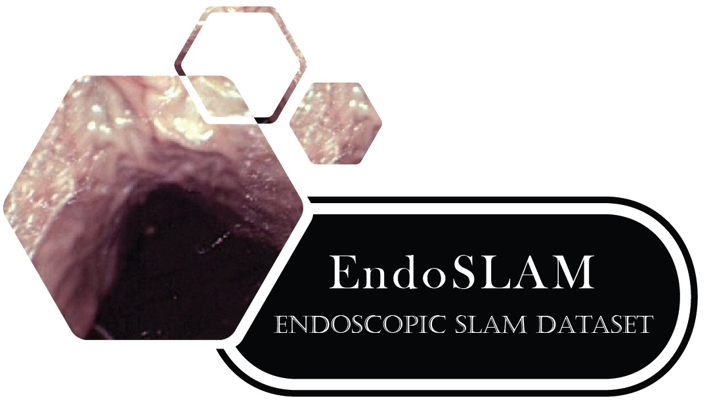
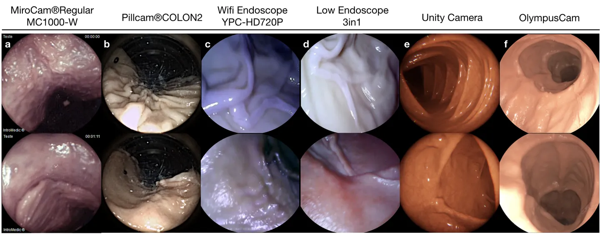
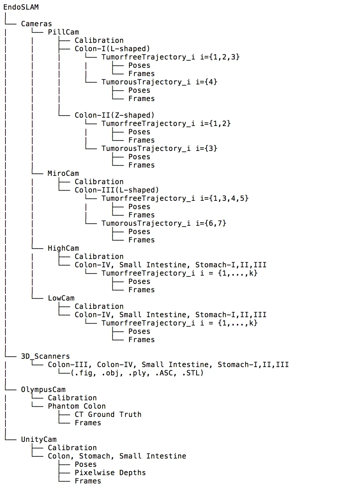

# EndoSLAM

<div align="center">
    <a href="https://github.com/openmedlab/"></a>
</div>
<p style="text-align:center;font-size:10px;"><em></em></p>

## Dataset Information

The EndoSLAM dataset is a comprehensive dataset in the field of endoscopic Simultaneous Localization and Mapping (SLAM) research, covering 3D point cloud data, capsule and standard endoscopic video recordings, and synthetic data for (registration, detection) of six porcine organs. The dataset was collected from eight porcine gastrointestinal (GI) organs using a Panda robotic arm, two commercial capsule endoscopes, two traditional endoscopes with different camera properties, and two high-precision 3D scanners. A total of 35 sub-datasets are provided, containing the 6D pose ground truth of the ex-vivo parts: 18 colon, 12 stomach, and 5 small intestine sub-datasets, four of which include polyp-like protrusions created by expert gastroenterologists. Additionally, to facilitate the research of simulation-to-real transfer learning algorithms, it also includes synthetic capsule endoscopic frames with depth and pose annotations simulating the stomach, colon, and small intestine. The release of the EndoSLAM dataset provides a wealth of experimental data for in-depth research into accurate registration and lesion detection of endoscopic images, which is of significant importance for advancing clinical diagnostic and therapeutic technologies.

## Dataset Meta Information
| Type | Dimension | Category           | Total Images | Format |
|------|-----------|--------------------|--------------|--------|
| 2D   | Endoscopy | Three-category set | 64577        | png    |

### Resolution Details

| Camera     | Frame Count | Frame Rate (fps) | Resolution  |
|------------|-------------|------------------|-------------|
| HighCam    | 21,428      | 20               | 1280 x 720  |
| LowCam     | 17,978      | 20               | 640 x 480   |
| Pillcam    | 239         | 4 - 35           | 256 x 256   |
| MiroCam    | 3,055       | 3                | 320 x 320   |
| UnityCam   | 21,887      | 30               | 320 x 320   |
| OlympusCam | 12,250      | 30               | 1350 x 1080 |

## Visualization

<div align="center">
    <a href="https://github.com/openmedlab/"></a>
</div>
<p style="text-align:center;font-size:10px;"><em></em></p>

## File Structure

The official file structure is as follows:

<div align="center">
    <a href="https://github.com/openmedlab/"></a>
</div>
<p style="text-align:center;font-size:10px;"><em> ITK-SNAP Visualization.</em></p>

## Authors and Institutions

Kutsev Bengisu Ozyoruk (Institute of Biomedical Engineering, Bogazici University, Turkey)

Guliz Irem Gokceler (Institute of Biomedical Engineering, Bogazici University, Turkey)

Gulifze Coskun (Institute of Biomedical Engineering, Bogazici University, Turkey)

Kagan Ince (Institute of Biomedical Engineering, Bogazici University, Turkey)

Yasin Almalioglu (Department of Computer Science, University of Oxford, UK)

Faisal Mahmood (Brigham and Women’s Hospital, Harvard Medical School; Cancer Data Science at Dana-Farber Cancer Institute; eCancer project at the Broad Institute, USA)

Eva Curto (Brigham and Women’s Hospital, Harvard Medical School; Cancer Data Science at Dana-Farber Cancer Institute, USA)

Luis Perdigoto (Institute for Systems and Robotics, University of Coimbra, Portugal)

Marina Oliveira (Institute for Systems and Robotics, University of Coimbra, Portugal)

Hasan Sahin (Department of Biomedical Engineering, Johns Hopkins University, USA)

Helder Araujo (Institute for Systems and Robotics, University of Coimbra, Portugal)

Henrique Alexandrino (Faculty of Medicine, Clinical Academic Center, University of Coimbra, Portugal)

Nicholas J. Durr (Department of Mechanical & Industrial Engineering, Louisiana State University, USA)

Hunter B. Gilbert (Department of Mechanical & Industrial Engineering, Louisiana State University, USA)

Mehmet Turan (Institute of Biomedical Engineering, Bogazici University, Turkey)


## Source Information

Official Website: https://github.com/CapsuleEndoscope/EndoSLAM

Download Link: https://github.com/CapsuleEndoscope/EndoSLAM

Article Address: https://arxiv.org/abs/2006.16670

Publication Date: 2020-10

## Citation

``` 
@misc{ozyoruk2020endoslam,
      title={EndoSLAM Dataset and An Unsupervised Monocular Visual Odometry and Depth Estimation Approach for Endoscopic Videos: Endo-SfMLearner}, 
      author={Kutsev Bengisu Ozyoruk and Guliz Irem Gokceler and Gulfize Coskun and Kagan Incetan and Yasin Almalioglu and Faisal Mahmood and Eva Curto and Luis Perdigoto and Marina Oliveira and Hasan Sahin and Helder Araujo and Henrique Alexandrino and Nicholas J. Durr and Hunter B. Gilbert and Mehmet Turan},
      year={2020},
      eprint={2006.16670},
      archivePrefix={arXiv},
      primaryClass={cs.CV}
}
```

Original introduction article is [here](https://zhuanlan.zhihu.com/p/663259554).