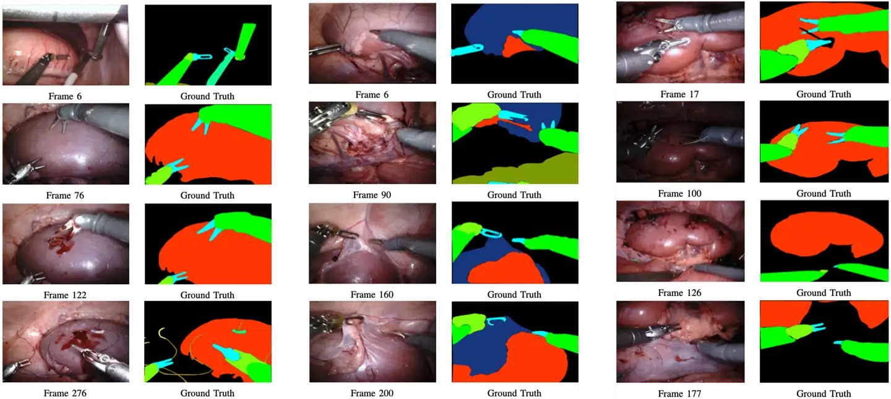

# EndoVisSub2018-RoboticSceneSegmentation

<div align="center">
    <a href="https://github.com/openmedlab/"></a>
</div>
<p style="text-align:center;font-size:10px;"><em></em></p>

## Dataset Information

The EndoVisSub2018-RoboticSceneSegmentation dataset is an image dataset for segmenting robotic surgical scenes, part of the MICCAI 2018 Endoscopic Vision (EndoVis) challenge. This dataset utilizes laparoscopic images and focuses on segmenting surgical instruments and anatomical structures. It includes pixel-level annotations for various surgical instruments and anatomical structures, aiming to advance robotic surgical scene understanding and image segmentation technology.

Robot-assisted minimally invasive surgery (MIS) has significantly enhanced the precision and safety of surgical operations. By accurately segmenting and identifying instruments and anatomical structures within the surgical scene, surgical precision can be further improved, patient trauma reduced, and support provided for intraoperative navigation and decision-making.

## Dataset Meta Information

| Dimensions | Modality  | Task Type    | Anatomical Structures | Anatomical Area | Number of Categories | Data Volume | File Format      |
|------------|-----------|--------------|-----------------------|-----------------|----------------------|-------------|------------------|
| 2D         | Endoscopy | Segmentation | abdomen               | abdomen         | 11                   | 7274        | .png,.json,.txt  |

The original dataset includes 7,274 images. The training set consists of two similar parts: left_frames and right_frames. A JSON file records the class information corresponding to different RGB values in the color mask, and a TXT file documents the equipment parameters and manufacturer information.

### Resolution Details

| Dataset Statistics | size          |
|--------------------|---------------|
| min                | (1280, 1024)  |
| median             | (1280, 1024)  |
| max                | (1280, 1024)  |

## Label Information Statistics

| ClassID | Name                  | RGB Color         | Number of Images | Percentage |
|---------|-----------------------|-------------------|------------------|------------|
| 0       | background-tissue     | [0, 0, 0, 128]    | 2235             | 100.00%    |
| 1       | instrument-shaft      | [0, 255, 0, 128]  | 2077             | 92.93%     |
| 2       | instrument-clasper    | [0, 255, 255, 128]| 2194             | 98.17%     |
| 3       | instrument-wrist      | [125, 255, 12, 128]| 1645            | 73.60%     |
| 4       | kidney-parenchyma     | [255, 55, 0, 128] | 1396             | 62.46%     |
| 5       | covered-kidney        | [24, 55, 125, 128]| 1391             | 62.24%     |
| 6       | thread                | [187, 155, 25, 128]| 649             | 29.04%     |
| 7       | clamps                | [0, 255, 125, 128] | 372             | 16.64%     |
| 8       | suturing-needle       | [255, 255, 125, 128]| 12             | 0.54%      |
| 9       | suction-instrument    | [123, 15, 175, 128]| 269             | 12.04%     |
| 10      | intestine             | [124, 155, 5, 128] | 1015            | 45.41%     |
| 11      | ultrasound-probe      | [12, 255, 141, 128]| 156             | 6.98%      |


## Visualization

<div align="center">
    <a href="https://github.com/openmedlab/"></a>
</div>
<p style="text-align:center;font-size:10px;"><em> ITK-SNAP Visualization.</em></p>

## File Structure

``` 
EndoVis_2018_RSS
│
├── Test_data_and_label_release
│   ├── test_data
│   │   ├── seq_1
│   │   ├── seq_3
│
├── Training_data_release_1
│   ├── miccai_challenge_2018_release_1
│   │   ├── seq_1
│   │   │   ├── labels
│   │   │   │   ├── frame000.png
│   │   │   │   ├── frame001.png
│   │   │   │   ├── frame002.png
│   │   │   │   ├── ......
│   │   │   ├── left_frames
│   │   │   ├── right_frames
│   │   │   ├── camera_calibration.txt
│   │   ├── seq_2
│   │   ├── seq_3
│   │   ├── seq_4
│   ├── labels.json
│   ├── miccai_challenge_release_2
│
├── Training_data_release_2
│   ├── miccai_challenge_release_3
│   ├── miccai_challenge_release_4
```

## Authors and Institutions

Translation:
- M. Allan (Intuitive Inc.)
- S. Kondo (Konica Minolta Inc.)
- S. Bodenstedt (National Center for Tumor Diseases (NCT))
- S. Leger (National Center for Tumor Diseases (NCT))
- R. Kadkhodamohammadi (Digital Surgery Ltd.)
- I. Luengo (Digital Surgery Ltd.)
- F. Fuentes (Digital Surgery Ltd.)
- E. Flouty (Digital Surgery Ltd.)
- A. Mohammed (Norwegian University of Science and Technology)
- M. Pedersen (Norwegian University of Science and Technology)
- A. Kori (Indian Institute of Technology Madras)
- V. Alex (Indian Institute of Technology Madras)
- G. Krishnamurthi (Indian Institute of Technology Madras)
- D. Rauber (OTH Regensburg)
- R. Mendel (OTH Regensburg)
- C. Palm (OTH Regensburg)
- S. Bano (Wellcome/EPSRC Centre for Interventional and Surgical Sciences (WEISS) UCL)
- G. Saibro (IRCAD)
- C. S. Shih (National Taiwan University)
- H. A. Chiang (National Taiwan University)
- J. Zhuang (Yale University)
- J. Yang (Yale University)
- V. Iglovikov (Welcome to the Open Data Science community website! — Open Data Science)
- A. Dobrenkii (Welcome to the Open Data Science community website! — Open Data Science)
- X. Liu (Johns Hopkins University)
- C. Gao (Johns Hopkins University)
- M. Unberath (Johns Hopkins University)
- M. Reddiboina (Rediminds Inc.)
- A. Reddy (Rediminds Inc.)
- M. Kim (Daegu Gyeongbuk Institute of Science and Technology)
- C. Kim (Daegu Gyeongbuk Institute of Science and Technology)
- H. Kim (Daegu Gyeongbuk Institute of Science and Technology)
- G. Lee (Daegu Gyeongbuk Institute of Science and Technology)
- I. Ullah (Daegu Gyeongbuk Institute of Science and Technology)
- M. Luna (Daegu Gyeongbuk Institute of Science and Technology)
- S. H. Park (Daegu Gyeongbuk Institute of Science and Technology)
- M. Azizian (Intuitive Inc.)
- D. Stoyanov (Wellcome/EPSRC Centre for Interventional and Surgical Sciences (WEISS) UCL)
- L. Maier-Hein (German Cancer Research Center (DKFZ))
- S. Speidel (National Center for Tumor Diseases (NCT))

## Source Information

Official Website: https://endovissub2018-roboticscenesegmentation.grand-challenge.org/Home/

Download Link: https://drive.google.com/drive/folders/12p0f1nW2rhNIcyZrmeU7GxjcBTdHIqSM

Article Address: https://arxiv.org/pdf/2001.11190

Publication Date: 2020-08

## Citation

``` 
@misc{allan20202018roboticscenesegmentation,
      title={2018 Robotic Scene Segmentation Challenge}, 
      author={Max Allan and Satoshi Kondo and Sebastian Bodenstedt and Stefan Leger and Rahim Kadkhodamohammadi and Imanol Luengo and Felix Fuentes and Evangello Flouty and Ahmed Mohammed and Marius Pedersen and Avinash Kori and Varghese Alex and Ganapathy Krishnamurthi and David Rauber and Robert Mendel and Christoph Palm and Sophia Bano and Guinther Saibro and Chi-Sheng Shih and Hsun-An Chiang and Juntang Zhuang and Junlin Yang and Vladimir Iglovikov and Anton Dobrenkii and Madhu Reddiboina and Anubhav Reddy and Xingtong Liu and Cong Gao and Mathias Unberath and Myeonghyeon Kim and Chanho Kim and Chaewon Kim and Hyejin Kim and Gyeongmin Lee and Ihsan Ullah and Miguel Luna and Sang Hyun Park and Mahdi Azizian and Danail Stoyanov and Lena Maier-Hein and Stefanie Speidel},
      year={2020},
      eprint={2001.11190},
      archivePrefix={arXiv},
      primaryClass={cs.CV},
      url={https://arxiv.org/abs/2001.11190}, 
}
```

Original introduction article is [here](https://zhuanlan.zhihu.com/p/709788710).