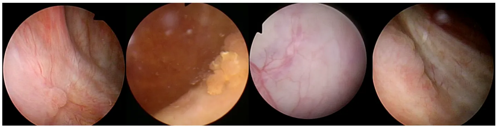

# Endoscopic Bladder Tissue Classification Dataset

<div align="center">
    <a href="https://github.com/openmedlab/"></a>
</div>
<p style="text-align:center;font-size:10px;"><em></em></p>

## Dataset Information

Here is the translation of the given text into English:

This dataset is derived from the article "Semi-Supervised Bladder Tissue Classification in Multi-Domain Endoscopic Images," comprising 1754 endoscopic images from 23 patients who underwent transurethral resection of bladder tumor (TURBT) procedures. The images in this dataset are annotated based on histopathological analysis of the resected tissues. Typically, endoscopy employs White Light Imaging (WLI) technology, and if conditions permit, Narrow Band Imaging (NBI) is used. According to the World Health Organization (WHO) and the International Society of Urological Pathology classification standards, there are four distinct categories of bladder tissues, including two neoplastic tissue categories: Low-Grade Cancer (LGC) and High-Grade Cancer (HGC), as well as two non-tumor lesion categories, namely Cystitis caused by infection or other inflammatory factors (NTL) and Non-Suspicious Tissue (NST). The data records the name of each frame, the imaging type (NBI or WLI), the tissue type (HGC, LGC, NTL, NST), and the dataset (train/val/test) used for training the classifier.

The clinical significance of this dataset lies in providing crucial information for the diagnosis and treatment of bladder cancer through precise classification of different tissue types within the bladder. Especially in distinguishing between low-grade and high-grade cancer tissues, it helps physicians to develop more personalized treatment plans, thereby improving treatment outcomes and patient quality of life. Additionally, identifying non-neoplastic injuries is equally important to avoid overtreatment and its unnecessary risks.

## Dataset Meta Information

| Dimensions | Modality  | Task Type      | Anatomical Structures          | Number of Categories                        | Data Volume | File Format |
|------------|-----------|----------------|-----------------|---------------------------------------------|-------------|-------------|
| 2D         | Endoscopy | Classification | bladder       | 4 (tissue categories), 2 (image categories) | 1,754        | .png        |


### Resolution Details

| Dataset Statistics | size        |
|--------------------|-------------|
| min                | 300 x 300  |
| max                | 350 x 350  |

## Label Information Statistics

High-Grade Carcinoma. (HGC),

Low-Grade Carcinoma (LGC),

No Tumor Lesion (NTL),

Non-Suspicious Tissue (NST)

| Tissue Category | HGC       | LGC       | NST       | NTL       |
|-----------------|-----------|-----------|-----------|-----------|
| Number of Images| 469       | 647       | 504       | 134       |
| Percentage      | 26%       | 37%       | 29%       | 7.6%      |

## Visualization

<div align="center">
    <a href="https://github.com/openmedlab/"></a>
</div>
<p style="text-align:center;font-size:10px;"><em>From left to right are examples of HGC, LGC, NST, NTL data.</em></p>

## File Structure

``` 
Endoscopic Bladder Tissue Classification Dataset 
|
|-- HGC
|   |-- case_002_pt_003_frame_0009.png
|   |-- case_002_pt_003_frame_0022.png
|   |-- ...
|
|-- LGC
|   |-- case_005_pt_001_frame_0000.png
|   |-- case_005_pt_001_frame_0008.png
|   |-- ...
|
|-- NST
|   |-- case_6_cys_pt1_0039.png
|   |-- case_6_cys_pt1_0165.png
|   |-- ...
|
|-- NTL
|   |-- case_002_pt_001_frame_0000.png
|   |-- case_002_pt_001_frame_0010.png
|   |-- ...
|
|-- annotations.csv
```

## Authors and Institutions

Jorge F. Lazo (Polytechnic University of Milan, University of Strasbourg)

Benoit Rosa (University of Strasbourg)

Michele Catellani (Pope John XXIII Hospital)

Matteo Fontana (European Institute of Oncology)

Francesco A. Mistretta (European Institute of Oncology)

Gennaro Musi (European Institute of Oncology)

Ottavio de Cobelli (European Institute of Oncology)

Michel de Mathelin (University of Strasbourg)

Elena De Momi (Polytechnic University of Milan, European Institute of Oncology)


## Source Information

Official Website: https://commons.datacite.org/doi.org/10.5281/zenodo.7741475

Download Link: https://www.kaggle.com/code/xokent/endoscopic-bladder-tissue-classification/input

Article Address: https://arxiv.org/pdf/2212.11375.pdf

Publication Date: 2023-03

## Citation

``` 
@article{lazo2023semi,
  title={Semi-supervised Bladder Tissue Classification in Multi-Domain Endoscopic Images},
  author={Lazo, Jorge F and Rosa, Benoit and Catellani, Michele and Fontana, Matteo and Mistretta, Francesco A and Musi, Gennaro and de Cobelli, Ottavio and de Mathelin, Michel and De Momi, Elena},
  journal={IEEE Transactions on Biomedical Engineering},
  year={2023},
  publisher={IEEE}
}
```

Original introduction article is [here](https://zhuanlan.zhihu.com/p/683649146).