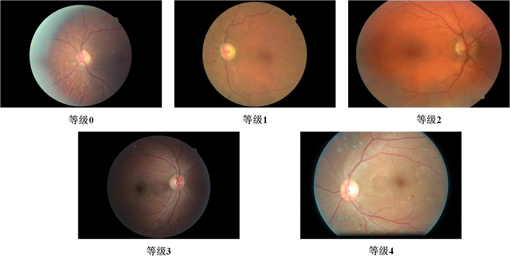

# Eyepacs

<div align="center">
    <a href="https://github.com/openmedlab/"></a>
</div>
<p style="text-align:center;font-size:10px;"><em></em></p>

## Dataset Information

The Eyepacs dataset contains a total of 35,126 diabetic retinopathy fundus images, graded from 0 to 4. This open-source data provided by the Kaggle 2019 Diabetic Retinopathy Detection competition was captured by technicians from Aravind Eye Hospital in India who went to rural areas with poor medical resources, and the images were then examined and categorized by experienced ophthalmologists. The resolution of the images varies from 433 x 289 pixels to 5184 x 3456 pixels. Some images in this dataset contain flaws, are out of focus, underexposed, or overexposed.

The Eyepacs dataset is an important medical image dataset that is used extensively worldwide for research on the automatic detection of diabetic retinopathy (DR). The aim of these studies is to develop algorithms that can accurately, quickly, and cost-effectively detect DR, helping medical institutions to identify problems at an early stage of the disease, thus allowing timely treatment and preventing blindness in patients.

## Dataset Meta Information

| Dimensions | Modality | Task Type      | Anatomical Structures | Anatomical Area | Number of Categories | Data Volume | File Format |
|------------|----------|----------------|-----------------------|-----------------|----------------------|-------------|-------------|
| 2D         | Fundus   | Classification | Eye                   | Eye             | 5                    | 35126        | JPEG        |


### Resolution Details

| Dataset Statistics | size             |
|--------------------|------------------|
| min                | (433, 289, 3)    |
| median             | (3644, 2477, 3)  |
| max                | (5184, 3456, 3)  |

## Label Information Statistics

| Category | Number of Images |
|----------|------------------|
| 0        | 20604            |
| 1        | 1961             |
| 2        | 4270             |
| 3        | 557              |
| 4        | 708              |

## Visualization

<div align="center">
    <a href="https://github.com/openmedlab/"></a>
</div>
<p style="text-align:center;font-size:10px;"><em>Local visualization.</em></p>

## File Structure

The file structure of the dataset is as follows: images are stored in an `images` folder, and annotations for training and validation are provided in text format as `.txt` files.

``` 
eyepacs
├── images
│   ├── xxx.jpeg
│   ├── xxx.jpeg
│   │    ...
├── train.txt
├── val.txt
```

## Authors and Institutions

Varun Gulshan (Arunachalam Narayanaswamy)

Lily Peng (Arunachalam Narayanaswamy)


## Source Information

Official Website: https://www.eyepacs.com/

Download Link: https://www.eyepacs.com/

Article Address: https://jamanetwork.com/journals/jama/fullarticle/2588763

Publication Date: 2016

## Citation

``` 
@article{gulshan2016development,
  title={Development and validation of a deep learning algorithm for detection of diabetic retinopathy in retinal fundus photographs},
  author={Gulshan, Varun and Peng, Lily and Coram, Marc and Stumpe, Martin C and Wu, Derek and Narayanaswamy, Arunachalam and Venugopalan, Subhashini and Widner, Kasumi and Madams, Tom and Cuadros, Jorge and others},
  journal={jama},
  volume={316},
  number={22},
  pages={2402--2410},
  year={2016},
  publisher={American Medical Association}
}
```

Original introduction article is [here](https://zhuanlan.zhihu.com/p/683930522).