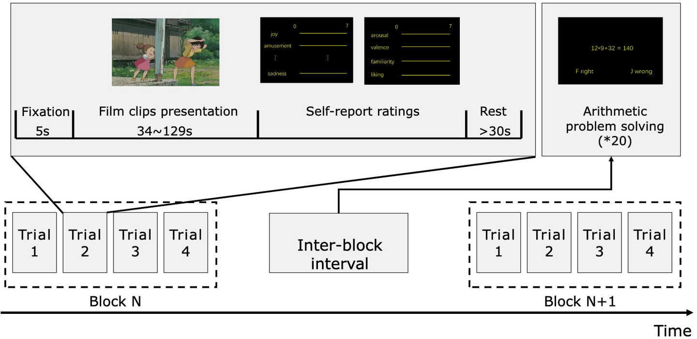

# FACE

<div align="center">
    <a href="https://github.com/openmedlab/"></a>
</div>
<p style="text-align:center;font-size:10px;"><em></em></p>

## Dataset Information

**A Large Finer-grained Affective Computing EEG (FACE) Dataset** is a large-scale, fine-grained electroencephalogram (EEG) dataset designed for affective computing, focusing on capturing subtle changes in emotional states. The dataset contains EEG data from 123 participants who experienced 9 different emotional categories while watching 28 emotion-inducing videos. The emotion-inducing tasks used video viewing to ensure participants could deeply experience each emotion.

The dataset is designed to address the lack of positive emotion classification in existing datasets, providing a more balanced classification of positive and negative emotions. It is suitable for research in affective computing, neuroscience, machine learning, interdisciplinary psychology, and more, promoting the development of cross-subject emotion recognition models based on EEG signals.

### Experimental Design

The experiment was divided into three parts to record EEG signals under different emotional states using multiple emotion induction methods:

1. **Emotion Induction**: Participants were induced to experience target emotions by watching specific emotional video clips. Each emotion category was paired with three video clips, while the neutral emotion had four clips. The average length of each video was 66 seconds, ensuring participants could continuously experience the target emotion.

2. **EEG Collection**: A 32-channel EEG device was used to record real-time signals, covering brainwaves from low to high frequency, capturing electrical activity from different regions of the brain. The sampling rate was either 250 Hz or 1000 Hz, ensuring high precision in signal recording.

3. **Emotion Self-Assessment**: After each emotion induction task, participants completed a self-report questionnaire to rate 12 emotional dimensions (including arousal and valence) on a scale from 0 to 7, quantifying individual subjective emotional experiences.


## Dataset Meta Information

| Task Type            | EEG Channels | EEG Sampling Rate  | Data Format       | EEG Format |
|----------------------|--------------|--------------------|-------------------|------------|
| Emotion Recognition  | 32           | 250Hz, 1000Hz      | .mat, .csv        | .bdf       |

## Dataset Statisitics Information

| Key Features of the FACED Dataset | Details                                                                                           |
|-----------------------------------|---------------------------------------------------------------------------------------------------|
| Number of subjects               | 123                                                                                               |
| Emotion category                 | 9 (anger, fear, disgust, sadness, amusement, inspiration, joy, tenderness, and neutral emotion)   |
| Number of video clips            | 28 (three clips for each negative/positive emotion and four clips for the neutral emotion)        |
| Self-reporting ratings (continuous scale of 0–7) | 12 items (anger, fear, disgust, sadness, amusement, inspiration, joy, tenderness, valence, arousal, liking, and familiarity) |
| Recorded signals                 | 32-channel EEG                                                                                   |


## Dataset Example

<div align="center">
    <a href="https://github.com/openmedlab/"></a>
</div>
<p style="text-align:center;font-size:10px;"><em></em></p>

## File Structure

``` 
FACED_Dataset
│
├── Dataset_description.md
│   └── Content of the dataset
│
├── Task_event.xlsx
│   └── Event information during the experiment
│
├── Electrodes_Location.xlsx
│   └── Details of electrode locations
│
├── Stimuli_info.csv
│   └── Details of the video clips
│
├── DataStructureOfBehaviouralData.xlsx
│   └── Structure of the behavioural data
│
├── Processed_Data
│   ├── subXXX/Data.xlsx
│   │   └── Self-reporting ratings and the performance of the inter-block arithmetic task
│   ├── Processed_EEG_Data
│   │   ├── subXXX/EEG_features/EEG_Data_3D_matrix.pkl
│   │   │   └── 3-dimensional matrix of VideoNum*TrialNum*EEGNum
│   │   ├── subXXX/EEG_Features/DE/EEG_Subjects.pkl
│   │   │   └── 4-dimensional matrix of VideoNum*TrialNum*EEGNum*FreqBand
│   │   ├── subXXX/EEG_Features/PSD/EEG_Subjects.pkl
│   │   │   └── PSD feature 4-dimensional matrix of VideoNum*TrialNum*EEGNum*FreqBand
│
└── README.md
    └── Usage notes for data and codes
```

## Authors and Institutions

Jingjing Chen (Tsinghua University, Beijing, China)

Xiaobin Wang (Tsinghua University, Beijing, China)

Chen Huang (Tsinghua University, Beijing, China)

Xin Hu (University of Pittsburgh, Pittsburgh, USA)

Xinke Shen (Tsinghua University, Beijing, China)

Dan Zhang (Tsinghua University, Beijing, China)

## Source Information

Official Website: https://www.synapse.org/Synapse:syn50614194/wiki/620378

Download Link: https://www.synapse.org/Synapse:syn50614194/files/

Article Address: https://www.nature.com/articles/s41597-023-02650-w

Publication Date: 2023

## Citation

``` 
@article{chen2023large,
  title={A large finer-grained affective computing EEG dataset},
  author={Chen, Jingjing and Wang, Xiaobin and Huang, Chen and Hu, Xin and Shen, Xinke and Zhang, Dan},
  journal={Scientific Data},
  volume={10},
  number={1},
  pages={740},
  year={2023},
  publisher={Nature Publishing Group UK London}
}
```

Original introduction article is [here](https://zhuanlan.zhihu.com/p/747120845).