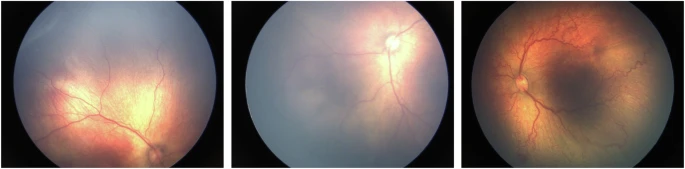

# FARFUM-RoP

<div align="center">
    <a href="https://github.com/openmedlab/"></a>
</div>
<p style="text-align:center;font-size:10px;"><em></em></p>

## Dataset Information

Retinopathy of Prematurity (ROP) is a potentially blinding eye disorder primarily affecting premature infants. This condition is characterized by abnormal retinal blood vessel development in babies born before 31 weeks of gestation. A critical aspect of ROP is "Plus disease," a severe manifestation indicating rapid disease progression. This article delves into the etiology, pathophysiology, clinical features, management, and implications of ROP and Plus disease, referencing a wide range of academic resources. ROP is fundamentally linked to prematurity and low birth weight. Retinal vascular underdevelopment in premature infants is a critical factor. Post-birth exposure to high oxygen levels in neonatal care can halt normal retinal vascular growth, leading to subsequent neovascularization. 

Plus disease is a marker of severe ROP, characterized by posterior retinal vascular dilation and tortuosity, indicating significant disease activity. ROP diagnosis is based on clinical retinal examination. The International Classification of Retinopathy of Prematurity (ICROP) categorizes ROP by zone, stage, and the presence of Plus disease (International Committee for the Classification of Retinopathy of Prematurity, 2005). Plus disease is identified by comparing retinal vascular appearance with standard reference images. Early detection and treatment are critical. Managing ROP involves routine eye examinations by pediatric ophthalmologists. Treatment options include laser therapy, cryotherapy, and anti-VEGF injections, aiming to prevent or slow the progression of retinal detachment. Untreated, severe ROP may result in complications like retinal detachment and blindness. Early treatment, especially in the presence of Plus disease, significantly improves outcomes. Long-term follow-up is essential as these infants are at risk of developing other visual disorders.

Artificial intelligence (AI) applications in ROP and Plus disease diagnosis represent a groundbreaking shift in pediatric ophthalmology. Advanced AI technologies like machine learning and deep learning have the potential to improve diagnostic accuracy, efficiency, and accessibility. Recent AI developments include sophisticated algorithms capable of analyzing retinal images to detect ROP and Plus disease. These algorithms, trained on extensive datasets, can identify subtle disease indicators with high accuracy. Recent studies demonstrate that AI can match or surpass human experts in diagnosing ROP. AI's ability to detect Plus disease, particularly its complex vascular changes, has significantly improved, enabling more reliable and early detection.

The application of AI in ROP diagnosis marks a significant leap in pediatric ophthalmology. However, the effectiveness and accuracy of these AI systems heavily depend on the availability and quality of datasets for their training and validation. Public datasets for this purpose encourage collaboration among researchers, practitioners, and developers. Shared data facilitates resource and expertise pooling, leading to more innovative and effective AI solutions. This collaborative environment accelerates AI development and its subsequent impact on ROP diagnosis. Nevertheless, researchers still face the challenge of accurately evaluating and comparing their results due to the lack of suitable public datasets for this application. To address this issue, some researchers have generated private datasets that are not shared.

In this article, we introduce a public dataset named **FARFUM-RoP** (representing the Mashhad Farabi and Ferdowsi University ROP dataset) for computer-aided detection, research, and educational purposes. It includes **1533 retinal images from 68 patients**. Five professional pediatric ophthalmologists independently annotated the images into three categories: "Normal," "Pre-Plus," and "Plus."

## Dataset Meta Information

| Dimensions | Modality                 | Task Type      | Anatomical Structures | Anatomical Area | Number of Categories | Data Volume | File Format |
|------------|--------------------------|----------------|-----------------------|-----------------|----------------------|-------------|-------------|
| 2D         | fundus color photography | Classification | Eye                   | Eye             | 3                    | 1533        | .jpg        |


### Resolution Details

| Dataset Statistics | size          |
|--------------------|---------------|
| min                | (1200, 1600)  |
| median             | (1200, 1600)  |
| max                | (1200, 1600)  |


## Visualization

<div align="center">
    <a href="https://github.com/openmedlab/"></a>
</div>
<p style="text-align:center;font-size:10px;"><em>Figure 1. FARFUM-RoP example.</em></p>

## File Structure

``` 
FARFUM-RoP
├── Dataset_Details.xlsx
├── Dataset_Labels.xlsx
 with time-boundary annotation--original resolution and FPS)
```

## Authors and Institutions

Morteza Akbari (Machine Vision Lab., Faculty of Engineering, Ferdowsi University of Mashhad, Mashhad, 9177948974, Iran)

Hamid-Reza Pourreza (Machine Vision Lab., Faculty of Engineering, Ferdowsi University of Mashhad, Mashhad, 9177948974, Iran; Faculty of Engineering, McMaster University, Hamilton, Ontario, L8S 4L7, Canada)

Elias Khalili Pour (Department of Pediatric Ophthalmology, Farabi Eye Hospital, Tehran University of Medical Sciences, Tehran, 1336616351, Iran)

Afsar Dastjani Farahani (Department of Pediatric Ophthalmology, Farabi Eye Hospital, Tehran University of Medical Sciences, Tehran, 1336616351, Iran)

Fatemeh Bazvand (Department of Pediatric Ophthalmology, Farabi Eye Hospital, Tehran University of Medical Sciences, Tehran, 1336616351, Iran)

Nazanin Ebrahimiadib (Department of Pediatric Ophthalmology, Farabi Eye Hospital, Tehran University of Medical Sciences, Tehran, 1336616351, Iran)

Marjan Imani Fooladi (Department of Pediatric Ophthalmology, Farabi Eye Hospital, Tehran University of Medical Sciences, Tehran, 1336616351, Iran)

Fereshteh Ramazani K. (Machine Vision Lab., Faculty of Engineering, Ferdowsi University of Mashhad, Mashhad, 9177948974, Iran)


## Source Information

Official Website: https://www.nature.com/articles/s41597-024-03897-7

Download Link: https://www.nature.com/articles/s41597-024-03897-7

Article Address: https://www.nature.com/articles/s41597-024-03897-7

Publication Date: 2024-10

## Citation

``` 
@article{akbari2024farfum,
  title={FARFUM-RoP, A dataset for computer-aided detection of Retinopathy of Prematurity},
  author={Akbari, Morteza and Pourreza, Hamid-Reza and Khalili Pour, Elias and Dastjani Farahani, Afsar and Bazvand, Fatemeh and Ebrahimiadib, Nazanin and Imani Fooladi, Marjan and Ramazani K, Fereshteh},
  journal={Scientific Data},
  volume={11},
  number={1},
  pages={1176},
  year={2024},
  publisher={Nature Publishing Group UK London}
}
```

Original introduction article is [here](https://zhuanlan.zhihu.com/p/5971011256).