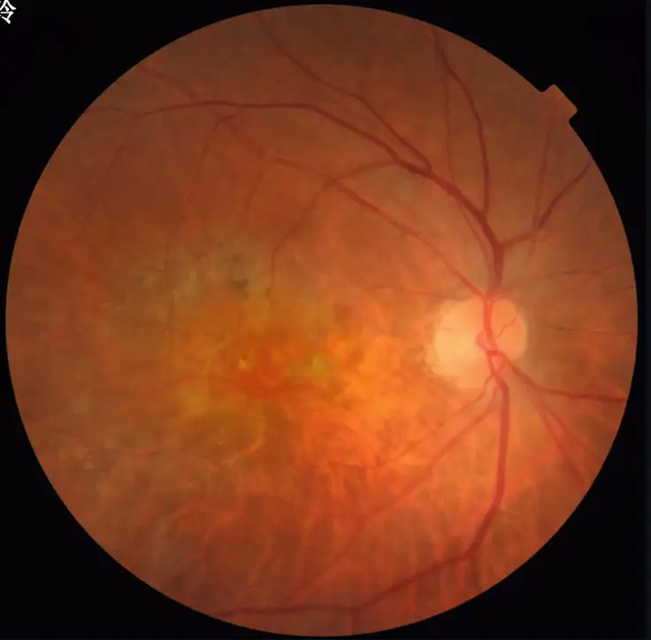

# FIVES

<div align="center">
    <a href="https://github.com/openmedlab/"></a>
</div>
<p style="text-align:center;font-size:10px;"><em></em></p>

## Dataset Information

FIVES (Fundus Image dataset for Vessel Segmentation) is currently the largest dataset for AI-based vessel segmentation in fundus images. The dataset contains 800 high-resolution (2048x2048) color photographs of various fundus conditions, including diabetic retinopathy (DR), age-related macular degeneration (AMD), glaucoma, and normal fundus, with 200 images for each condition. All images have been meticulously annotated at the pixel level by a group of medical experts through a standardized crowdsourcing process to ensure annotation quality. Additionally, the authors evaluated the quality of each image based on lighting/color distortion, blurriness, and low contrast, and used these assessments to divide the dataset into training and testing sets, ensuring a balanced distribution of image features across the subsets. Ultimately, the dataset includes 600 training images and 200 testing images, with both the original fundus images and corresponding vessel annotations provided.

Vessel segmentation in fundus images is of great importance in the diagnosis and research of ophthalmic diseases. Changes in the morphology of fundus vessels are closely related to various ocular and systemic diseases, such as diabetic retinopathy, glaucoma, and cardiovascular diseases. Traditional manual segmentation methods are time-consuming and labor-intensive, making them difficult to apply in large-scale research and screening. AI methods offer the potential for efficient, objective, and quantitative analysis of fundus vessels. However, existing public datasets have limitations, such as small sample sizes, low resolution, and a lack of diverse disease types. The FIVES dataset addresses these shortcomings, providing high-quality data support for the development, training, and evaluation of AI models for fundus vessel segmentation. This will aid in improving the performance of related algorithms and their translation into clinical applications, ultimately benefiting the diagnosis and prognosis of ophthalmic diseases.

## Dataset Meta Information

| Dimensions | Modality            | Task Type | Anatomical Structures | Anatomical Area | Number of Categories | Data Volume | File Format |
|------------|---------------------|-----------|-----------------------|-----------------|----------------------|-------------|-------------|
| 2D         | Fundus Color Photos | Segmentation | Fundus Blood Vessels  | Retina          | 1                    | 800         | PNG         |


### Resolution Details

| Dataset Statistics | size          |
|--------------------|---------------|
| min                | (2048, 2048)  |
| median             | (2048, 2048)  |
| max                | (2048, 2048)  |

## Label Information Statistics

| Metric        | Fundus Blood Vessels |
|---------------|----------------------|
| Case Count    | 800                  |
| Coverage      | 100%                 |

## Visualization

<div align="center">
    <a href="https://github.com/openmedlab/"></a>
</div>
<p style="text-align:center;font-size:10px;"><em>Original fundus color photos</em></p>

<div align="center">
    <a href="https://github.com/openmedlab/"></a>
</div>
<p style="text-align:center;font-size:10px;"><em>Segmentation Mask.</em></p>

## File Structure

The folder contains `train` and `test` directories representing the training and testing data, respectively. Additionally, the `Quality Assessment.xlsx` file provides quality scores for the collected images.

``` 
Dataset
│
├── train
│   ├── Groud truth
│   │   ├── 1_A.png
│   │   ├── 2_A.png
│   │   ├── 3_A.png
│   │   ├── ...
│   ├── Original
│   │   ├── 1_A.png
│   │   ├── 2_A.png
│   │   ├── 3_A.png
│   │   ├── ...
├── test
│   ├── Groud truth
│   │   ├── 1_A.png
│   │   ├── 2_A.png
│   │   ├── 3_A.png
│   │   ├── ...
│   ├── Original
│   │   ├── 1_A.png
│   │   ├── 2_A.png
│   │   ├── 3_A.png
│   │   ├── ...
```

## Authors and Institutions

Kai Jin (Department of Ophthalmology, Second Affiliated Hospital, Zhejiang University School of Medicine; School of Media Engineering, Zhejiang University of Media and Communications)

Xingru Huang (School of Electronic Engineering and Computer Science, Hangzhou University; School of Media Engineering, Zhejiang University of Media and Communications)

Jingxing Zhou (Department of Ophthalmology, Second Affiliated Hospital, Zhejiang University School of Medicine; School of Media Engineering, Zhejiang University of Media and Communications)

Yunxiang Li (University College London)

Yan Yan (Department of Ophthalmology, Second Affiliated Hospital, Zhejiang University School of Medicine)

Yibao Sun (School of Electronic Engineering and Computer Science, Hangzhou University)

Qianni Zhang (School of Electronic Engineering and Computer Science, Hangzhou University)

Yaqi Wang (University of Electronic Science and Technology of China)

Juan Ye (Department of Ophthalmology, Second Affiliated Hospital, Zhejiang University School of Medicine)

## Source Information

Official Website: https://figshare.com/articles/figure/FIVES_A_Fundus_Image_Dataset_for_AI-based_Vessel_Segmentation/19688169/1

Download Link: https://figshare.com/articles/figure/FIVES_A_Fundus_Image_Dataset_for_AI-based_Vessel_Segmentation/19688169/1

Article Address: https://www.nature.com/articles/s41597-022-01564-3

Publication Date: 2022-08

## Citation

``` 
@article{jin2022fives,
  title={Fives: A fundus image dataset for artificial Intelligence based vessel segmentation},
  author={Jin, Kai and Huang, Xingru and Zhou, Jingxing and Li, Yunxiang and Yan, Yan and Sun, Yibao and Zhang, Qianni and Wang, Yaqi and Ye, Juan},
  journal={Scientific Data},
  volume={9},
  number={1},
  pages={475},
  year={2022},
  publisher={Nature Publishing Group UK London}
}
```

Original introduction article is [here](https://zhuanlan.zhihu.com/p/696577173).