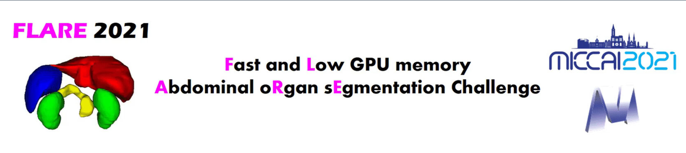
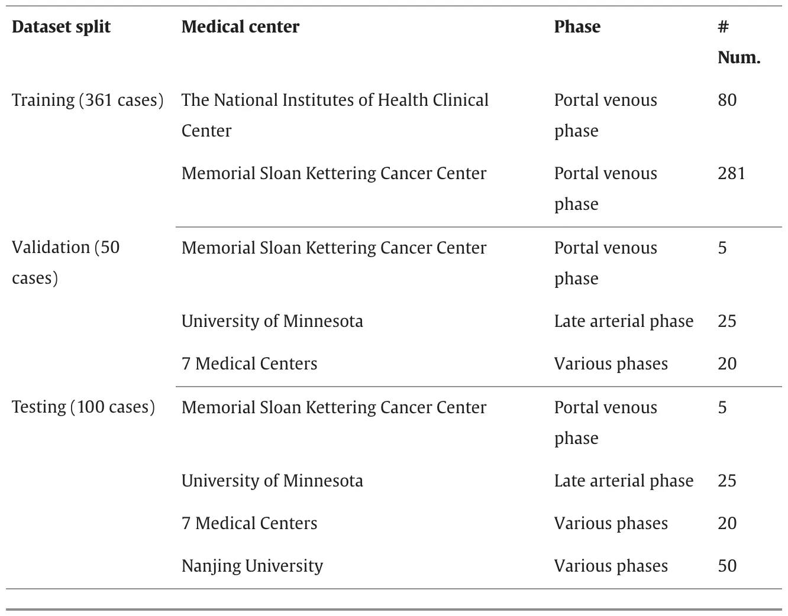
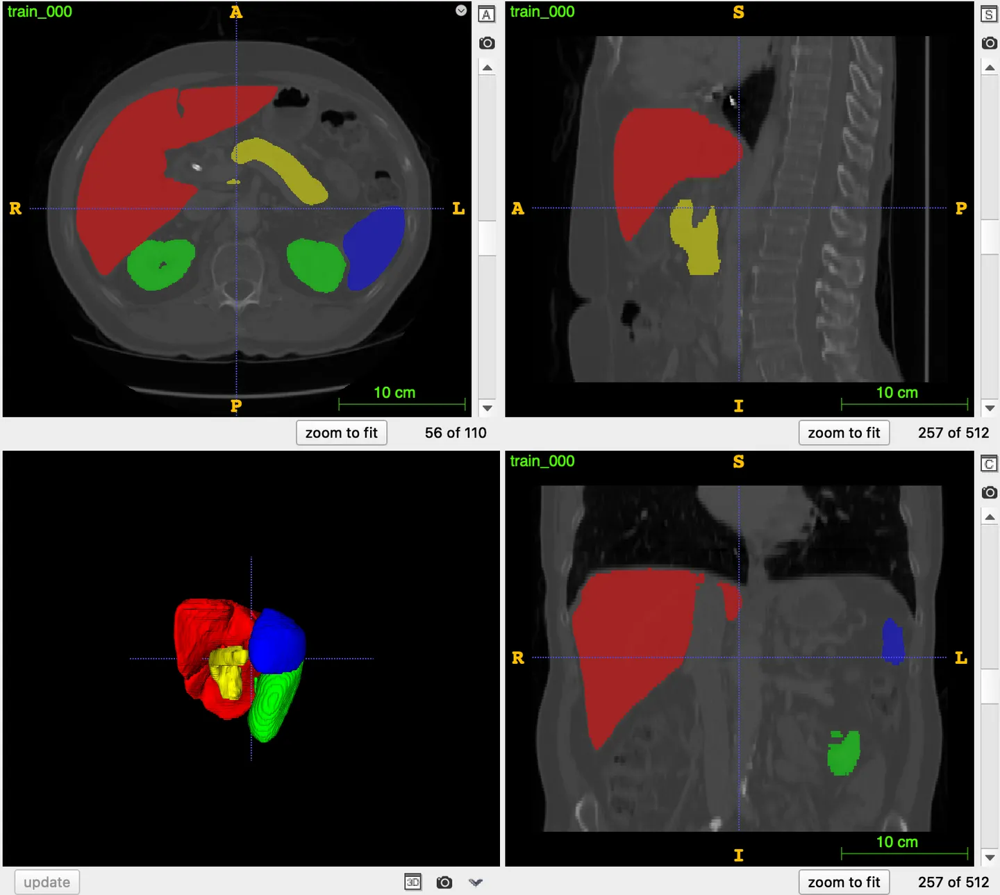

# FLARE 2021

<div align="center">
    <a href="https://github.com/openmedlab/"></a>
</div>
<p style="text-align:center;font-size:10px;"><em></em></p>

## Dataset Information

FLARE 2021 is a CT dataset focused on the segmentation of four abdominal organs: liver, spleen, pancreas, and kidneys, and is the first edition in the FLARE series of competitions. FLARE 2022 and FLARE 2023 datasets have been introduced in previous articles, and this article supplements the introduction of FLARE 2021. The challenge dataset comes from publicly available datasets such as MSD (liver, spleen, pancreas), NIH Pancreas, KiTS19, LiTS, as well as a private dataset collected by Nanjing University. The dataset includes 361 training cases, 50 validation cases, and 100 test cases. Specific data sources and distributions are as shown in the following figure:

<div align="center">
    <a href="https://github.com/openmedlab/"></a>
</div>
<p style="text-align:center;font-size:10px;"><em></em></p>

Abdominal organ segmentation plays an important role in clinical practice. However, existing abdominal datasets mostly contain cases from a single center, single phase, single vendor, or single disease, and it remains unclear whether these excellent performances can be generalized to more diverse datasets. In addition, many state-of-the-art methods use model ensembles to improve performance, but these solutions are usually large-scale and computationally expensive, making them impractical for clinical deployment. To address these limitations, researchers have organized the fast, low-GPU-memory abdominal organ segmentation challenge, which has two main features: (1) The dataset is large and diverse, including 511 cases from 11 medical centers. (2) The focus is not only on the accuracy of segmentation but also on the efficiency of segmentation, which is consistent with real clinical practice and requirements.


## Dataset Meta Information

| Dimensions | Modality | Task Type | Anatomical Structures          | Anatomical Area | Number of Categories | Data Volume                                        | File Format |
|------------|----------|-----------|--------------------------------|-----------------|----------------------|----------------------------------------------------|-------------|
| 3D         | CT       | Segmentation | Liver, kidneys, spleen, pancreas | Abdomen         | 4                    | 361 for training, 50 for validation, 100 for test. | .nii.gz     |


### Resolution Details

| Dataset Statistics | spacing (mm)     | size            |
|--------------------|------------------|-----------------|
| min                | (0.61,0.61,0.5)              | (512,512,37)     |
| median             | (0.82,0.82,2.5)           | (512,512,97) |
| max                | (0.98,0.98,7.5)              | (512,512,751) |

## Label Information Statistics

| Organ | liver | kidney | spleen | pancreas |
| ---- | ---- | ---- | ---- | ---- |
| Number of Cases | 361 | 361 | 360 | 361 |
| Coverage | 100% | 100% | 99.72% | 100% |
| Maximum Volume (cm³) | 4503.92 | 1528.76 | 1039.34 | 867.6 |
| Average Volume (cm³) | 505.48 | 149.02 | 34.02 | 22.36 |
| Median Volume (cm³) | 1504.74 | 353.8 | 210.64 | 78.1 |


## Visualization

<div align="center">
    <a href="https://github.com/openmedlab/"></a>
</div>
<p style="text-align:center;font-size:10px;"><em> ITK-SNAP Visualization. Red: liver; green: kidney; blue: spleen; yellow: pancreas.</em></p>

## File Structure

The official file structure is as follows, the original data has been stored in the format required by nnUNet, divided into three folders: training images, training labels, and test images.

``` 
FLARE21
│
├── imagesTr
│   ├── train_000.nii.gz
│   └── ...
│
├── labelsTr
│   ├── train_000.nii.gz
│   └── ...
├── imagesTs
│   ├── validation_001.nii.gz
│   └── ...
```

## Authors and Institutions

Jun Ma (Nanjing University of Science and Technology)

Song Gu (Nanjing University of Information Science & Technology)

Yao Zhang (University of Chinese Academy of Sciences)

Xingle An (Beijing ImagineVision Medical Technology Co., Ltd.)

Zhihe Wang (Shenzhen Heaco Medical Technology Co., Ltd.)

Cheng Ge (Jiangsu University of Science and Technology)

Congcong Wang (Tianjin Polytechnic University)

Guoqiang Dong (Nanjing University)

Qiongjie Zhu (Nanjing University)

Jian He (Nanjing University)

Xiaoping Yang (Nanjing University)


## Source Information

Official Website: https://flare.grand-challenge.org/

Download Link: https://flare.grand-challenge.org/Data/

Article Address: https://www.sciencedirect.com/science/article/abs/pii/S1361841522002444?via%3Dihub

Publication Date: May, 2021.

## Citation

``` 
@article{MedIA-FLARE21,
title = {Fast and Low-GPU-memory abdomen CT organ segmentation: The FLARE challenge},
author = {Jun Ma and Yao Zhang and Song Gu and Xingle An and Zhihe Wang and Cheng Ge and Congcong Wang and Fan Zhang and Yu Wang and Yinan Xu and Shuiping Gou and Franz Thaler and Christian Payer and Darko Štern and Edward G.A. Henderson and Dónal M. McSweeney and Andrew Green and Price Jackson and Lachlan McIntosh and Quoc-Cuong Nguyen and Abdul Qayyum and Pierre-Henri Conze and Ziyan Huang and Ziqi Zhou and Deng-Ping Fan and Huan Xiong and Guoqiang Dong and Qiongjie Zhu and Jian He and Xiaoping Yang},
journal = {Medical Image Analysis},
pages = {102616},
volume = {82},
year =  {2022}
}
```

Original introduction article is [here](https://zhuanlan.zhihu.com/p/663694119).