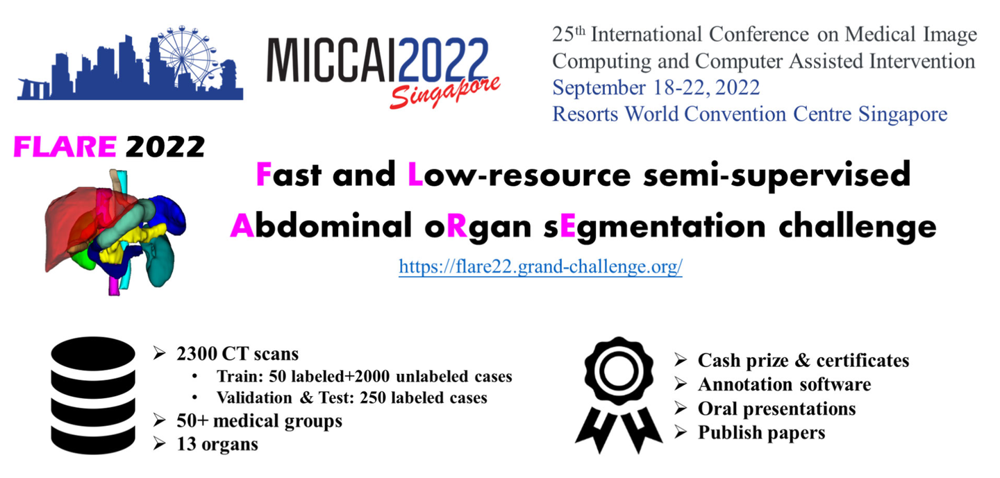
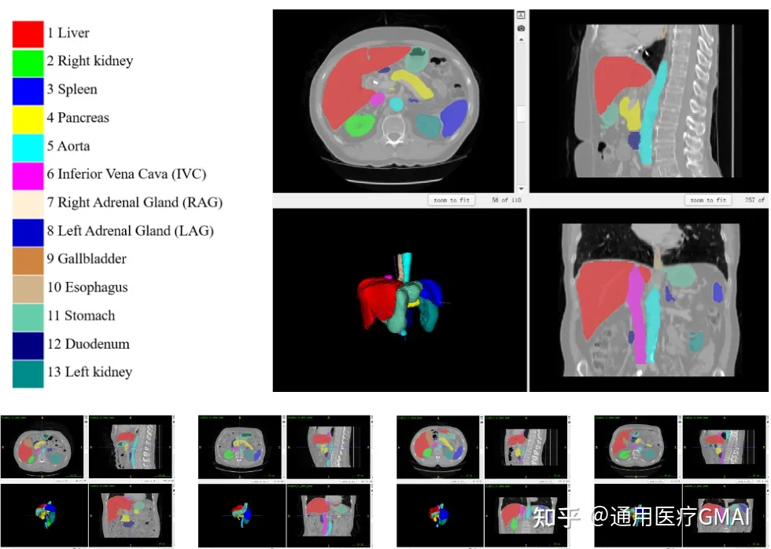

# FLARE 2022

<div align="center">
    <a href="https://github.com/openmedlab/"></a>
</div>
<p style="text-align:center;font-size:10px;"><em></em></p>

## Dataset Information

The MICCAI FLARE 2022 challenge requires algorithms to simultaneously segment 13 abdominal organs, which is a critical task in medical image analysis. This competition provides the largest abdominal CT dataset to date, comprising a total of 2300 three-dimensional CT image data from over 20 centers. It includes 50 annotated cases and 2000 unannotated cases for training, 50 cases for validation, and 200 cases for the final testing and ranking.

In most previous medical image segmentation competitions, evaluation metrics only considered algorithm accuracy, leading researchers to focus on increasing model size and model fusion. However, in real clinical applications, model inference speed and resource consumption are of great practical importance. In the FLARE 2022 challenge, participants are not only required to accurately segment abdominal organs but also need to consider model inference speed and resource consumption. The final score will be based on a comprehensive evaluation of accuracy, speed, CPU consumption, and GPU memory consumption.

### Task Information
- How to fully exploit the value of a large amount of unlabeled data.
- How to balance model efficiency and accuracy.

## Dataset Meta Information

You can write down meta information about the dataset, take TotalSegmentator for example, it could be:

| Dimensions | Modality | Task Type | Anatomical Structures                                                         | Anatomical Area | Number of Categories | Data Volume                                                                  | File Format |
|------------|----------|-----------|-------------------------------------------------------------------------------|---------------|----------------------|------------------------------------------------------------------------------|-------------|
| 3D         | CT       | Segmentation | Kidney, Liver, Pancreas, Spleen, Stomach, Esophagus, Duodenum, Adrenal Gland. | Abdomen       | 13                   | 50 annotated, 2000 unannotated for training; 50 for validation; 200 for test | .nii.gz     |


### Resolution Details

| Dataset Statistics | spacing (mm)     | size            |
|--------------------|------------------|-----------------|
| min                | (0.64, 0.64, 2.5)             | (512, 512, 71)     |
| median             | (0.74, 0.74, 2.5)           | (512, 512, 97) |
| mean               | (0.72, 0.72, 2.5)           | (512, 512, 106) |
| max                | (0.77, 0.77, 5)             | (512, 512, 113) |

## Intensity Information Statistics

| Categories	            | CT-min	 | CT-0.5%               | CT-median        | CT-mean        | 	CT-std    | CT-99.5% | CT-max |
|------------------------|---------|-----------------------|------------------|----------------|------------|----------|--------|
| Total Foreground       | -1024   | 	-975                 | 	123             | 	92            | 	172       | 	231     | 	1204  |
| 1 Liver                | -119    | 	53                   | 	127             | 	126           | 23	        | 190	     | 255    |
| 2 Right Kidney	        | -83	    | 2	                    | 183	             | 167	           | 53	        | 247	     | 286    |          
| 3 Spleen	              | -201	   | 0	                    | 122	             | 118	           | 27	        | 175      | 	244   |               
| 4 Pancreas	            | -104	   | -41                   | 	89	             | 83.5	          | 35	        | 159      | 	281   |           
| 5 Aorta	               | -100	   | -14                   | 	130	            | 120            | 46	        | 204      | 	1204  |            
| 6 Inferior Vena Cava	  | -37     | 	23	                  | 107	             | 108	           | 34         | 	190	    | 222    | 
| 7 Right Adrenal Gland	 | -72	    | -45	                  | 72	              | 68	            | 38	        | 151	     | 174    | 
| 8 Left Adrenal Gland	  | -59     | 	-35                  | 	70              | 	68            | 	36        | 	151	    | 184    |  
| 9 Gall Bladder	        | -80	    | -38	                  | 14	              | 15	            | 22	        | 94	      | 154    |           
| 10 Esophagus	          | -935	   | -837	                 | 30               | 	-13	          | 165        | 	129     | 	168   |       
| 11 Stomach	            | -1024	  | -994	                 | 42	              | -158	          | 404	       | 157      | 	259   |         
| 12 Duodenum	           | -499    | 	-69	| 84| 	77	| 39	| 148| 	577   |     
| 13 Left Kidney	        | -96	    | 5	      | 187	    | 171	    | 52	     | 248     | 	288    |   

## Label Information Statistics

| Categories    | Coverage Min (%) | Coverage Mean (%) | Coverage Max (%) | Actual Size Min (cm³) | Actual Size Mean (cm³) | Actual Size Max (cm³) | Number of Samples |
|---------------|------------------|-------------------|------------------|-----------------------|-------------------|------------------|-------------------|
| Liver         | 3.74%            | 7.14%             | 13.67%           | 2032                  | 3016              | 4113             | 50                |
| Right Kidney  | 2.04%            | 3.84%             | 6.33%            | 1037                  | 1632              | 2570             | 50                |
| Spleen        | 0.25%            | 0.47%             | 1.11%            | 107                   | 201               | 420              | 50                |
| Pancreas      | 0.10%            | 0.56%             | 1.84%            | 51                    | 237               | 693              | 50                |
| Aorta         | 0.09%            | 0.22%             | 0.59%            | 41                    | 94                | 178              | 50                |
| Inferior Vena Cava | 0.10%     | 0.22%             | 0.46%            | 40                    | 94                | 187              | 50                |
| Right Adrenal Gland | 0.11%    | 0.20%             | 0.42%            | 41                    | 86                | 127              | 50                |
| Left Adrenal Gland | 0.005%    | 0.01%             | 0.02%            | 1                     | 4                 | 9                | 50                |
| Left Adrenal Gland   | 0.01%            | 0.01%             | 0.02%            | 2                | 5                 | 9                | 50                |
| Gallbladder          | 0.01%            | 0.08%             | 0.25%            | 4                | 33                | 117              | 50                |
| Esophagus            | 0.02%            | 0.04%             | 0.09%            | 6                | 16                | 25               | 50                |
| Stomach              | 0.25%            | 0.82%             | 2.89%            | 140              | 332               | 830              | 50                |
| Duodenum             | 0.07%            | 0.18%             | 0.32%            | 43               | 76                | 119              | 50                |
| Left Kidney          | 0.23%            | 0.47%             | 0.91%            | 102              | 201               | 381              | 50                |


## Visualization

<div align="center">
    <a href="https://github.com/openmedlab/"></a>
</div>
<p style="text-align:center;font-size:10px;"><em></em></p>

## File Structure

After unpacking the official compressed package, the file structure is as follows:

``` 
FLARE2022
├── Training
│   ├── FLARE22_LabeledCase50
│   │   ├── images
│   │   │   ├── FLARE22_Tr_0001_0000.nii.gz
│   │   │   ├── FLARE22_Tr_0002_0000.nii.gz
│   │   │   ├── ...
│   │   │   └── FLARE22_Tr_0050_0000.nii.gz
│   │   └── labels
│   │       ├── FLARE22_Tr_0001.nii.gz
│   │       ├── FLARE22_Tr_0002.nii.gz
│   │       ├── ...
│   │       └── FLARE22_Tr_0050.nii.gz
│   ├── FLARE22_UnlabeledCase1-1000
│   │   ├── Case_00001_0000.nii.gz
│   │   ├── Case_00002_0000.nii.gz
│   │   ├── ...
│   │   └── Case_01000_0000.nii.gz
│   └── FLARE22_UnlabeledCase1001-2000
│       ├── Case_01001_0000.nii.gz
│       ├── Case_01002_0000.nii.gz
│       ├── ...
│       └── Case_02000_0000.nii.gz
├── Tuning
│   ├── images
│   │   ├── FLARETs_0001_0000.nii.gz
│   │   ├── FLARETs_0002_0000.nii.gz
│   │   ├── ...
│   │   └── FLARETs_0050_0000.nii.gz
│   └── labels
│       ├── FLARETs_0001.nii.gz
│       ├── FLARETs_0002.nii.gz
│       ├── ...
│       └── FLARETs_0050.nii.gz
└── Testing
    ├── FLARETs_0001_0000.nii.gz
    ├── FLARETs_0002_0000.nii.gz
    ├── ...
    └── FLARETs_0200_0000.nii.gz
```

## Authors and Institutions

Jun Ma (University of Toronto)

Bo Wang (University of Toronto)


## Source Information

Official Website: https://flare22.grand-challenge.org/

Download Link: https://flare22.grand-challenge.org/Dataset/

Article Address: https://arxiv.org/pdf/2308.05862.pdf

Publication Date: March, 2022.

## Citation

``` 
@article{FLARE22,
    author = {Jun Ma and Yao Zhang and Song Gu and Cheng Ge and Shihao Ma and Adamo Young and Cheng Zhu and Kangkang Meng and Xin Yang and Ziyan Huang and Fan Zhang and Wentao Liu and YuanKe Pan and Shoujin Huang and Jiacheng Wang and Mingze Sun and Weixin Xu and Dengqiang Jia and Jae Won Choi and Natália Alves and Bram de Wilde and Gregor Koehler and Yajun Wu and Manuel Wiesenfarth and Qiongjie Zhu and Guoqiang Dong and Jian He and the FLARE Challenge Consortium and Bo Wang},
    title = {Unleashing the Strengths of Unlabeled Data in Pan-cancer Abdominal Organ Quantification: the FLARE22 Challenge},
    year = {2023},
    journal = {arXiv preprint arXiv:2308.05862},
}
```