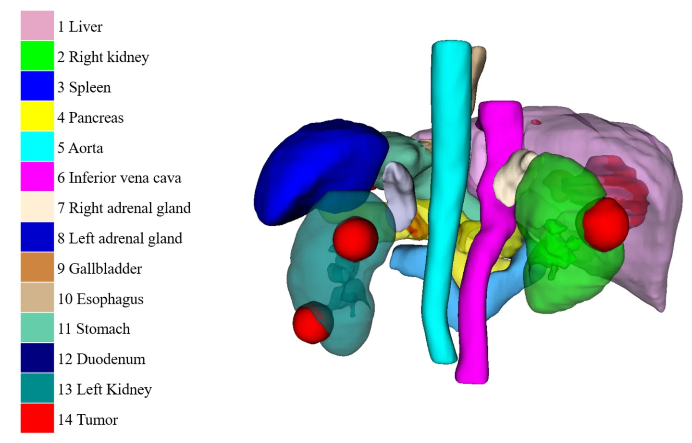
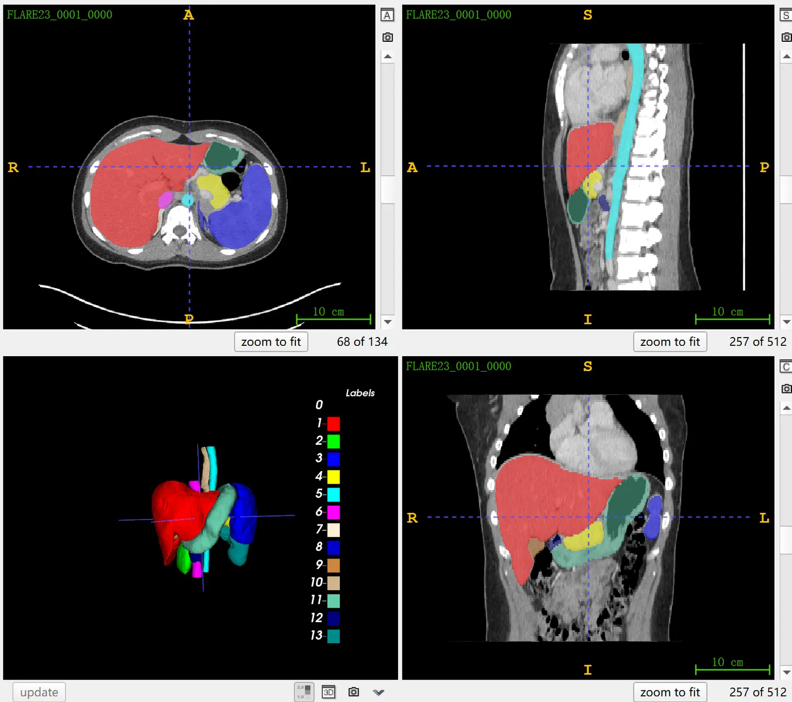
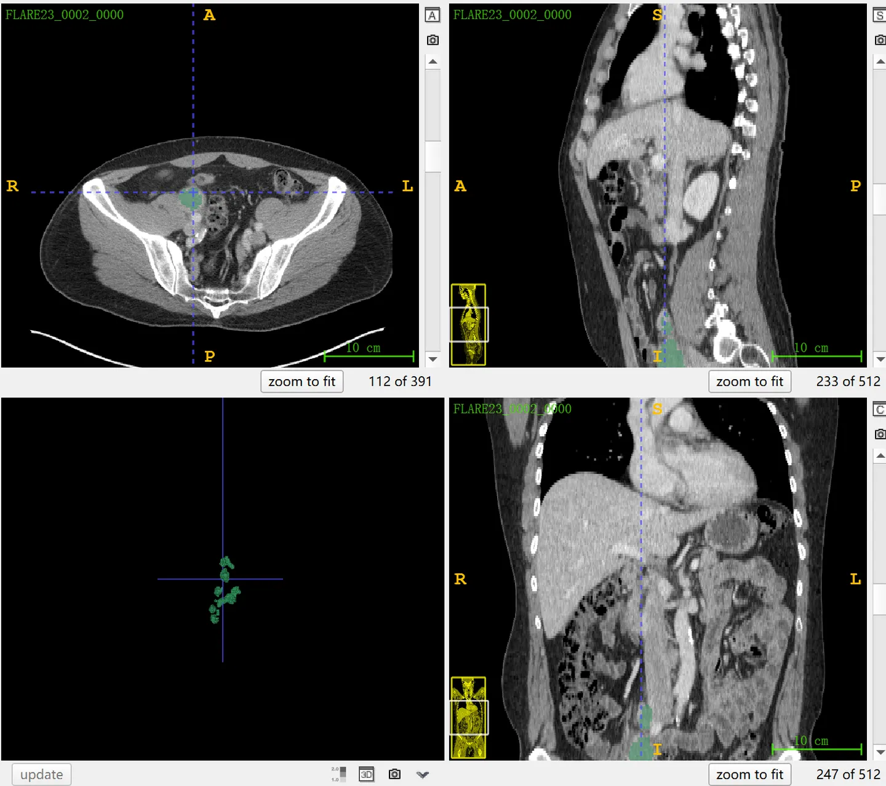
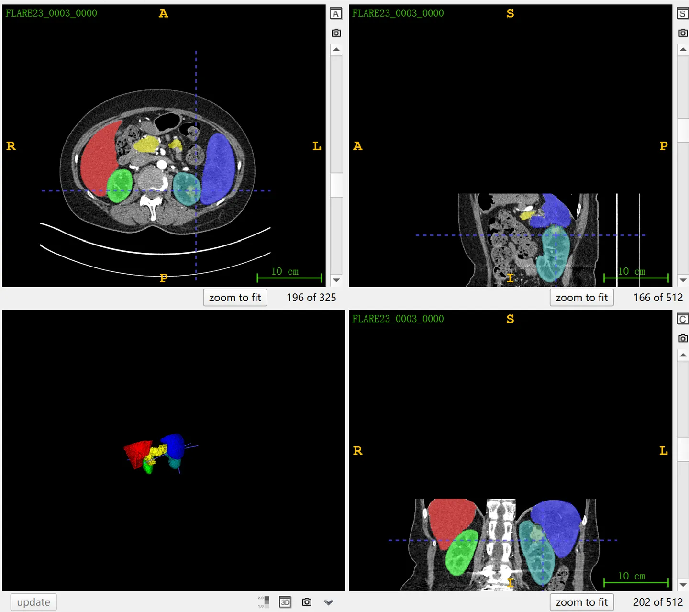

# FLARE 2023

<div align="center">
    <a href="https://github.com/openmedlab/"></a>
</div>
<p style="text-align:center;font-size:10px;"><em></em></p>

## Dataset Information

**FLARE 2023** (Fast, Low-resource, and Accurate oRgan and Pan-cancer sEgmentation in Abdomen CT) is a large-scale CT dataset focused on the precise segmentation of 13 types of normal organs and **pan-cancer tumors in the abdomen**. FLARE 2023 is the third edition of the FLARE challenge and is also part of the MICCAI 2023 challenges. The dataset consists of 4000 training samples, of which 2200 samples contain **partial annotations**, and the remaining 1800 samples are unannotated. Additionally, there is a validation set composed of 100 images for participants to perform online performance evaluation via the official platform. The final ranking will be based on a closed test set of 400 samples, which is not publicly disclosed. The dataset comes from over 30 medical centers, including data from FLARE 2022, TCIA, LiTS, MSD, KiTS, autoPET, TotalSegmentator, and AbdomenCT-1K. **Notably, for cases where tumors are annotated, only a subset of the tumors is marked.**

Abdominal organs are common sites of cancer occurrence, such as colorectal and pancreatic cancers, which are among the leading causes of cancer-related deaths. In computed tomography (CT) scans, accurate segmentation of organs and tumors is crucial for the early diagnosis and effective treatment of cancer, as CT scans provide significant prognostic information for cancer patients and are widely used in treatment monitoring. FLARE 2023 aims to advance the development of generic organ and tumor segmentation methods in abdominal CT scans by providing a high-quality dataset. Compared to existing challenges, it focuses on a wider variety of abdominal cancers, thereby enhancing the precision of diagnosis and the efficacy of treatment.

## Dataset Meta Information

You can write down meta information about the dataset, take TotalSegmentator for example, it could be:

| Dimensions | Modality | Task Type | Anatomical Structures       | Anatomical Area | Number of Categories | Data Volume | File Format |
|------------|----------|-----------|-----------------------------|---------------|---------------------|-------------|-------------|
| 3D         | CT       | Segmentation | Abdominal organs and Tumors | Abdomen       | 14                  | 4500        | .nii.gz     |


### Resolution Details

| Dataset Statistics | spacing (mm)     | size            |
|--------------------|------------------|-----------------|
| min                | (0.44, 0.44, 0.45)              | (512, 79, 24)     |
| median             | (0.82, 0.82, 2.5)           | (512, 512, 134) |
| max                | (1.0, 3.0, 8.0)              | (796, 512, 2471) |

Number of two-dimensional slices in the training set of 4000 cases: 1,241,146.

## Label Information Statistics

**The coverage statistics** refer to the presence of features in the partially annotated dataset of 2200 training images.

| Label | Anatomical Structure  | Cases | Coverage  | Mean Volume (cm³) | Median Volume (cm³) | Max Volume (cm³) |
|-------|-----------------------|-------|-----------|-------------------|---------------------|------------------|
| 1     | Liver                 | 1312  | 59.64%    | 334               | 1566                | 6393             |
| 2     | Right Kidney          | 1302  | 59.18%    | 0.1               | 184                 | 1438             |
| 3     | Spleen                | 1307  | 59.41%    | 17                | 224                 | 1256             |
| 4     | Pancreas              | 1312  | 59.64%    | 11                | 82                  | 1327             |
| 5     | Aorta                 | 250   | 11.36%    | 40                | 118                 | 391              |
| 6     | Inferior Vena Cava    | 250   | 11.36%    | 31                | 85                  | 150              |
| 7     | Right Adrenal Gland   | 250   | 11.36%    | 1                 | 4                   | 17               |
| 8     | Left Adrenal Gland    | 248   | 11.27%    | 2                 | 5                   | 16               |
| 9     | Gallbladder           | 227   | 10.32%    | 0.004             | 21                  | 100              |
| 10    | Esophagus             | 250   | 11.36%    | 7                 | 24                  | 66               |
| 11    | Stomach               | 250   | 11.36%    | 111               | 405                 | 1359             |
| 12    | Duodenum              | 249   | 11.32%    | 26                | 71                  | 269              |
| 13    | Left Kidney           | 1299  | 59.05%    | 27                | 189                 | 1405             |
| 14    | Tumor                 | 1497  | 68.05%    | 0.03              | 12                  | 2123             |


## Visualization


<div align="center">
    <a href="https://github.com/openmedlab/"></a>
</div>
<p style="text-align:center;font-size:10px;"><em> Official Visualization.</em></p>

<div align="center">
    <a href="https://github.com/openmedlab/"></a>
</div>
<p style="text-align:center;font-size:10px;"><em> 13 abdominal organs, leaving tumors unlabeled. </em></p>

<div align="center">
    <a href="https://github.com/openmedlab/"></a>
</div>
<p style="text-align:center;font-size:10px;"><em> Tumor only, leaving abdominal organs unlabeled. </em></p>

<div align="center">
    <a href="https://github.com/openmedlab/"></a>
</div>
<p style="text-align:center;font-size:10px;"><em> Annotate 5 abdominal organs and tumors, leaving the remaining 8 abdominal organs unlabeled. </em></p>

## File Structure

The FLARE 2023 dataset consists of 2200 partially annotated CT images with corresponding annotations stored in the `imagesTr2200` and `labelsTr2200` folders, while 1800 unannotated images are stored in the `unlabeledTr1800` folder. There is also a validation set containing 100 examples for performance evaluation. A detailed FLARE23Data-ReadMe document is provided with comprehensive instructions.

``` 
MICCAI-FLARE23
│
├── imagesTr2200
│   ├── FLARE23_0001_0000.nii.gz
│   └── ... 
│
├── labelsTr2200
│   ├── FLARE23_0001.nii.gz
│   └── ... 
│
├── unlabeledTr1800
│   ├── FLARE23_2201.nii.gz
│   └── ... 
│
├── FLARE23Data-ReadMe
│
└── validation
```

## Authors and Institutions

Jun Ma (University of Toronto, Canada)

Bo Wang (University of Toronto, Canada)


## Source Information

Official Website: https://codalab.lisn.upsaclay.fr/competitions/12239

Download Link: https://codalab.lisn.upsaclay.fr/competitions/12239#learn_the_details-dataset

Article Address: TBD

Publication Date: April, 2023.

## Citation

``` 
TBD
```

Original introduction article is [here](https://zhuanlan.zhihu.com/p/666419521).