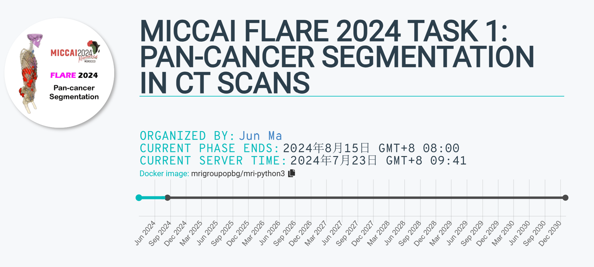
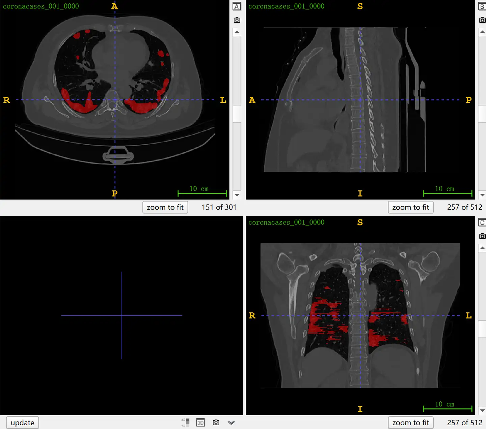

# FLARE 2024 Task1

<div align="center">
    <a href="https://github.com/openmedlab/"></a>
</div>
<p style="text-align:center;font-size:10px;"><em></em></p>

## Dataset Information

The FLARE24 Task1 provides a large-scale CT dataset of over 10,000 cases covering the whole body and multiple types of tumors. As one of the three tasks set by MICCAI FLARE24, compared to the previous FLARE competitions (FLARE21, FLARE22, FLARE23), it not only further increases the volume of data but also expands the focus from abdominal tumors to various types of tumors throughout the body, without providing organ annotations. In the competition, FLARE24 Task1 focuses not only on segmentation accuracy (DSC, NSD) but also on the efficiency of the algorithm (runtime, memory usage).

Of the 10,000 training images provided in FLARE24 Task1, 5,000 are partially annotated (only the main lesion in each case is marked, other lesions may not be marked), and 5,000 are unannotated. In the 100 cases of the validation set and 500 cases of the test set, all tumors are marked, and the test set also includes some data from healthy individuals. The image data in FLARE24 includes multiple public datasets as follows:

The 5,000 partially annotated images provided in the FLARE24 training set are composed of the following public datasets:

```
| Dataset          | Number of Cases Used in FLARE24 |
|------------------|--------------------------------|
| COVID-19         | 209                            |
| DeepLesion       | 1093                           |
| KiTS23           | 488                            |
| LIDC             | 1010                           |
| MSD              | 892                            |
| TCIA-Adrenal     | 52                             |
| TCIA-LymphNodes  | 176                            |
| TCIA-NSCLC       | 581                            |
| AutoPET          | 500                            |
```

The 5000 unannotated images provided in the FLARE24 training set come from the following public datasets:

| Dataset | Number in FLARE24 Unannotated Data |
|---------|------------------------------------|
| AMOS    | 2350                               |
| DeepLesion | 750                              |
| MELA    | 880                                |
| MSD     | 506                                |
| AutoPET | 514                                |

## Dataset Meta Information

| Dimensions | Modality | Task Type    | Anatomical Structures | Anatomical Area | Number of Categories | Data Volume | File Format |
|------------|----------|--------------|-----------------------|-----------------|----------------------|-------------|-------------|
| 3D         | CT       | Segmentation | Tumor                 | Entire body       | 1                    | 10000       | .nii.gz     |

### Resolution Details

The statistics of 5000 partially annotated images are as follows:

| Dataset Statistics | spacing (mm)       | size             |
|--------------------|--------------------|------------------|
| min                | (0.31, 0.31, 0.25) | (400, 400, 7)    |
| median             | (0.8, 0.8, 3.0)    | (512, 512, 121)  |
| max                | (2.0, 2.0, 8.0)    | (796, 512, 1059) |

Number of 2D slices in the dataset: 914,541.

## Label Information Statistics

The statistics of 5000 partially annotated images are as follows:

| Metric              | Tumor   |
|---------------------|---------|
| Case Count          | 4865    |
| Coverage            | 97.3%   |
| Min Volume (cm³)    | 0.01    |
| Median Volume (cm³) | 14.19   |
| Max Volume (cm³)    | 7863.83 |

## Visualization

<div align="center">
    <a href="https://github.com/openmedlab/"></a>
</div>
<p style="text-align:center;font-size:10px;"><em></em></p>

## File Structure

The file structure of FLARE24 is divided according to the training and validation sets. The training set is split into two parts: annotated and unannotated, each containing different public datasets, with folder names composed of the public dataset name and the data volume. The specific structure is as follows:

``` 
FLARE24-Task1
│
├── Train-Labeled
│   ├── COVID-19-209
│   ├── DeepLesion-1093
│   ├── KiTS23-488
│   ├── labelsTr
│   ├── LIDC-1010
│   ├── MSD-892
│   ├── TCIA-Adrenal-52
│   ├── TCIA-LymphNodes-176
│   ├── TCIA-NSCLC-581
│   └── whole-bodyCT-500
│
├── Train-Unlabeled
│   ├── AMOS-image-Part1-750
│   ├── AMOS-image-Part2-800
│   ├── AMOS-image-Part3-800
│   ├── DeepLesion-750
│   ├── MELA-image-880
│   └── MSD-506
│
├── Validation-Hidden
│   ├── FLARE24Val_0001_0000.nii.gz
│   ├── ...
│   └── FLARE24Val_0100_0000.nii.gz
│
├── Validation-Public
│   ├── HealthyImages-noLesion
│   ├── lesion-gts
│   └── lesion-images
│
└── readme.txt
```

## Authors and Institutions

Jun Ma (University of Toronto; University Health Network; Vector Institute)

Bo Wang (University of Toronto; University Health Network; Vector Institute)

Song Gu (Nanjing Anke Medical Technology Co., Ltd.)

Yao Zhang (Shanghai Artificial Intelligence Laboratory)

Cheng Ge (Ocean University of China)

Chenyu You (Yale University)

## Source Information

Official Website: https://www.codabench.org/competitions/2319

Download Link: https://www.codabench.org/competitions/2319

Article Address: TBD

Publication Date: 2024-04

## Citation

``` 
TBD
```

Original introduction article is [here](https://zhuanlan.zhihu.com/p/710297853).