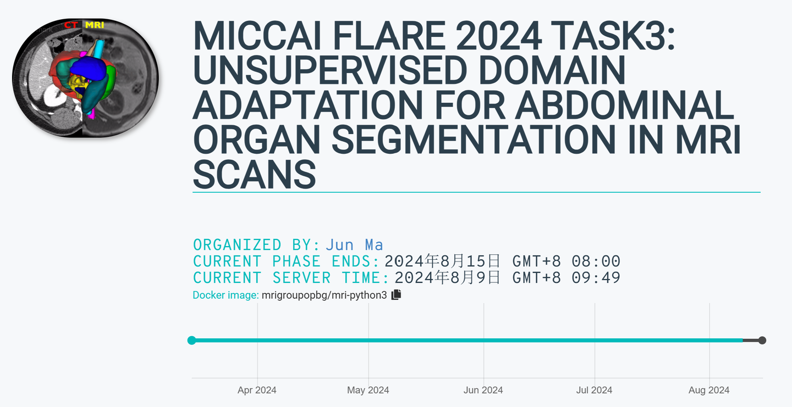
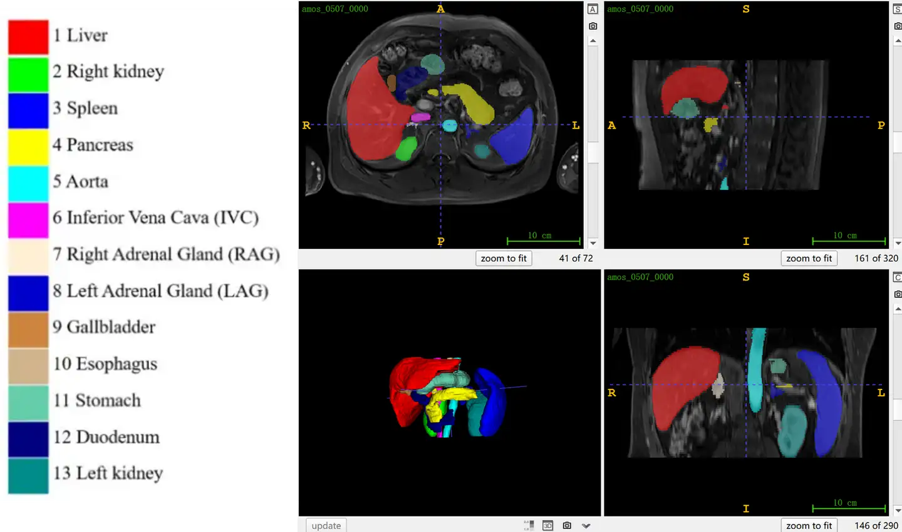

# FLARE2024 Task3

<div align="center">
    <a href="https://github.com/openmedlab/"></a>
</div>
<p style="text-align:center;font-size:10px;"><em></em></p>

## Dataset Information

**FLARE 2024 Task 3** provides over 4,000 unlabeled MRI images (833 cases from the AMOS dataset and 3,984 cases from the LLD-MMRI dataset) for model training, as well as 110 MRI cases (sourced from the AMOS dataset) as a publicly labeled validation set and 300 cases as a non-public test set. **FLARE 2024 Task 3** is an unsupervised cross-modality domain adaptation challenge for abdominal organ segmentation, part of the MICCAI 2024 challenge.

The organizers provide 2,300 labeled abdominal CT scans (sourced from FLARE 2022, including 50 manually labeled cases and 2,000 pseudo-labeled cases provided by the FLARE 2022 champion) as the source domain, while the unlabeled MRI scans are used as the target domain. The challenge for participants is to develop a multi-organ MRI segmentation model using this dataset, but without relying on any MRI annotations.

Over the past decade, research on abdominal organ segmentation in CT scans has received widespread attention, but MRI, another technique commonly used for diagnosing abdominal diseases, has been relatively underexplored. One of the main reasons for this is the lack of labeled abdominal MRI scans within the community. In contrast, there are a large number of labeled or high-quality pseudo-labeled CT scans available, and it is relatively easy to collect unlabeled MRI scans. Therefore, it is significant to develop MRI abdominal multi-organ segmentation algorithms that utilize the abundance of labeled CT images and a large number of unlabeled MRI images.

## Dataset Meta Information

| Dimensions | Modality | Task Type | Anatomical Structures | Anatomical Area | Number of Categories | Data Volume          | File Format |
|------------|----------|-----------|-----------------------|-----------------|----------------------|----------------------|-------------|
| 3D         | MRI      | Segmentation | 13 organs             | Abdomen         | 13                   | 4817 (No Annotation) | .nii.gz     |


### Resolution Details

4817 unlabeled training sets:

| Dataset Statistics | spacing (mm)        | size              |
|--------------------|---------------------|-------------------|
| min                | (0.30, 0.30, 0.80)  | (160, 160, 4)     |
| median             | (0.78, 0.78, 6)     | (448, 448, 35)    |
| max                | (2.27, 2.27, 27.5)  | (1024, 1024, 160) |

110 public validation sets:

| Dataset Statistics | spacing (mm)       | size               |
|--------------------|--------------------|--------------------|
| min                | (0.36, 0.36, 0.82) | (192, 60, 30)      |
| median             | (1.11, 1.11, 3.0)  | (336, 290, 72)     |
| max                | (1.95, 3.0, 7.8)   | (1024, 1024, 512)  |

## Label Information Statistics

| Anatomical Structure             | Number of Occurrences | Percentage of Occurrences | Minimum Volume (cm³) | Median Volume (cm³) | Maximum Volume (cm³) |
|----------------------------------|-----------------------|---------------------------|-----------------------|----------------------|-----------------------|
| 1. Liver                         | 110                   | 100%                      | 763                   | 1201                 | 2389                  |
| 2. Right kidney                  | 110                   | 100%                      | 76                    | 135                  | 368                   |
| 3. Spleen                        | 110                   | 100%                      | 59                    | 189                  | 635                   |
| 4. Pancreas                      | 110                   | 100%                      | 29                    | 74                   | 142                   |
| 5. Aorta                         | 110                   | 100%                      | 21                    | 70                   | 264                   |
| 6. Inferior vena cava            | 110                   | 100%                      | 21                    | 43                   | 103                   |
| 7. Right adrenal gland           | 109                   | 99.09%                    | 0.48                  | 2                    | 5                     |
| 8. Left adrenal gland            | 110                   | 100%                      | 0.3                   | 3                    | 10                    |
| 9. Gallbladder                   | 102                   | 92.73%                    | 1.67                  | 26                   | 75                    |
| 10. Esophagus                    | 110                   | 100%                      | 0.93                  | 8                    | 19                    |
| 11. Stomach                      | 110                   | 100%                      | 29                    | 176                  | 315                   |
| 12. Duodenum                     | 110                   | 100%                      | 17                    | 41                   | 114                   |
| 13. Left kidney                  | 110                   | 100%                      | 22                    | 139                  | 225                   |

## Visualization

<div align="center">
    <a href="https://github.com/openmedlab/"></a>
</div>
<p style="text-align:center;font-size:10px;"><em></em></p>

## File Structure

``` 
FLARE24-Task3-MR
│
├── Training
│   ├── AMOS_MR_good_spacing-833
│   └── LLD-MMRI-3984
│
├── PublicValidation
│   ├── imagesVal
│   ├── labelsVal
│   └── readme.txt
│
└── T3-MRI-ReadMe.docx
```

## Authors and Institutions

Jun Ma (University of Toronto; University Health Network; Vector Institute)

Bo Wang (University of Toronto; University Health Network; Vector Institute)

Song Gu (Nanjing Anke Medical Technology Co., Ltd.)

Yao Zhang (Shanghai Artificial Intelligence Laboratory)

Cheng Ge (Ocean University of China)

Chenyu You (Yale University)

## Source Information

Official Website: https://www.codabench.org/competitions/2296/

Download Link: https://www.codabench.org/competitions/2296/

Article Address: TBD

Publication Date: 2024-04

## Citation

``` 
TBD
```

Original introduction article is [here](https://zhuanlan.zhihu.com/p/713610345).