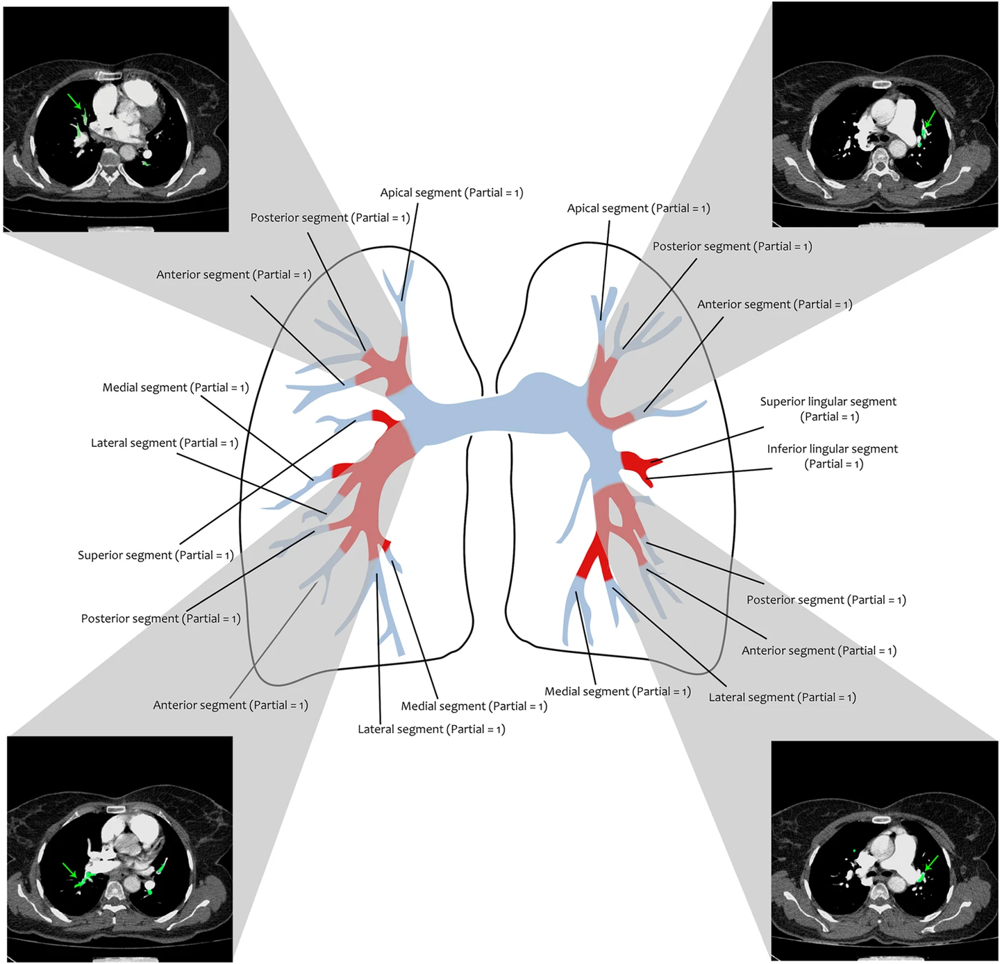
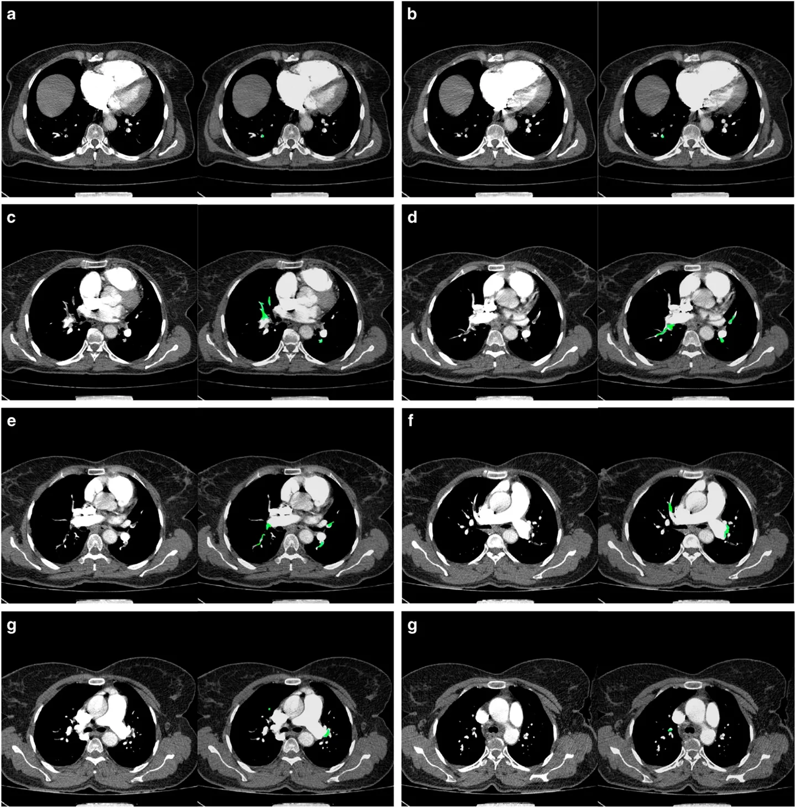
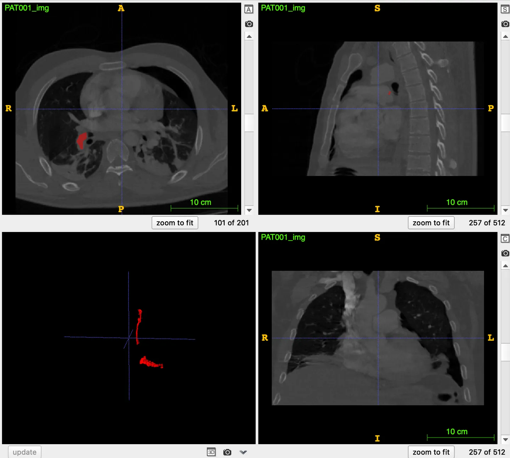

# FUMPE

<div align="center">
    <a href="https://github.com/openmedlab/"></a>
</div>
<p style="text-align:center;font-size:10px;"><em></em></p>

## Dataset Information

The FUMPE (Ferdowsi University of Mashhad's Pulmonary Embolism) dataset is a collection of images for segmenting pulmonary embolism (PE) regions in computed tomography angiography (CTA) images, including images from 35 different patients. Pulmonary Embolism (PE) is a condition where a substance from another part of the body (usually in the form of a blood clot) travels through the bloodstream and blocks the arteries in the lungs. Each reference image in the dataset has been annotated by two radiology experts using semi-automatic image processing software tools. This dataset aims to provide researchers with resources to develop and test computer-aided detection (CAD) systems for pulmonary embolism.

## Dataset Meta Information

| Dimensions | Modality | Task Type | Anatomical Structures | Anatomical Area | Number of Categories | Data Volume | File Format |
|------------|----------|-----------|-----------------------|----------------|----------------------|-------------|-------------|
| 3D         | CT       | Segmentation | Lung                  | Chest          | 1                    | 35          | .nii.gz     |

Number of slices based on the publicly available 35 training sets: 8792.

### Resolution Details

| Dataset Statistics | spacing (mm)     | size             |
|--------------------|------------------|------------------|
| min                | (0.5215, 0.5215, 0.5)              | (512, 512, 139)  |
| median             | (0.6348, 0.6348, 1.0)           | (512, 512, 217)  |
| max                | (0.7852, 0.7852, 1.5)              | (512, 512, 475)  |

## Label Information Statistics

| Segmentation Class | pulmonary embolism |
|--------------------|-----------------------|
| Case Count         | 33                    |
| Detection Rate     | 94.29%                |
| Min Volume (cm³)   | 0.3                   |
| Median Volume (cm³)| 6.64                  |
| Max Volume (cm³)   | 62.23                 |

## Visualization

<div align="center">
    <a href="https://github.com/openmedlab/"></a>
</div>
<p style="text-align:center;font-size:10px;"><em> Paper Visualization.</em></p>

<div align="center">
    <a href="https://github.com/openmedlab/"></a>
</div>
<p style="text-align:center;font-size:10px;"><em> ITK-SNAP Visualization.</em></p>

## File Structure

``` 
FUMPE
│
├── imagesTr
│   ├── PAT001.nii.gz
│   ├── ...
├── labelsTr
│   ├── PAT001.nii.gz
│   ├── ...
```

## Authors and Institutions

Mojtaba Masoudi (National Oceanography Centre, UK)

Mahdi Saadatmand-Tarzjan (Ferdowsi University of Mashhad)


## Source Information

Official Website: https://figshare.com/collections/FUMPE/4107803/1

Download Link: https://www.kaggle.com/datasets/andrewmvd/pulmonary-embolism-in-ct-images

Article Address: https://www.nature.com/articles/sdata2018180

Publication Date: September, 2018.

## Citation

``` 
@article{masoudi2018,
    title={A new dataset of computed-tomography angiography images for computer-aided detection of pulmonary embolism},
    author={Mojtaba Masoudi and Hamid-Reza Pourreza and Mahdi Saadatmand-Tarzjan and Noushin Eftekhari and Fateme Shafiee Zargar and Masoud Pezeshki Rad},
    journal={Scientific Data},
    volume={5},
    article number={180180},
    year={2018},
    publisher={Nature Publishing Group}
}
```

Original introduction article is [here](https://zhuanlan.zhihu.com/p/658215941).
