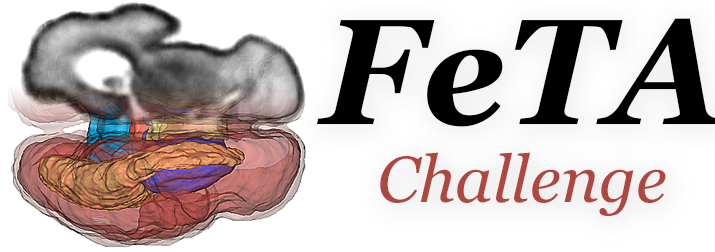
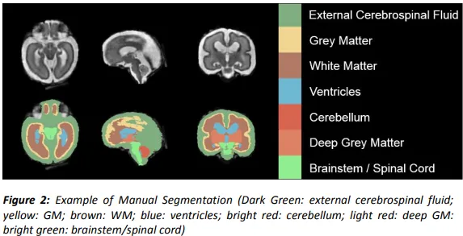
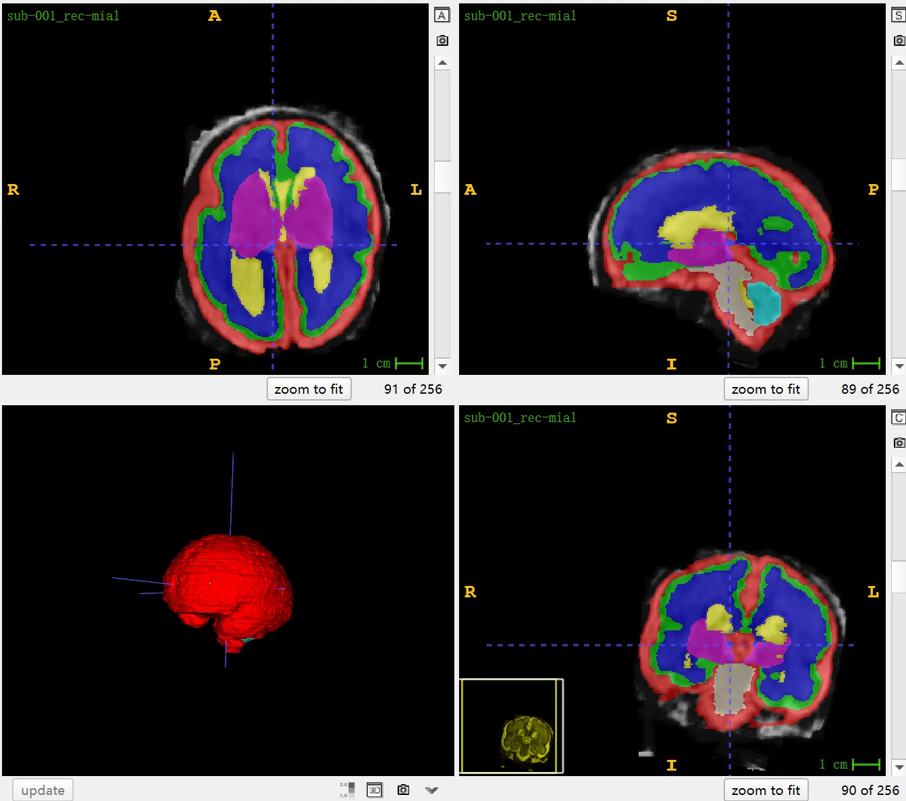

# FeTA

<div align="center">
    <a href="https://github.com/openmedlab/"></a>
</div>
<p style="text-align:center;font-size:10px;"><em></em></p>

## Dataset Information

FeTA 2022 (Fetal Tissue Annotation and Segmentation Challenge) is a medical imaging competition dedicated to the reconstruction and segmentation of the fetal brain. The FeTA dataset has hosted two competitions at MICCAI 2021 and MICCAI 2022, and compared to FeTA 2021, which provided single-center data for training and testing, FeTA 2022 focuses more on the generalizability and cross-center applicability of algorithms. FeTA 2022 offers 120 cases of T2-weighted fetal brain MRI reconstruction data from two different medical institutions, complete with manual segmentation labels for seven different brain tissues. In addition, the test dataset includes data from these two institutions as well as two other institutions not featured in the training set, with each institution providing 40 cases, totaling 160 test cases. Through this design, FeTA 2022 aims to promote the application of deep learning algorithms on multi-center, diverse data to improve the accuracy of diagnosis and treatment of fetal brain diseases.

Congenital diseases are one of the leading causes of infant mortality globally, and in utero Magnetic Resonance Imaging (MRI) of the fetal brain has become a key tool for studying these diseases and fetal neurodevelopment. In fetal brain MRI data, automatic segmentation and quantification of the complex and rapidly changing brain morphology can improve the diagnostic process and reduce the human error and time consumption of manual segmentation. However, the implementation of this technology faces many challenges, such as image quality issues caused by the movement of the fetus and mother, as well as changes in the physiological state and structure of the brain during prenatal development. Moreover, compared to normal fetuses, the brain structure of abnormal fetuses often exhibits different morphologies, increasing the difficulty of automatic identification.

## Dataset Meta Information

| Dimensions | Modality | Task Type | Anatomical Structures | Anatomical Area | Number of Categories | Data Volume | File Format |
|------------|----------|-----------|-----------------------|-----------------|----------------------|-------------|-------------|
| 3D         | MR       | Segmentation | 7 Brain Tissues       | Brain           | 7                    | 280         | .nii.gz     |


### Resolution Details

| Dataset Statistics | spacing (mm)       | size            |
|--------------------|--------------------|-----------------|
| min                | (0.43, 0.43, 0.43) | (256, 256, 256)     |
| median             | (0.50, 0.50, 0.50) | (256, 256, 256) |
| max                | (1.0, 1.0, 1.0)    | (256, 256, 256) |

Number of two-dimensional slices in the dataset: 30,720 (based on statistics from 120 training cases).

## Label Information Statistics

| Label | Anatomical Structure            | Cases | Coverage | Mean Volume (cm³) | Median Volume (cm³) | Max Volume (cm³) |
|-------|---------------------------------|-------|----------|-------------------|---------------------|------------------|
| 1     | External Cerebrospinal Fluid    | 120   | 100.00%  | 0.83              | 60.79               | 197.17           |
| 2     | Grey Matter                     | 120   | 100.00%  | 3.93              | 29.12               | 93.88            |
| 3     | White Matter                    | 120   | 100.00%  | 13.89             | 61.5                | 150.14           |
| 4     | Ventricles                      | 120   | 100.00%  | 2.42              | 8.04                | 127.41           |
| 5     | Cerebellum                      | 120   | 100.00%  | 0.74              | 3.82                | 15.91            |
| 6     | Deep Grey Matter                | 120   | 100.00%  | 0.54              | 7.91                | 21.14            |
| 7     | Brainstem                       | 120   | 100.00%  | 0.43              | 3.25                | 8.04             |


## Visualization

<div align="center">
    <a href="https://github.com/openmedlab/"></a>
</div>
<p style="text-align:center;font-size:10px;"><em> Visualization from paper. </em></p>

<div align="center">
    <a href="https://github.com/openmedlab/"></a>
</div>
<p style="text-align:center;font-size:10px;"><em> ITK-SNAP Visualization. </em></p>

## File Structure

The FeTA dataset file structure follows the BIDS format, with each subject's folder containing the reconstructed T2-weighted fetal brain images for that subject, 
along with manually created segmentations containing labels for 7 types of tissues (external cerebrospinal fluid, grey 
matter, white matter, ventricles, cerebellum, deep grey matter, and brainstem). Each `sub-0XX` or `sub-0YY` folder represents a different subject, where XX and YY are the subject's identifiers. The `anat` subfolder within each subject's folder contains the reconstructed T2-weighted fetal brain images and the corresponding segmentation files. Each image file is accompanied by a JSON file providing relevant metadata information.

``` 
FeTA_2.1
│
├── sub-0XX
│   └── anat
│       ├── sub-0XX_rec-mial_T2w.nii.gz (T2-weighted fetal brain reconstructed using mial super-resolution.)
│       ├── sub-0XX_rec-mial_T2w.json
│       ├── sub-0XX_rec-mial_dseg.nii.gz (Manual segmentation of T2-weighted fetal brain reconstruction)
│       └── sub-0XX_rec-mial_dseg.json
│
└── sub-0YY
    └── anat
        ├── sub-0YY_rec-irtk_T2w.nii.gz (T2-weighted fetal brain reconstructed using irtk super-resolution)
        ├── sub-0YY_rec-irtk_T2w.json
        ├── sub-0YY_rec-irtk_dseg.nii.gz (Manual segmentation of T2-weighted fetal brain reconstruction)
        └── sub-0YY_rec-irtk_dseg.json
```

## Authors and Institutions

Kelly Payette (University of Zurich and University Children's Hospital Zurich, Switzerland)

Priscille de Dumast (University of Lausanne, Switzerland)

Andras Jakab (University of Zurich and University Children's Hospital Zurich, Switzerland)

Meritxell Bach Cuadra (University of Lausanne, Switzerland)

Roxane Licandro (Vienna University of Technology and Medical University of Vienna, Austria)

Hongwei (Bran) Li (Technical University of Munich, Germany)

Lana Vasung (Harvard Medical School, USA)

Matthew Barkovich (University of California, San Francisco, UCSF Benioff Children's Hospital, USA)

Céline Steger (University of Zurich and University Children's Hospital Zurich, Switzerland)


## Source Information

Official Website: https://feta.grand-challenge.org/

Download Link: https://feta.grand-challenge.org/data-download/

Article Address: https://arxiv.org/ftp/arxiv/papers/2010/2010.15526.pdf, https://www.nature.com/articles/s41597-021-00946-3

Publication Date: 2021.

## Citation

``` 
@article{payette2021automatic,
  title={An automatic multi-tissue human fetal brain segmentation benchmark using the fetal tissue annotation dataset},
  author={Payette, Kelly and de Dumast, Priscille and Kebiri, Hamza and Ezhov, Ivan and Paetzold, Johannes C and Shit, Suprosanna and Iqbal, Asim and Khan, Romesa and Kottke, Raimund and Grehten, Patrice and others},
  journal={Scientific data},
  volume={8},
  number={1},
  pages={167},
  year={2021},
  publisher={Nature Publishing Group UK London}
}
```

Original introduction article is [here](https://zhuanlan.zhihu.com/p/668608834).
