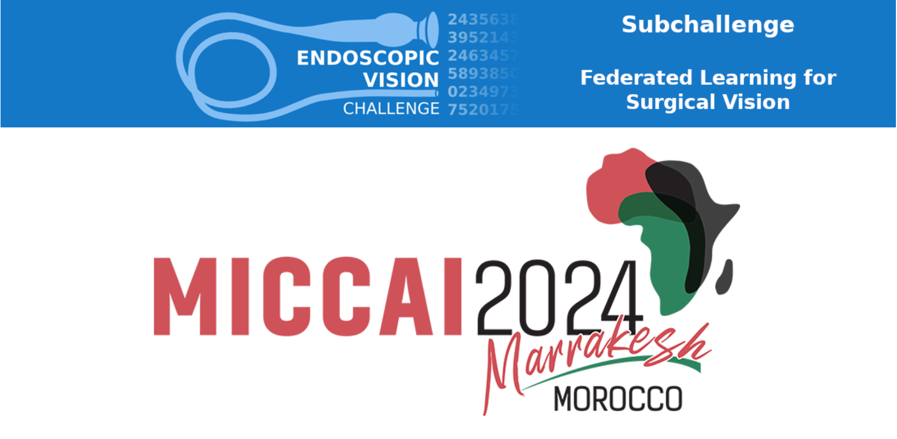
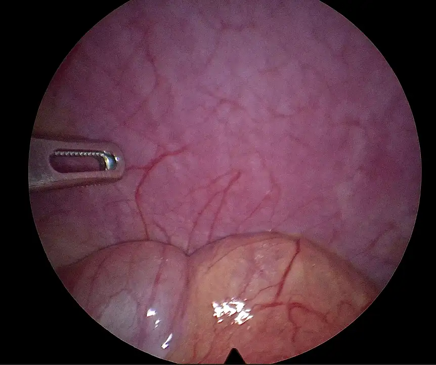
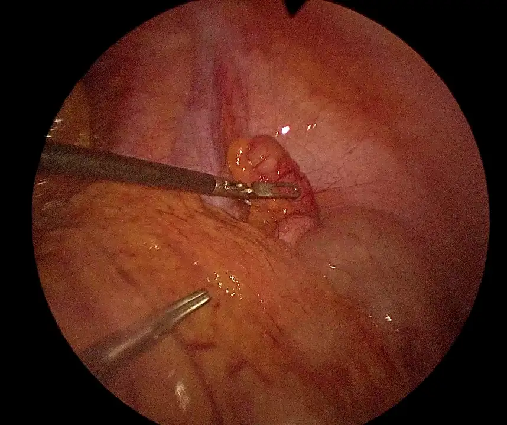
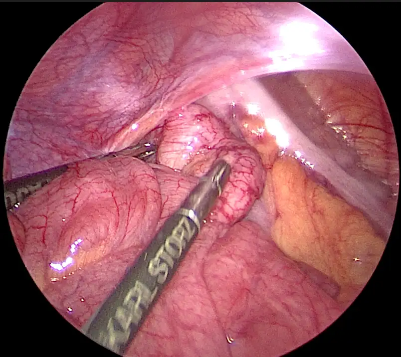
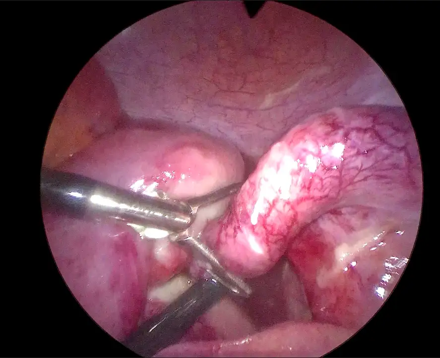
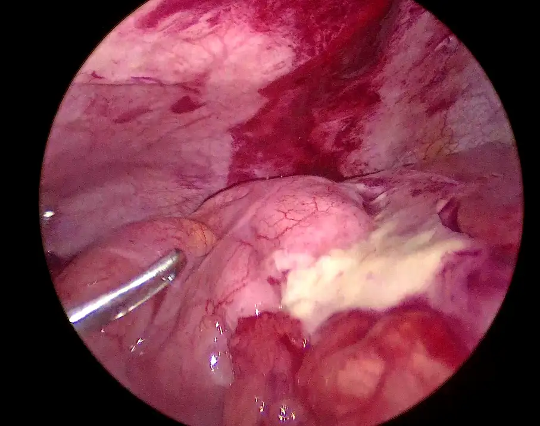
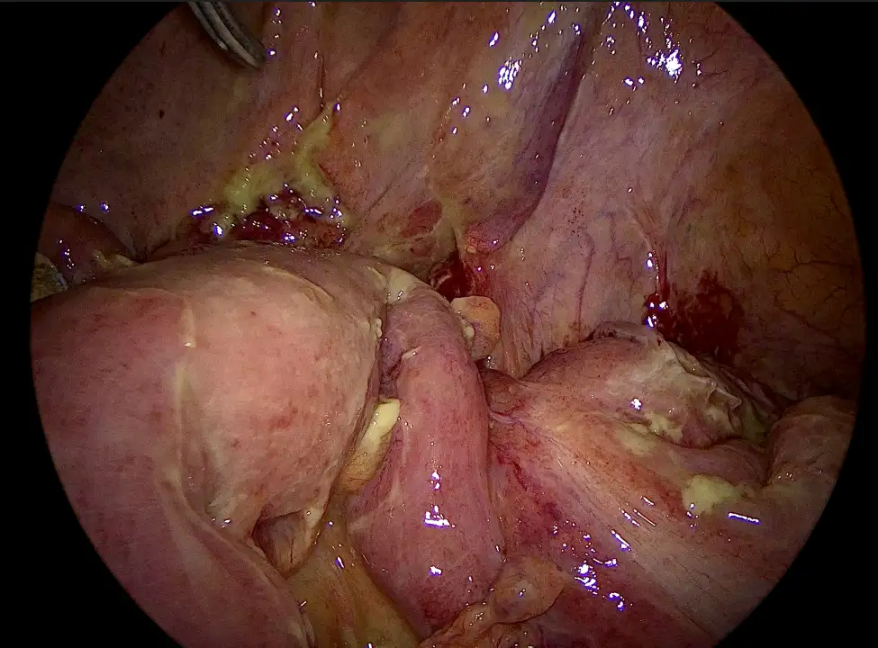

# FedSurg

<div align="center">
    <a href="https://github.com/openmedlab/"></a>
</div>
<p style="text-align:center;font-size:10px;"><em></em></p>

## Dataset Information

Medical datasets are typically collected from real clinical settings, and in order to protect patient privacy, these data often cannot be shared between institutions. Federated learning aims to train models by sharing model weights without exposing raw patient data. The FedSurg2024 competition aims to evaluate different federated learning approaches in surgical video analysis based on a new dataset of laparoscopic appendectomy videos. The main challenge of the competition is to accurately classify the severity of appendicitis in laparoscopic appendectomy videos, in addition to addressing issues of privacy and data management in surgical data. The dataset provides a total of 30 appendectomy videos from 3 centers, with corresponding severity labels of appendicitis for each video, encompassing 6 types of severity levels. The dataset samples each video at a frame rate of 2 FPS, storing each frame as an image.

Laparoscopic appendectomy is a common surgical procedure used to treat appendicitis. Classifying these videos is important for several reasons. First, it allows for the categorization of surgical techniques, helping to identify best practices and improve surgical skills. Second, accurate classification supports the development of automated surgical assistance systems, providing real-time feedback to surgeons and enhancing surgical outcomes. Lastly, a comprehensive understanding of laparoscopic appendectomy videos aids in advancing surgical education and training programs. The competition primarily evaluates the performance of different federated learning methods in this specific task. The competition not only aims to address privacy concerns but also to advance the field of surgical video analysis, ultimately improving patient care and surgical practice.

## Dataset Meta Information

| Dimensions | Modality     | Task Type            | Anatomical Structures | Anatomical Area | Number of Categories | Data Volume | File Format |
|------------|--------------|----------------------|-----------------------|-----------------|----------------------|-------------|-------------|
| 2D         | Laparoscopy  | Video Classification | Appendix              | Abdomen         | 6                    | 30          | PNG         |


### Resolution Details

| Dataset Statistics | size         |
|--------------------|--------------|
| min                | (1920, 1080) |
| median             | (1920, 1080) |
| max                | (1920, 1080) |

## Label Information Statistics

Due to competition regulations, the specific number of occurrences and proportions of each category are not shown here.

| Label | Description                                                                  |
|-------|------------------------------------------------------------------------------|
| 0     | Normal looking appendix                                                      |
| 1     | Redness and edema                                                            |
| 2     | Fibrin                                                                       |
| 3     | Segmental/partial necrosis or Base/total necrosis                            |
| 4     | Localized perityphlitic abscess or Regional peritonitis of the lower abdomen |
| 5     | Generalized/diffuse peritonitis                                              |

## Visualization

Each category only shows a frame diagram in the video.


<div align="center">
    <a href="https://github.com/openmedlab/"></a>
</div>
<p style="text-align:center;font-size:10px;"><em>0 - Normal looking appendix.</em></p>

<div align="center">
    <a href="https://github.com/openmedlab/"></a>
</div>
<p style="text-align:center;font-size:10px;"><em>1 - Redness and edema.</em></p>

<div align="center">
    <a href="https://github.com/openmedlab/"></a>
</div>
<p style="text-align:center;font-size:10px;"><em>2 - Fibrin.</em></p>

<div align="center">
    <a href="https://github.com/openmedlab/"></a>
</div>
<p style="text-align:center;font-size:10px;"><em>3 - Segmental/partial necrosis or Base/total necrosis.</em></p>

<div align="center">
    <a href="https://github.com/openmedlab/"></a>
</div>
<p style="text-align:center;font-size:10px;"><em>4 - Localized perityphlitic abscess or Regional peritonitis of the lower abdomen.</em></p>

<div align="center">
    <a href="https://github.com/openmedlab/"></a>
</div>
<p style="text-align:center;font-size:10px;"><em>5 - Generalized/diffuse peritonitis.</em></p>


## File Structure

``` 
├── center01
│   ├── Train_Private
│   │ ├── [...]
│   │    └── center01_train_private.csv
│   └── Train_Public
│   ├── 14
│   ├── 15
│   ├── 25
│   ├── 3
│   ├── 37
│   ├── 38
│   ├── 49
│   ├── 5
│   ├── 50
│   ├── 7
│   └── center_01_train_public.csv
├── center02
│   ├── Train_Private
│   │ ├── [...]
│   │   └── center02_train_private.csv
│   └── Train_Public
│   ├── 16
│   ├── 28
│   ├── 30
│   ├── 39
│   ├── 40
│   ├── 41
│   ├── 42
│   ├── 44
│   ├── 7
│   └── center02_train_public.csv
└── center03
├── Train_Private
   │ ├── [...]
│    └──center03_train_private.csv
└── Train_Public
├── 14
├── 16
├── 18
├── 19
├── 2
├── 31
├── 36
├── 56
├── 6
├── 60
├── 70
└── center03_train_public.csv
```

## Authors and Institutions

Max Kirchner (NCT Dresden)

Alexander Jenke (NCT Dresden)

Sebastian Bodenstedt (NCT Dresden)

Stefanie Speidel (NCT Dresden)

Fiona Kolbinger (Else Kröner Fresenius Center for Digital Health)

Oliver Lester Saldanha (Purdue University)

Jakob Nikolas Kather (Purdue University)

## Source Information

Official Website: https://www.synapse.org/Synapse:syn53137385/wiki/625370

Download Link: Download according to the relevant regulations of the competition.

Publication Date: 2024-05

## Citation

``` 
TBD
```

Original introduction article is [here](https://zhuanlan.zhihu.com/p/710301838).