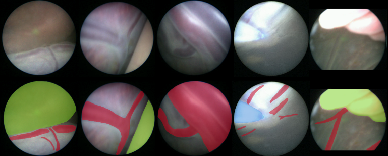
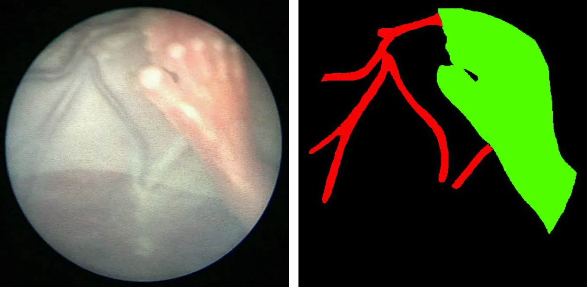
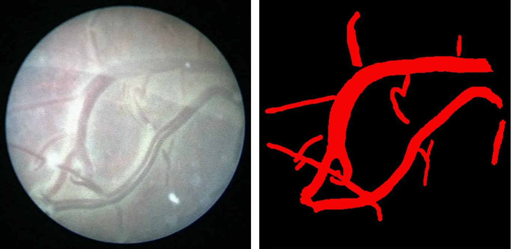
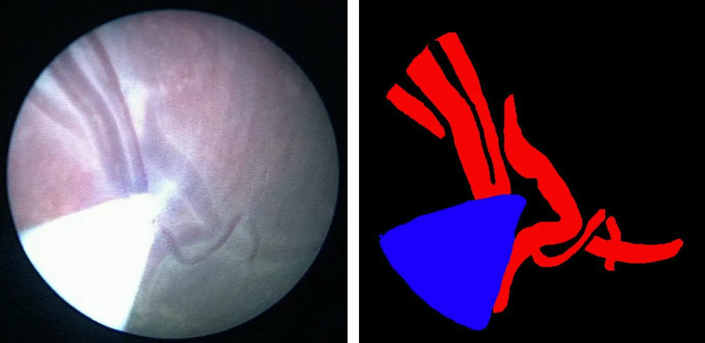

# FetReg 2021 Task1

<div align="center">
    <a href="https://github.com/openmedlab/"></a>
</div>
<p style="text-align:center;font-size:10px;"><em></em></p>

## Dataset Information

The FetReg2021 (Fetoscopy Placental Vessel Segmentation and Registration) Challenge was part of the Endoscopic Vision (EndoVis) Challenge at MICCAI 2021. The challenge released the first large-scale, multi-center dataset for fetoscopic laser photocoagulation surgeries for Twin-Twin Transfusion Syndrome (TTTS). The dataset includes 2,718 pixel-level annotated images for background, vessels, fetus, and instruments, from 24 different in vivo TTTS fetoscopic surgeries, and 24 unannotated video clips containing 9,616 frames for training and testing. The dataset facilitates the development of generic and robust algorithms for semantic segmentation and video mosaicking of long fetoscopic videos. This article mainly introduces the segmentation data of task1, Placental Semantic Segmentation. Task1 data includes three class labels: 1 for vessels, 2 for instruments, and 3 for the fetus. The training set consists of 2,060 images, and the test set consists of 658 images. Since the fetoscopy videos were recorded at different centers using different devices (e.g., endoscopes), image resolutions vary.

Fetoscopic laser photocoagulation is a method widely used to treat TTTS. The procedure is particularly challenging due to the limited field of view and maneuverability of fetoscopy, poor visibility due to turbid liquids and light source changes, and the unusual positioning of the placenta. This can lead to prolonged operation times and persistent TTTS. Computer-assisted intervention can help overcome these challenges by expanding the field of view with video mosaicking and providing better vascular graph visualization, thereby guiding surgeons to better locate the abnormal anastomoses. For this purpose, the authors introduced the first large-scale multi-center dataset for fetoscopic laser photocoagulation surgery, which contains pixel-level annotations of fetoscopy frames marked with three semantic labels and unannotated video segments. This dataset is particularly significant for semantic segmentation in the fetoscopy environment and the design and evaluation of endoscopic video mosaicking algorithms.

## Dataset Meta Information

| Dimensions | Modality  | Task Type | Anatomical Structures          | Anatomical Area | Number of Categories | Data Volume | File Format |
|------------|-----------|-----------|--------------------------------|-----------------|----------------------|-------------|-------------|
| 2D         | Endoscopy | Segmentation | fetus | abdomen        | 3                    | 2178        | .png        |


### Resolution Details

| Dataset Statistics | size        |
|--------------------|-------------|
| min                | [320, 320]  |
| median             | [500, 500]  |
| max                | [720, 720]  |

## Label Information Statistics

| Category | Percentage |
|----------|------------|
| background    | 100.00%    |
| blood vessels    | 99.17%     |
| tools     | 28.20%     |
| fetus   | 14.22%     |


## Visualization

- Color [0, 0, 0]: Black, representing the background.
- Color [255, 0, 0]: Red, representing blood vessels.
- Color [0, 0, 255]: Blue, representing tools.
- Color [0, 255, 0]: Green, representing the fetus.

<div align="center">
    <a href="https://github.com/openmedlab/"></a>
</div>
<p style="text-align:center;font-size:10px;"><em></em></p>

<div align="center">
    <a href="https://github.com/openmedlab/"></a>
</div>
<p style="text-align:center;font-size:10px;"><em></em></p>

<div align="center">
    <a href="https://github.com/openmedlab/"></a>
</div>
<p style="text-align:center;font-size:10px;"><em></em></p>

<div align="center">
    <a href="https://github.com/openmedlab/"></a>
</div>
<p style="text-align:center;font-size:10px;"><em></em></p>

## File Structure

The file structure of the dataset is as follows: The Train folder contains the training set data, and the Test folder contains the test set data. The images folder contains the original images, and the labels folder contains the mask images.

``` 
FetReg2021_dataset
├── Train
│   ├── Train_FetReg2021_Task1_Segmentation
│   ├── ├──Video001
│   ├── ├──├──images
│   ├── ├──├──├──Video001_frame00500.png
│   ├── ├──├──├──Video001_frame01250.png
│   ├── ├──├──├──...
│   ├── ├──├──labels
│   ├── ├──├──├──Video001_frame00500.png
│   ├── ├──├──├──Video001_frame01250.png
│   ├── ├──├──├──...
│   ├── ├──Video002
│   ├── ├──├──images
│   ├── ├──├──├──...
│   ├── ├──├──labels
│   ├── ├──├──├──...
│   ├── ├──...
├── Test
│   ├── Train_FetReg2021_Task1_Segmentation
│   ├── ├──Video010
│   ├── ├──├──images
│   ├── ├──├──├──Video010_frame0Video010_00000.png
│   ├── ├──├──├──Video010_frame0Video010_00042.png
│   ├── ├──├──├──...
│   ├── ├──├──labels
│   ├── ├──├──├──Video010_frame0Video010_00000.png
│   ├── ├──├──├──Video010_frame0Video010_00042.png
│   ├── ├──├──├──...
│   ├── ├──Video012
│   ├── ├──├──images
│   ├── ├──├──├──...
│   ├── ├──├──labels
│   ├── ├──├──├──...
│   ├── ├──...
```

## Authors and Institutions

Sophia Bano (WEISS/EPSRC Centre for Interventional and Surgical Sciences, United Kingdom)

Alessandro Casella (Department of Advanced Robotics, Istituto Italiano di Tecnologia, Italy; Department of Electronics, Information, and Bioengineering, Politecnico di Milano, Italy)

Francisco Vasconcelos (WEISS/EPSRC Centre for Interventional and Surgical Sciences, United Kingdom)

Sara Moccia (BioRobotics Institute, Scuola Superiore Sant'Anna, Italy)

George Attilakos (Fetal Medicine Unit, Elizabeth Garrett Anderson Wing, University College Hospital, United Kingdom; EGA Institute for Women’s Health, Institute of Population Health Sciences, UCL, United Kingdom)

Ruwan Wimalasundera (Fetal Medicine Unit, Elizabeth Garrett Anderson Wing, University College Hospital, United Kingdom; EGA Institute for Women’s Health, Institute of Population Health Sciences, UCL, United Kingdom)

Anna L. David (Fetal Medicine Unit, Elizabeth Garrett Anderson Wing, University College Hospital, United Kingdom; Department of Development and Regeneration, University Hospitals Leuven, Belgium; EGA Institute for Women’s Health, Institute of Population Health Sciences, UCL, United Kingdom)


## Source Information

Official Website: https://www.synapse.org/#!Synapse:syn25313156

Download Link: https://weiss-develop.cs.ucl.ac.uk/fetreg/

Article Address: https://arxiv.org/pdf/2106.05923.pdf

Publication Date: 2021-07

## Citation

``` 
@article{bano2021fetreg,
  title={FetReg: placental vessel segmentation and registration in fetoscopy challenge dataset},
  author={Bano, Sophia and Casella, Alessandro and Vasconcelos, Francisco and Moccia, Sara and Attilakos, George and Wimalasundera, Ruwan and David, Anna L and Paladini, Dario and Deprest, Jan and De Momi, Elena and others},
  journal={arXiv preprint arXiv:2106.05923},
  year={2021}
}
```

Original introduction article is [here](https://zhuanlan.zhihu.com/p/682973644).