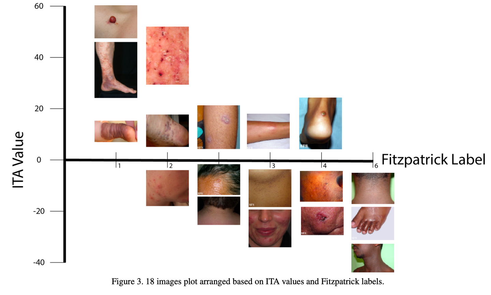

# Fitzpatrick 17k

<div align="center">
    <a href="https://github.com/openmedlab/"></a>
</div>
<p style="text-align:center;font-size:10px;"><em></em></p>

## Dataset Information

The Fitzpatrick 17k dataset consists of 16,577 dermatological images categorized by the Fitzpatrick skin type system, sourced from the open-source dermatological atlases DermaAmin and Atlas Dermatologico. It covers 114 different skin conditions, with each condition having at least 53 images and up to 653 images. Developers of this dataset have noted significant biases in existing dermatological datasets and analysis algorithms concerning skin color. The Fitzpatrick skin type system classifies human skin into six levels from 1 to 6, with higher numbers corresponding to darker skin tones. By providing detailed Fitzpatrick category labels for these images, this dataset not only advances research in dermatology but also plays a crucial role in improving the accuracy and fairness of machine learning models in diagnosing skin diseases. Additionally, this dataset is used to evaluate the fairness of algorithms across different skin types, aiming to reduce biases and enhance diagnostic outcomes for diverse populations.

<div align="center">
    <a href="https://github.com/openmedlab/"></a>
</div>
<p style="text-align:center;font-size:10px;"><em> Fitzpatrick Skin Type Grading Scale.</em></p>

## Dataset Meta Information

| Dimensions | Modality   | Task Type      | Anatomical Structures | Anatomical Area | Number of Categories | Data Volume | File Format |
|------------|------------|----------------|-----------------------|-----------------|----------------------|-------------|-------------|
| 2D         | Dermoscopy | Classification | Skin                  | Skin            | 6                    | 16577        | JPG         |


### Resolution Details

| Dataset Statistics | size            |
|--------------------|-----------------|
| min                | (66, 130)     |
| median             | (470, 541) |
| max                | (1380, 2449) |

## Label Information Statistics

The table below displays the distribution of images in the Fitzpatrick 17k dataset categorized by Fitzpatrick skin types and high-level skin condition categories. The table is divided into three main columns, each representing a different type of skin condition: Non-Neoplastic, Benign, and Malignant. The numbers under each category indicate the total number of images in that category, followed by the percentage distribution of different Fitzpatrick skin types (from Type 1 to Type 6, and Unknown) within each skin condition category.

| Skin Condition Type | Non-Neoplastic | Benign | Malignant |
|---------------------|----------------|--------|-----------|
| **# Images**        | 12,080         | 2,234   | 2,263      |
| **Type 1**          | 17.0%          | 19.9%   | 20.2%      |
| **Type 2**          | 28.1%          | 30.0%   | 32.8%      |
| **Type 3**          | 19.7%          | 21.2%   | 20.2%      |
| **Type 4**          | 17.5%          | 16.4%   | 13.3%      |
| **Type 5**          | 10.1%          | 7.1%    | 6.5%       |
| **Type 6**          | 4.4%           | 2.0%    | 2.7%       |
| **Unknown**         | 3.2%           | 3.3%    | 4.6%       |

Table 1. Distribution of skin conditions in Fitzpatrick 17k by Fitzpatrick skin type and high level skin condition categorization.

## Visualization

The image is a visualization from an official paper that displays examples for each Fitzpatrick skin type. Another method of annotating images with Fitzpatrick labels involves estimating skin color through the Individual Typology Angle (ITA), which is calculated based on statistical features of the image pixels and negatively correlates with the melanin index. Ideally, the ITA is calculated on pixels within segmented areas that highlight only the non-diseased skin.

<div align="center">
    <a href="https://github.com/openmedlab/"></a>
</div>
<p style="text-align:center;font-size:10px;"><em></em></p>

## File Structure

The dataset's file structure is as follows: images are stored in an "images" folder, and annotations for the train and validation sets are provided in txt format.

``` 
Fitzpatrick
├── image
│   ├── xxx.jpg
│   ├── xxx.jpg
│   │    ...
│   ├── xxx.jpg
│   ├── xxx.jpg
│   │    ...
├── train.txt
├── val.txt
```

## Authors and Institutions

Matthew Groh ( MIT Media Lab)

Caleb Harris ( MIT Media Lab)

Luis Soenksen ( MIT, Harvard University)

Felix Lau (San Francisco, CA)


## Source Information

Official Website: https://github.com/mattgroh/fitzpatrick17k

Download Link: https://github.com/mattgroh/fitzpatrick17k

Article Address: https://openaccess.thecvf.com/content/CVPR2021W/ISIC/papers/Groh_Evaluating_Deep_Neural_Networks_Trained_on_Clinical_Images_in_Dermatology_CVPRW_2021_paper.pdf

Publication Date: 2021

## Citation

``` 
@inproceedings{groh2021evaluating,
  title={Evaluating deep neural networks trained on clinical images in dermatology with the fitzpatrick 17k dataset},
  author={Groh, Matthew and Harris, Caleb and Soenksen, Luis and Lau, Felix and Han, Rachel and Kim, Aerin and Koochek, Arash and Badri, Omar},
  booktitle={Proceedings of the IEEE/CVF Conference on Computer Vision and Pattern Recognition},
  pages={1820--1828},
  year={2021}
}
@article{groh2022towards,
  title={Towards transparency in dermatology image datasets with skin tone annotations by experts, crowds, and an algorithm},
  author={Groh, Matthew and Harris, Caleb and Daneshjou, Roxana and Badri, Omar and Koochek, Arash},
  journal={Proceedings of the ACM on Human-Computer Interaction},
  volume={6},
  number={CSCW2},
  pages={1--26},
  year={2022},
  publisher={ACM New York, NY, USA}
}
```

Original introduction article is [here](https://zhuanlan.zhihu.com/p/692787106).