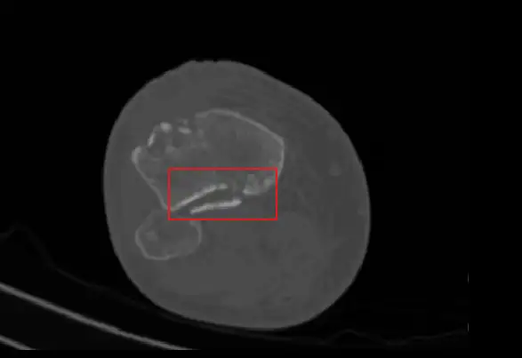
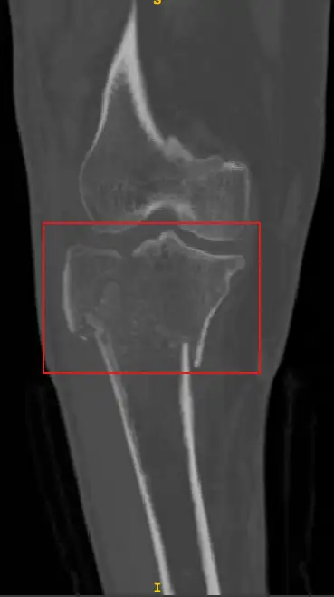

# Fractured Bone Detection

<div align="center">
    <a href="https://github.com/openmedlab/"></a>
</div>
<p style="text-align:center;font-size:10px;"><em></em></p>

## Dataset Information

**The Fractured Bone Detection Challenge** dataset is a 3D dataset for classifying fractures in CT modality. It is part of a Kaggle competition. The dataset includes a total of 24 CT scans, encompassing 5,567 anonymous CT slices. The task labels indicate whether the 2D slices along the z-axis of the 3D data contain fractures. Fractures are common clinical injuries, and timely and accurate diagnosis is crucial for patient treatment and recovery. However, manual inspection of X-rays is not only time-consuming but also prone to subjective factors from the examiner, leading to misdiagnosis or missed diagnosis. Therefore, developing an automated fracture detection system that can enhance diagnostic efficiency and accuracy, and reduce the burden on medical personnel, is highly meaningful.

Through this challenge, participants can leverage advanced deep learning and computer vision technologies to train high-precision fracture detection models. These models can serve as auxiliary tools for doctors in practical clinical applications, helping them quickly identify fractures and improve diagnostic accuracy and efficiency. Additionally, this challenge provides a platform for researchers and developers to advance medical image processing technologies, promote the widespread application of medical AI, and ultimately benefit patients and the healthcare industry.

## Dataset Meta Information

| Dimensions | Modality | Task Type      | Anatomical Structures    | Anatomical Area | Number of Categories | Data Volume         | File Format |
|----------|----------|----------------|--------------------------|-----------------|----------------------|---------------------|-------------|
| 3D       | CT       | Classification | Upper limbs, Lower limbs | Bones           | 2                    | 24 (5567 2D Slices) | .dcm        |


### Resolution Details

Since the data labels are at the 2D slice level, the size of the 2Dslice on the z axis is now counted.

| Dataset Statistics | size        |
|--------------------|-------------|
| min                | (512, 512)  |
| median             | (512, 512)  |
| max                | (512, 512)  |

Number of 2D slices in the dataset: 5567

## Label Information Statistics

| Structure        | Fractured Slices | Non-Fractured Slices |
|------------------|------------------|----------------------|
| Occurrences      | 993              | 3358                 |
| Occurrence Ratio | 22.82%           | 77.18%               |


## Visualization

<div align="center">
    <a href="https://github.com/openmedlab/"></a>
</div>
<p style="text-align:center;font-size:10px;"><em>In the z-axis direction, the red frame is the fractured part.</em></p>

<div align="center">
    <a href="https://github.com/openmedlab/"></a>
</div>
<p style="text-align:center;font-size:10px;"><em>In the y-axis direction, the red frame is the fractured part.</em></p>

<div align="center">
    <a href="https://github.com/openmedlab/"></a>
</div>
<p style="text-align:center;font-size:10px;"><em>In the x-axis direction, the red frame is the fractured part.</em></p>

## File Structure

The data set file includes file names such as upper limbs and lower limbs, left limbs and right limbs. The folder includes 24 CT cases, which contain 3D dcm data.

``` 
Dataset
│
├── LowerLimb
│   ├── PartLeft
│   │   ├── Case1
│   │   │   ├── 1.dcm
│   │   │   ├── 2.dcm
│   │   │   ├── ...
│   │   ├── Case2
│   │   │   ├── 1.dcm
│   │   │   ├── ...
│   │   ├── ...
│   ├── PartRight
│   │   ├── Case5
│   │   │   ├── 1.dcm
│   │   │   ├── 2.dcm
│   │   │   ├── ...
│   │   ├── Case6
│   │   │   ├── 1.dcm
│   │   │   ├── ...
├── UpperLimb
│   ├── PartLeft
│   │   ├── Case17
│   │   │   ├── 1.dcm
│   │   │   ├── 2.dcm
│   │   │   ├── ...
│   ├── PartRight
│   │   ├── Case18
│   │   │   ├── 1.dcm
│   │   │   ├── 2.dcm
│   │   │   ├── ...
│   │   ├── Case19
│   │   │   ├── 1.dcm
│   │   │   ├── ...
```

## Authors and Institutions

Anup Khanal (University of South Dakota, USA)

Siddhi Bajracharya (University of South Dakota, USA)

Rodrigue Rizk (University of South Dakota, USA)

KC Santosh (University of South Dakota, USA)

## Source Information

Official Website: https://www.kaggle.com/competitions/fractured-bone-detection-challenge/overview

Download Link: https://www.kaggle.com/competitions/fractured-bone-detection-challenge/data

Article Address: -

Publication Date: 2023-06

## Citation

``` 
@misc{fractured-bone-detection-challenge,
    author = {Anup Khanal, Applied Artificial Intelligence Lab, KC Santosh, PhD, SIddhi Kiran Bajracharya},
    title = {Fractured bone detection challenge},
    publisher = {Kaggle},
    year = {2023},
    url = {https://kaggle.com/competitions/fractured-bone-detection-challenge}
}
```

Original introduction article is [here](https://zhuanlan.zhihu.com/p/700078866).