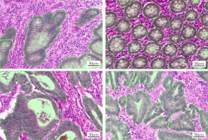
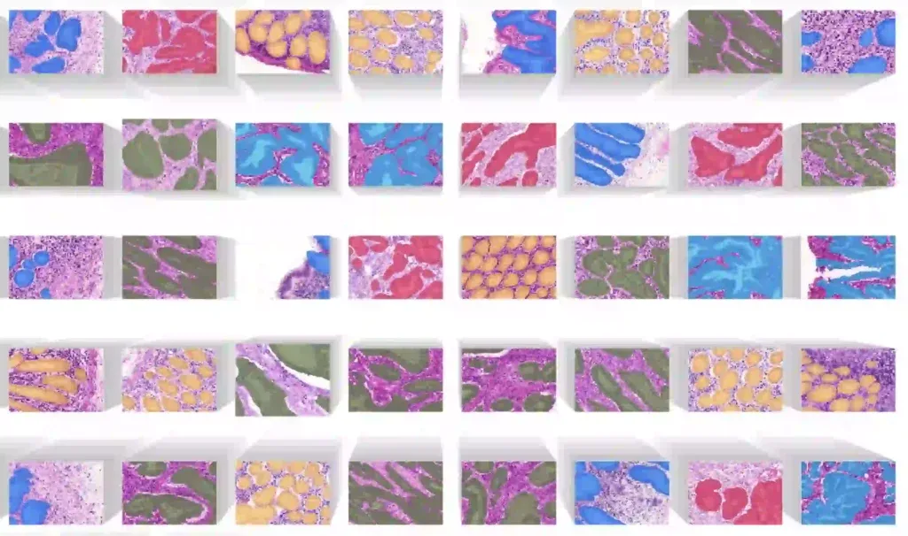

# GlaS

<div align="center">
    <a href="https://github.com/openmedlab/"></a>
</div>
<p style="text-align:center;font-size:10px;"><em></em></p>

## Dataset Information

The GlaS (Gland Segmentation) dataset is a collection of data for the segmentation task of colorectal adenomatous tissue structures. This dataset was initially released as part of the MICCAI 2015 Gland Segmentation Challenge. The aim is to develop algorithms to automatically segment gland structures in histological images. The dataset used for this challenge includes 165 images originating from 16 H&E-stained histological sections representing T3 or T4 stage colorectal adenocarcinomas. Each section comes from a different patient and the sections were processed in the lab at different times. As a result, this dataset exhibits a high degree of inter-individual variability in staining distribution and tissue structure. These histological sections were digitized into whole slide images (WSIs) using a Zeiss MIRAX MIDI slide scanner, with a pixel resolution of 0.465 micrometers.

## Dataset Meta Information

| Dimensions | Modality  | Task Type    | Anatomical Structures | Anatomical Area | Number of Categories | Data Volume               | File Format |
|------------|-----------|--------------|-----------------------|-----------------|----------------------|---------------------------|-------------|
| 2D         | Pathology | Segmentation | Colorectal                  | Glands          | 1                    | 85 for train, 80 for test | .bmp        |


### Resolution Details

| Dataset Statistics | size         |
|--------------------|--------------|
| min                | (522, 775)   |
| median             | (522, 775)   |
| max                | (522, 775)   |


## Label Information Statistics

| Category    | Gland (Gland Segmentation) |
|-------------|----------------------------|
| Image count | 1530*                      |
| Coverage    | 100% (relative to 38.74%)  |
| Small gland | 1                          |
| Medium gland| 11172                      |
| Large gland | 358105                     |

`*`: There are multiple glands in one picture.

## Visualization

<div align="center">
    <a href="https://github.com/openmedlab/"></a>
</div>
<p style="text-align:center;font-size:10px;"><em> Dataset Visualization (https://datasets.activeloop.ai/wp-content/uploads/2022/09/GlaS-dataset-visualization-on-activeloop-platform-1024x606.webp).</em></p>

## File Structure

Introduce file structure of original dataset folder.

Take representative MSD dataset for example:

``` 
Glas  Dataset
|   |-- train_1.bmp
|   |-- train_1_anno.bmp
|   |-- testA_1.bmp
|   |-- testA_1_anoo.bmp
|   |-- ...
|
```

## Authors and Institutions

The data was primarily obtained from the team of pathologists at University Hospital Coventry and Warwickshire in the UK.

The main contributor is Korsuk Sirinukunwattana from the Department of Computer Science at the University of Warwick.


## Source Information

Official Website: https://warwick.ac.uk/services/gov/calendar/section2/regulations/computing/

Download Link: https://academictorrents.com/details/208814dd113c2b0a242e74e832ccac28fcff74e5

Article Address: https://www.sciencedirect.com/science/article/pii/S1361841516301542

Publication Date: 2017

## Citation

``` 
@article{SIRINUKUNWATTANA2017489,
title = {Gland segmentation in colon histology images: The glas challenge contest},
journal = {Medical Image Analysis},
volume = {35},
pages = {489-502},
year = {2017},
issn = {1361-8415},
}
```

Original introduction article is [here](https://zhuanlan.zhihu.com/p/663753879).