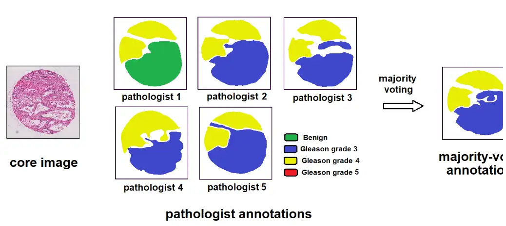
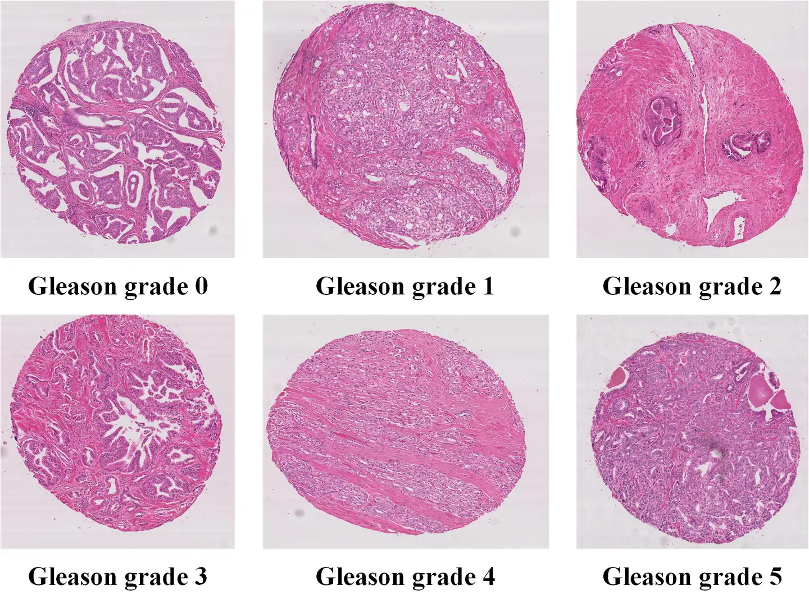

# Gleason 2019

<div align="center">
    <a href="https://github.com/openmedlab/"></a>
</div>
<p style="text-align:center;font-size:10px;"><em></em></p>

## Dataset Information

The Gleason 2019 dataset is one of the three major challenges of the MICCAI 2019 Pathology Challenge, aimed at automating Gleason grading of prostate cancer based on H&E stained histopathological images. This task is critical as the Gleason score is a potent prognostic predictor. On the other hand, it is highly challenging due to the significant heterogeneity in cellular and glandular patterns associated with each Gleason grade, leading to notable observer variability, even among pathologists. The dataset includes 331 annotated pathological images, categorized into six classes.

Gleason grading of prostate cancer is typically conducted by expert pathologists who visually inspect prostate tissues under a microscope. However, this is a time-consuming task with high inter-observer variability. Automated computer-assisted methods could potentially enhance the speed, accuracy, and repeatability of results. This challenge provides a unique dataset and evaluation framework for the crucial and challenging task of Gleason grading of prostate cancer. It aims to establish a benchmark for evaluating and comparing state-of-the-art image analysis and machine learning-based algorithms for this challenging task.

## Dataset Meta Information

| Dimensions | Modality  | Task Type      | Anatomical Structures | Anatomical Area | Number of Categories | Data Volume | File Format |
|------------|-----------|----------------|-----------------------|----------------|----------------------|-------------|-------------|
| 2D         | Pathology | Classification | Prostate              | Prostate       | 6                    | 331         | JPG         |


### Resolution Details

| Dataset Statistics | size         |
|--------------------|--------------|
| min                | (4608, 4608) |
| median             | (5096, 5004) |
| max                | (5632, 5632) |

## Label Information Statistics

| Grade | Description              | Number of Images |
|-------|--------------------------|------------------|
| 0     | Gleason grade 0: Normal  | 64               |
| 1     | Gleason grade 1: Very low| 56               |
| 2     | Gleason grade 2: Low     | 45               |
| 3     | Gleason grade 3: Medium  | 63               |
| 4     | Gleason grade 4: High    | 66               |
| 5     | Gleason grade 5: Very high| 37              |

## Visualization

<div align="center">
    <a href="https://github.com/openmedlab/"></a>
</div>
<p style="text-align:center;font-size:10px;"><em>Official Visualization.</em></p>

<div align="center">
    <a href="https://github.com/openmedlab/"></a>
</div>
<p style="text-align:center;font-size:10px;"><em>Local Visualization.</em></p>

## File Structure

The dataset file structure is as follows:

``` 
Gleason
├── image
│   ├── train
│   │   ├── xxx.jpg
│   │   ├── xxx.jpg
│   │   ├── xxx.jpg
│   │   ├── xxx.jpg
│   │   └── ...
│   └── val
│   │   ├── xxx.jpg
│   │   ├── xxx.jpg
│   │   ├── xxx.jpg
│   │   ├── xxx.jpg
│   │   └── ...
    ├── train.txt
    └── val.txt
```

## Authors and Institutions

Guy Nir (Department of Urologic Sciences, University of British Columbia, Vancouver, BC, Canada)

Soheil Hor (Department of Electrical Engineering, Stanford University, Stanford, CA, USA)

Davood Karimi (Department of Electrical and Computer Engineering, University of British Columbia, Vancouver, BC, Canada)

Ladan Fazli (Department of Urologic Sciences, University of British Columbia, Vancouver, BC, Canada)

Brian F. Skinnider (BC Cancer Agency, Vancouver, BC, Canada)

Peyman Tavassoli (Department of Pathology, Richmond Hospital, Richmond, BC, Canada)

## Source Information

Official Website: https://gleason2019.grand-challenge.org/Home/

Download Link: https://gleason2019.grand-challenge.org/Home/

Article Address: https://doi.org/10.1016/j.media.2018.09.005

Publication Date: 2019

## Citation

``` 
@article{nir2018automatic,
  title={Automatic grading of prostate cancer in digitized histopathology images: Learning from multiple experts},
  author={Nir, Guy and Hor, Soheil and Karimi, Davood and Fazli, Ladan and Skinnider, Brian F and Tavassoli, Peyman and Turbin, Dmitry and Villamil, Carlos F and Wang, Gang and Wilson, R Storey and others},
  journal={Medical image analysis},
  volume={50},
  pages={167--180},
  year={2018},
  publisher={Elsevier}
}
```

Original introduction article is [here](https://zhuanlan.zhihu.com/p/709112003).