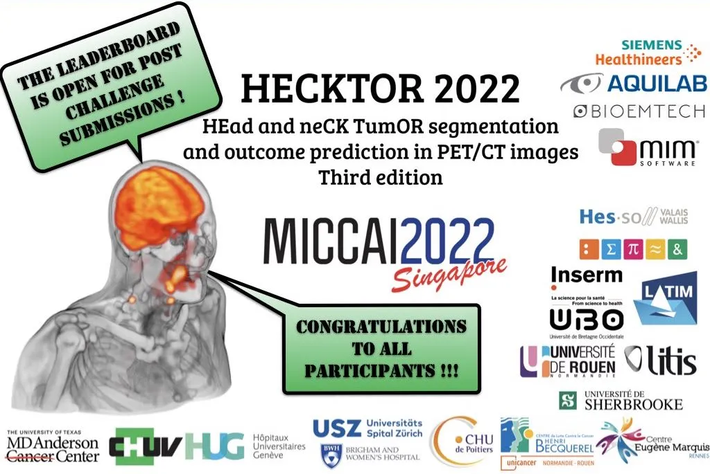
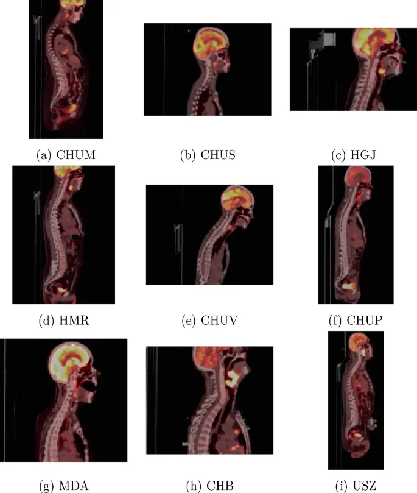
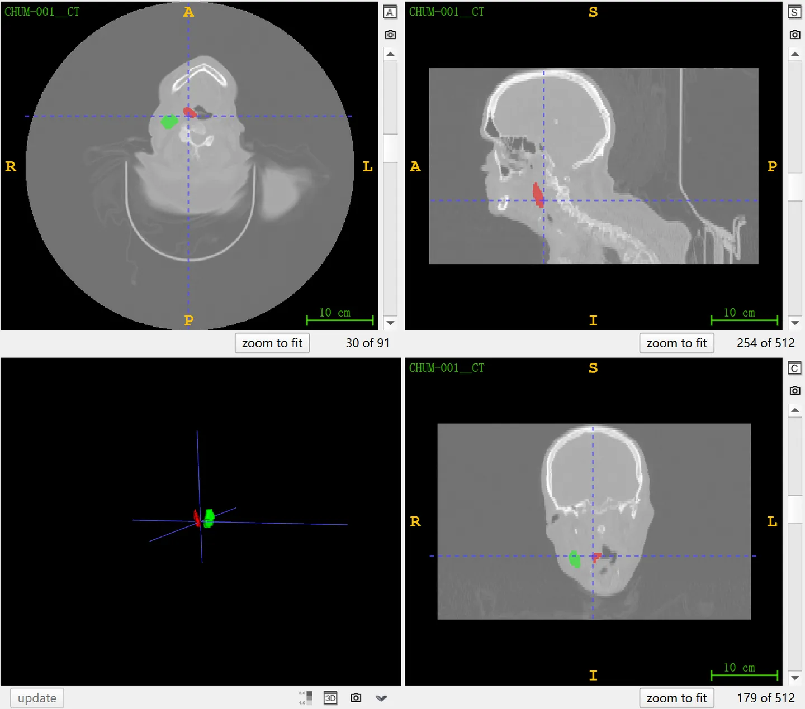
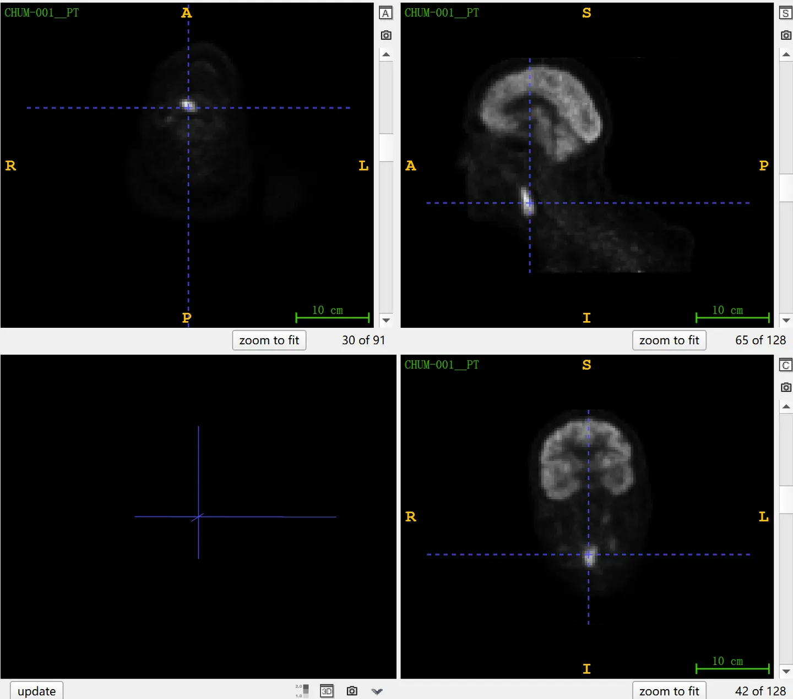

# HECKTOR 2022

<div align="center">
    <a href="https://github.com/openmedlab/"></a>
</div>
<p style="text-align:center;font-size:10px;"><em></em></p>

## Dataset Information

HECKTOR 2022 (HEad and neCK TuOR Segmentation) is a head and neck PET/CT dataset. It includes two tasks: segmentation of head and neck tumors (GTVp) and involved lymph nodes (GTVn), and prediction of patient survival without recurrence. As a challenge in MICCAI 2022, HECKTOR 2022 is a continuation of the competitions HECKTOR 2020 and HECKTOR 2021. HECKTOR 2022 comprises a total of 882 cases, with 524 and 489 cases for training in tasks 1 and 2, respectively. The training set is derived from 7 different data centers, including the test data from HECKTOR 2021. The test set contains 356 cases from 3 data centers, and all test data have never been published before. The distribution of the training and test sets is consistent with the distribution of patients diagnosed with early-stage pharyngeal cancer in reality (in the training set, about 21% of patients have recurrences, and the median recurrence-free survival time is 14 months). The preprocessing of the data includes (i) calculating the Standard Uptake Value (SUV) of PET images and (ii) converting DICOM file format to NIfTI format.

Head and neck cancer is one of the most common cancers globally (ranked fifth in terms of incidence rate) and has a high probability of recurrence after treatment. PET and CT imaging, by focusing on metabolic and morphological tissue characteristics, respectively, provide complementary and synergistic information for segmentation of cancerous lesions and tumor characteristics related to patient prognosis. To extract and utilize this information, advanced image analysis methods need to be developed, and these methods require extensive and rigorous validation. This paper primarily focuses on the segmentation task.


## Dataset Meta Information

| Dimensions | Modality | Task Type | Anatomical Structures       | Anatomical Area | Number of Categories | Data Volume | File Format |
|------------|----------|-----------|-----------------------------|-----------------|----------------------|-------------|-------------|
| 3D         | PET/CT   | Segmentation | Tumor, Lymph Node | Head and Neck   | 2                    | 882         | .nii.gz     |


### Resolution Details

### CT images in training set

| Dataset Statistics | spacing (mm)     | size            |
|--------------------|------------------|-----------------|
| min                | (0.49, 0.49, 1.0)              | (128, 128, 67)     |
| median             | (0.98, 0.98, 3.3)           | (512, 512, 135) |
| max                | (2.7, 2.7, 5.0)              | 	(512, 512, 736) |

Number of two-dimensional slices in CT images: 122,662 (based on statistics from 524 training data cases).

### PET images in training set

| Dataset Statistics | spacing (mm)    | size            |
|--------------------|-----------------|-----------------|
| min                | (2.7, 2.7, 2.0)              | 	(128, 128, 66)     |
| median             | (4.0, 4.0, 3.3)          | (128, 128, 127) |
| max                | (5.5, 5.5, 5.0)             | 	(256, 256, 543) |

Number of two-dimensional slices in PET images: 110,096 (based on statistics from 524 training data cases).

## Label Information Statistics

| Segmentation Target | GTVp (Primary Tumor) | GTVn (Involved Lymph Nodes) |
|---------------------|----------------------|-----------------------------|
| Cases               | 508                  | 464                         |
| Coverage            | 96.95%               | 88.55%                      |
| Mean Volume (cm³)   | 0.4                  | 0.2                         |
| Median Volume (cm³) | 8.2                  | 13.4                        |
| Max Volume (cm³)    | 186                  | 127                         |


## Visualization

<div align="center">
    <a href="https://github.com/openmedlab/"></a>
</div>
<p style="text-align:center;font-size:10px;"><em> Paper visualization. Fused 2D sagittal slice PET/CT images from 9 centers. </em></p>

<div align="center">
    <a href="https://github.com/openmedlab/"></a>
</div>
<p style="text-align:center;font-size:10px;"><em> ITK-SNAP visualization of CT and segmentation results. Red: Tumor, Green: Lymph Node. </em></p>

<div align="center">
    <a href="https://github.com/openmedlab/"></a>
</div>
<p style="text-align:center;font-size:10px;"><em> ITK-SNAP visualization of PET images for the same patient as in the above figure. </em></p>

## File Structure

The official file structure is as follows, with the training and test folders organized in the following format:

``` 
hecktor2022_training/
├── imagesTr
    ├── CHUM-001__CT.nii.gz
    ├── CHUM-001__PT.nii.gz
    └── ...
├── labelsTr
    ├── CHUM_001.nii.gz
    └── ...
├── hecktor2022_clinical_info_training.csv
└── hecktor2022_endpoint_training.csv

hecktor2022_testing/
├── imagesTs
    ├── USZ-001__CT.nii.gz
    ├── USZ-001__PT.nii.gz
    └── ...
└── hecktor2022_clinical_info_testing.csv
```

## Authors and Institutions

Vincent Andrearczyk (Institute of Information Systems, University of Applied Sciences of Western Switzerland, Switzerland)

Valentin Oreiller (Institute of Information Systems, University of Applied Sciences of Western Switzerland and Centre Hospitalier Universitaire Vaudois, Switzerland)

Martin Vallières (Department of Computer Science, University of Sherbrooke, Canada)

Clifton Dave Fuller (MD Anderson Cancer Center, USA)

Mohamed Naser (MD Anderson Cancer Center, USA)

Kareem Wahid (MD Anderson Cancer Center, USA)

Abdallah Mohamed (MD Anderson Cancer Center, USA)

Su Ruan (University of Rouen Normandy, France)

Pierre Decazes (Henri Becquerel Cancer Center, France)

Pierre Vera (Henri Becquerel Cancer Center, France)

Habib Zaidi (Geneva University Hospital, Switzerland)

Stephanie Tanadini-Lang (University Hospital Zurich, Switzerland)

Catherine Cheze-Le Rest (University Hospital Poitiers and University of Brest, France)

Olena Tankyevych (University Hospital Poitiers and University of Brest, France)

Hesham Elhalawani (Brigham and Women's Hospital, USA)

Joël Castelli (Centre Eugène Marquis, France)

Mario Jreige (Centre Hospitalier Universitaire Vaudois, Switzerland)

Ricardo Dias-Correia (Centre Hospitalier Universitaire Vaudois, Switzerland)

Sarah Boughdad (Centre Hospitalier Universitaire Vaudois, Switzerland)

John O. Prior (Centre Hospitalier Universitaire Vaudois, Switzerland)

Mathieu Hatt (University of Brest, France)

Adrien Depeursinge (Institute of Information Systems, University of Applied Sciences of Western Switzerland and Centre Hospitalier Universitaire Vaudois, Switzerland)


## Source Information

Official Website: https://hecktor.grand-challenge.org/

Download Link: https://hecktor.grand-challenge.org/Data/

Article Address: https://link.springer.com/book/10.1007/978-3-031-27420-6

Publication Date: June, 2022.

## Citation

``` 
@InCollection{Andrearczyk2023,
  author    = {Andrearczyk, V. and Oreiller, V. and Hatt, M. and Depeursinge, A.},
  title     = {Overview of the HECKTOR Challenge at MICCAI 2022: Automatic Head and Neck Tumor Segmentation and Outcome Prediction in PET/CT},
  booktitle = {Head and Neck Tumor Segmentation and Outcome Prediction. HECKTOR 2022. Lecture Notes in Computer Science},
  year      = {2023},
  volume    = {13626},
  publisher = {Springer},
  address   = {Cham},
  doi       = {https://doi.org/10.1007/978-3-031-27420-6_1},
  editor    = {Andrearczyk, V. and Oreiller, V. and Hatt, M. and Depeursinge, A.}
}
```

Original introduction article is [here](https://zhuanlan.zhihu.com/p/663142303).