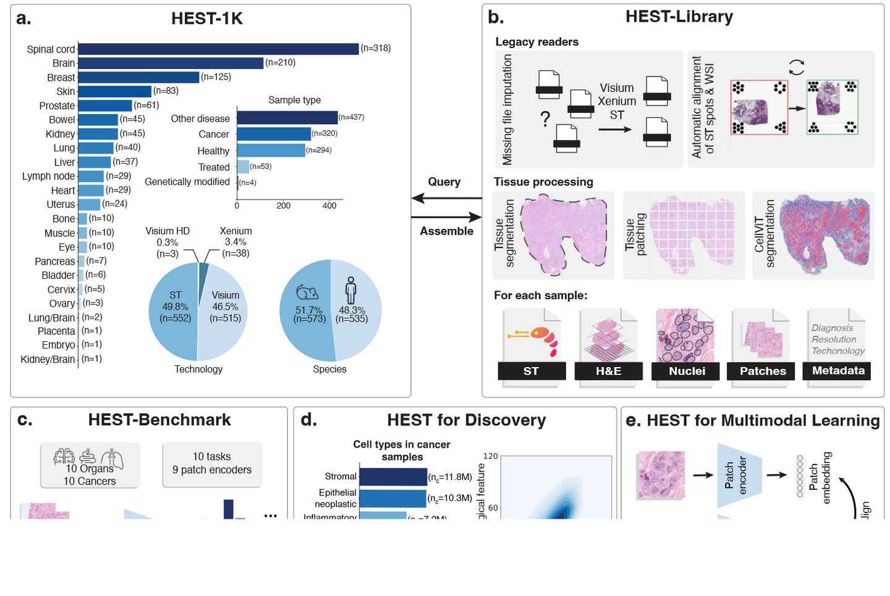
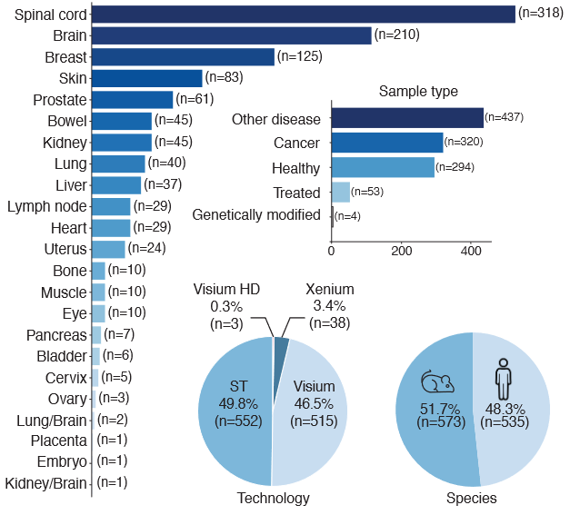

# HEST-1k

<div align="center">
    <a href="https://github.com/openmedlab/"></a>
</div>
<p style="text-align:center;font-size:10px;"><em></em></p>

## Dataset Information
HEST-1k is a novel multimodal dataset consisting of 1,108 spatial transcriptomics (ST) samples, each paired with a hematoxylin and eosin (H&E) stained whole slide image (WSI) and associated metadata. Curated from 131 publicly available and internal cohorts by the HEST-Library, this dataset spans 25 organs, two species (human and mouse), and includes 320 cancer samples across 25 cancer subtypes. Through processing, researchers have identified 1.5 million expression-morphology pairs and 60 million nuclei, making HEST-1k one of the most comprehensive datasets of its kind. Compared to earlier multimodal datasets, HEST-1k uniquely integrates rich pathological images with detailed gene expression data, while leveraging H&E-stained slides to provide broader insights into tissue morphology and its relationship to molecular characteristics.

The dataset aims to address analytical challenges in spatial transcriptomics, such as cost barriers, technological constraints, and the lack of standardization. By incorporating H&E-stained WSI, HEST-1k opens up opportunities for analyzing previously underexplored tissue morphology information. Furthermore, the dataset supports innovative applications: 

1. **HEST-Benchmark**: Offers a robust platform for benchmarking gene expression prediction models.  
2. **Biomarker Discovery**: Enables proof-of-concept experiments for biomarker identification.  
3. **Multimodal Representation Learning**: Guides foundational models to learn multimodal representations in histopathology.

HEST-1k's detailed expression-morphology pairings and extensive cellular structural data advance research into the relationship between gene expression and tissue morphology, offering higher resolution and broader applications. The high-quality multimodal data resources in HEST-1k not only accelerate computational pathology but also lay a strong foundation for personalized medicine through multimodal analyses. 

## Dataset Meta Information

| Task Type   | Language   | Number | File Format | 
|-------------|------------|--------|-------------|
| image-gene  | English    | 1108   | .json       |

## Dataset Information Statistics

| Slide | Expression–Morphology Pairs | Nuclei       | Organ | Species |
|-------|------------------------------|--------------|-------|---------|
| 1,108 | 1.5 million                 | 60 million   | 25    | 2       |


<div align="center">
    <a href="https://github.com/openmedlab/"></a>
</div>
<p style="text-align:center;font-size:10px;"><em>Dataset source information statistics.</em></p>

## Visualization

<div align="center">
    <a href="https://github.com/openmedlab/"></a>
</div>
<p style="text-align:center;font-size:10px;"><em>HEST-1k dataset display, including paired ST, H&E staining WSI and metadata.</em></p>

## File Structure

``` 
.               
├──cellvit_seg
├──metadata
├──patches
├──patches_vis
├──pixel_size_vits
├──spatial_plots
├──st
├──thumbnails
├──tissue_seg
├──transcripts
├──wsis
├──xenium_seg
```

## Authors and Institutions

Guillaume Jaume（Mass General Brigham&Harvard Medical School）

Paul Doucet（Mass General Brigham&ETH Zurich）

Andrew H. Song（Mass General Brigham&Harvard Medical School）

Ming Y. Lu（Mass General Brigham&Harvard Medical School）

Cristina Almagro-Pérez（Mass General Brigham&Harvard Medical School）

Sophia J. Wagner（Mass General Brigham&TUM&Helmholtz Munich）

Anurag J. Vaidya（Mass General Brigham&Harvard Medical School）

Richard J. Chen（Mass General Brigham&Harvard Medical School）

Drew F.K. Williamson（Emory School of Medicine）

Ahrong Kim（Pusan National University）

Faisal Mahmood（Mass General Brigham&Harvard Medical School）

## Source Information

Official Website: https://github.com/mahmoodlab/hest

Download Link: https://huggingface.co/datasets/MahmoodLab/hest/tree/main

Article Address: https://github.com/mahmoodlab/hest

Publication Date: 2024-06

## Citation

``` 
@article{jaume2024hest,
  title={Hest-1k: A dataset for spatial transcriptomics and histology image analysis},
  author={Jaume, Guillaume and Doucet, Paul and Song, Andrew H and Lu, Ming Y and Almagro-P{\'e}rez, Cristina and Wagner, Sophia J and Vaidya, Anurag J and Chen, Richard J and Williamson, Drew FK and Kim, Ahrong and others},
  journal={arXiv preprint arXiv:2406.16192},
  year={2024}
}
```

Original introduction article is [here](https://zhuanlan.zhihu.com/p/3802879765).