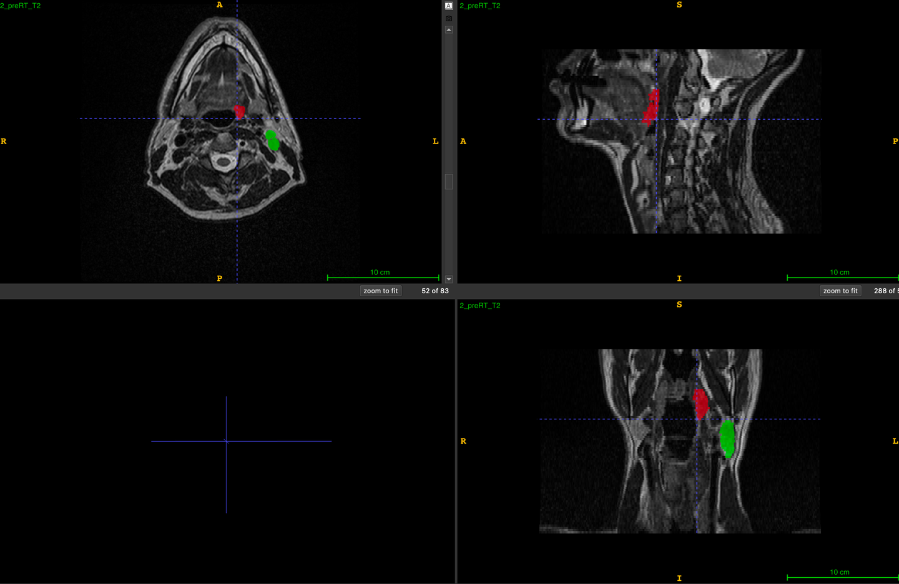

# MICCAI2024 HNTS-MRG Task1

<div align="center">
    <a href="https://github.com/openmedlab/"></a>
</div>
<p style="text-align:center;font-size:10px;"><em></em></p>

## Dataset Information

The HNTS-MRG 2024 Task1 dataset is the training data for the MICCAI 2024 HNTS-MRG Challenge Task1, a segmentation task using T2w MRI modality for delineating primary tumors (GTVp) and metastatic lymph nodes (GTVn), where data labels are: background = 0, GTVp = 1, GTVn = 2. This dataset comprises 150 training cases and is accessible by registering for the competition. It includes MRI images pre- and mid-radiotherapy of head and neck cancer patients annotated for GTVp and GTVn structures by 3-4 independent medical experts. According to recent studies, a minimum of three annotators is necessary to achieve acceptable segmentation results, synthesized using the STAPLE algorithm to produce the final true segmentation. All participating physicians have at least two years of experience in head and neck cancer segmentation and have access to the patients’ medical history and relevant imaging data. The final quality of the segmentation is validated by a professor of radiology oncology with over ten years of experience. For cases with significant discrepancies among observers, only the contours from a single experienced radiology oncologist are used.

This dataset primarily supports the development of algorithms for MRI-based segmentation of tumors in the head and neck area. It includes 150 cases each containing pre- and mid-radiotherapy T2-weighted MRI images from patients treated for pharyngeal cancer or cancer of unknown primary origin at the University of Texas MD Anderson Cancer Center. The training dataset consists of original pre- and mid-radiotherapy T2w MRI volumes and corresponding tumor segmentation masks, all converted to NIfTI format and uploaded to Zenodo for download. Additionally, the dataset provides registered MRI images and tumor masks to enhance the accuracy and practicality of segmentation algorithms. With these detailed data, participants can develop and test their algorithms to achieve more precise identification and segmentation of tumors in the head and neck region, which is crucial for clinical treatment planning and monitoring therapeutic efficacy.

## Dataset Meta Information

| Dimensions | Modality | Task Type     | Anatomical Structures | Anatomical Area | Number of Categories | Data Volume | File Format |
|------------|----------|---------------|-----------------------|-----------------|----------------------|-------------|-------------|
| 3D         | MRI T2w  | Segmentation  | Tumor                 | Head and Neck   | 2                    | 150         | .nii.gz     |
 

### Resolution Details

| Dataset Statistics | spacing (mm)        | size           |
|--------------------|---------------------|----------------|
| min                | (0.40, 0.40, 1.00)  | (480, 480, 57) |
| median             | (0.50, 0.50, 2.00)  | (512, 512, 76) |
| max                | (0.98, 0.98, 2.50)  | -              |

Number of 2D slices in the dataset: 12606

## Label Information Statistics

| Metric              | Primary tumor (GTVp) | Metastatic Lymph Nodes (GTVn) |
|---------------------|----------------------|-------------------------------|
| Case Count          | 135                  | 130                           |
| Coverage            | 90%                  | 86.67%                        |
| Min Volume (cm³)    | 0.22                 | 0.38                          |
| Median Volume (cm³) | 8.22                 | 10.325                        |
| Max Volume (cm³)    | 58.56                | 126.77                        |

## Visualization

<div align="center">
    <a href="https://github.com/openmedlab/"></a>
</div>
<p style="text-align:center;font-size:10px;"><em>Red is the primary tumor and green is the metastatic lymph nodes.</em></p>

## File Structure

``` 
train
├── 2
│   ├── midRT
│   │   ├── 2_midRT_mask.nii.gz
│   │   ├── 2_midRT_T2.nii.gz
│   │   ├── 2_preRT_mask_registered.nii.gz
│   │   └── 2_preRT_T2_registered.nii.gz
│   └── preRT
│       ├── 2_preRT_mask.nii.gz
│       └── 2_preRT_T2.nii.gz
├── 3
│   ├── midRT
│   │   ├── 3_midRT_mask.nii.gz
│   │   ├── 3_midRT_T2.nii.gz
│   │   ├── 3_preRT_mask_registered.nii.gz
│   │   └── 3_preRT_T2_registered.nii.gz
│   └── preRT
│       ├── 3_preRT_mask.nii.gz
│       └── 3_preRT_T2.nii.gz
├── ...
```

## Authors and Institutions

Clifton D. Fuller (The University of Texas MD Anderson Cancer Center, USA)

Mohamed A. Naser (The University of Texas MD Anderson Cancer Center, USA)

Andrew Schaefer (Rice University, USA)

Kareem A. Wahid (The University of Texas MD Anderson Cancer Center, USA)

Cem Dede (The University of Texas MD Anderson Cancer Center, USA)

Dina M. El-Habashy (The University of Texas MD Anderson Cancer Center, USA)

Yomna Khamis (The University of Texas MD Anderson Cancer Center, USA)

Moamen R. A. Abdelaal (The University of Texas MD Anderson Cancer Center, USA)

Abdallah S.R. Mohamed (Baylor College of Medicine, USA)

Serageldin Kamel (The University of Texas MD Anderson Cancer Center, USA)

Michael K. Rooney (The University of Texas MD Anderson Cancer Center, USA)

Kelsey L. Corrigan (The University of Texas MD Anderson Cancer Center, USA)

Enoch Chang (The University of Texas MD Anderson Cancer Center, USA)

## Source Information

Official Website: https://hntsmrg24.grand-challenge.org/overview/

Download Link: https://hntsmrg24.grand-challenge.org/dataset/

Article Address: TBD

Publication Date: 2024-06

## Citation

``` 
TBD
```

Original introduction article is [here](https://zhuanlan.zhihu.com/p/717218576).