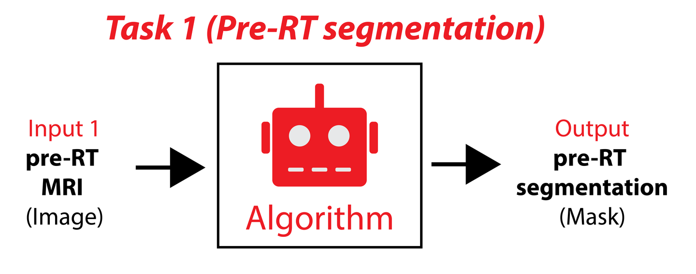
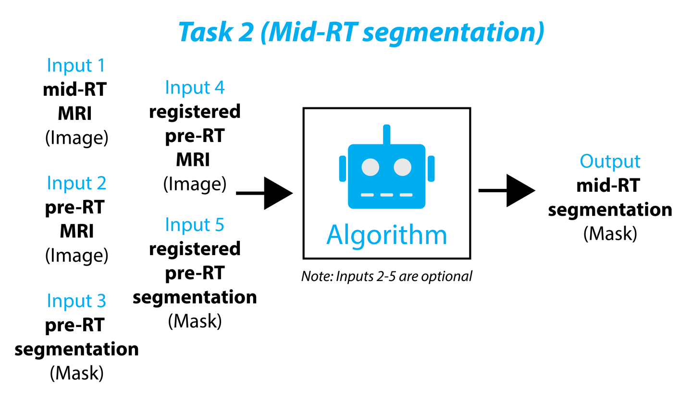
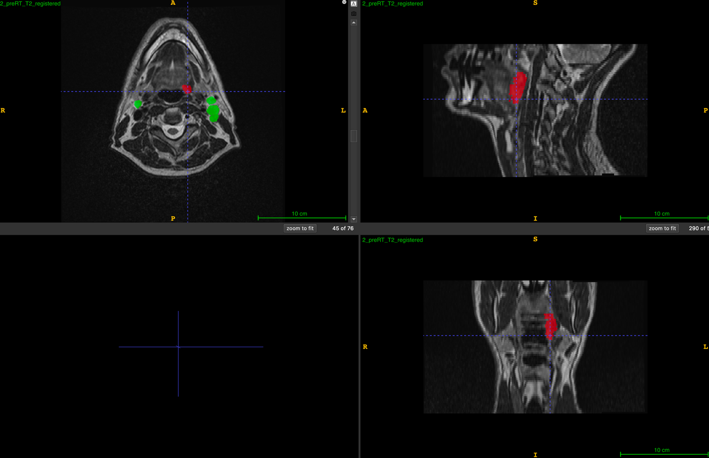
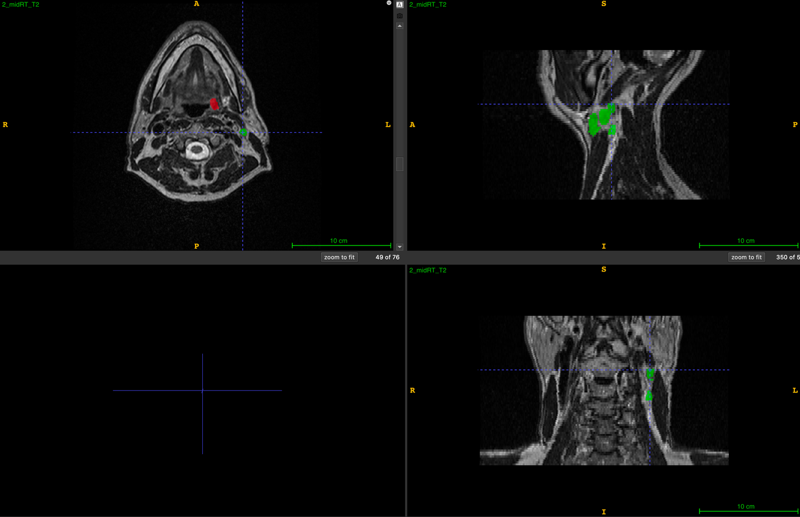

# MICCAI2024 HNTS-MRG Task2

<div align="center">
    <a href="https://github.com/openmedlab/"></a>
</div>
<p style="text-align:center;font-size:10px;"><em></em></p>

## Dataset Information

The HNTS-MRG 2024 Task2 dataset is the training data for Task2 of the MICCAI 2024 HNTS-MRG Challenge, which is also a segmentation task. The data, in T2-weighted MRI modality, is used to segment primary tumors (GTVp) and metastatic lymph nodes (GTVn), with data labels as follows: background = 0, GTVp = 1, GTVn = 2. The difference between Task2 and Task1 is that Task1 only provides pre-treatment data for inference, and then the segmentation Mask is given. Task2, on the other hand, for inference provides pre-treatment images along with pre-treatment Masks, images and Masks after registration from pre-treatment to mid-treatment, and finally, the mid-treatment images that need to be predicted, then outputting the mid-treatment segmentation Mask. It is evident that while we could train solely using the mid-treatment data pairs from the training data, disregarding other information would result in a loss of model performance, hence it is advisable to fuse information from both data types when feeding into the model.

<div align="center">
    <a href="https://github.com/openmedlab/"></a>
</div>
<p style="text-align:center;font-size:10px;"><em></em></p>

<div align="center">
    <a href="https://github.com/openmedlab/"></a>
</div>
<p style="text-align:center;font-size:10px;"><em></em></p>

## Dataset Meta Information

| Dimensions | Modality  | Task Type     | Anatomical Structures | Anatomical Area | Number of Categories | Data Volume | File Format |
|------------|-----------|---------------|-----------------------|-----------------|----------------------|-------------|-------------|
| 3D         | MRI T2w	  | Segmentation  | Tumor                 | Head and Neck   | 2                    | 150         | .nii.gz     |


### Resolution Details

| Dataset Statistics | spacing (mm)        | size             |
|--------------------|---------------------|------------------|
| min                | (0.40, 0.40, 1.00)  | (480, 480, 57)   |
| median             | (0.50, 0.50, 2.00)  | (512, 512, 76)   |
| max                | (0.98, 0.98, 2.50 ) | (768, 768, 168)  |

Number of 2D slices in the dataset: 13002.

## Label Information Statistics

| Metric                | Primary Tumor (GTVp) | Lymph Node (GTVn) |
|-----------------------|----------------------|-------------------|
| Sample Count          | 114                  | 129               |
| Accuracy              | 76.00%               | 86.00%            |
| Minimum Volume (cm³)  | 0.23                 | 0.38              |
| Median Volume (cm³)   | 2.63                 | 5.67              |
| Maximum Volume (cm³)  | 27.45                | 66.52             |

## Visualization

<div align="center">
    <a href="https://github.com/openmedlab/"></a>
</div>
<p style="text-align:center;font-size:10px;"><em>PreRT image after registration with midRT, red is the primary tumor, green is the metastatic lymph node.</em></p>

<div align="center">
    <a href="https://github.com/openmedlab/"></a>
</div>
<p style="text-align:center;font-size:10px;"><em>midRT image, red is the primary tumor, green is the metastatic lymph node.</em></p>

## File Structure

``` 
train
├── 2
│   ├── midRT
│   │   ├── 2_midRT_mask.nii.gz
│   │   ├── 2_midRT_T2.nii.gz
│   │   ├── 2_preRT_mask_registered.nii.gz
│   │   └── 2_preRT_T2_registered.nii.gz
│   └── preRT
│       ├── 2_preRT_mask.nii.gz
│       └── 2_preRT_T2.nii.gz
├── 3
│   ├── midRT
│   │   ├── 3_midRT_mask.nii.gz
│   │   ├── 3_midRT_T2.nii.gz
│   │   ├── 3_preRT_mask_registered.nii.gz
│   │   └── 3_preRT_T2_registered.nii.gz
│   └── preRT
│       ├── 3_preRT_mask.nii.gz
│       └── 3_preRT_T2.nii.gz
├── ...
```

## Authors and Institutions

Clifton D. Fuller (The University of Texas MD Anderson Cancer Center, USA)

Mohamed A. Naser (The University of Texas MD Anderson Cancer Center, USA)

Andrew Schaefer (Rice University, USA)

Kareem A. Wahid (The University of Texas MD Anderson Cancer Center, USA)

Cem Dede (The University of Texas MD Anderson Cancer Center, USA)

Dina M. El-Habashy (The University of Texas MD Anderson Cancer Center, USA)

Yomna Khamis (The University of Texas MD Anderson Cancer Center, USA)

Moamen R. A. Abdelaal (The University of Texas MD Anderson Cancer Center, USA)

Abdallah S.R. Mohamed (Baylor College of Medicine, USA)

Serageldin Kamel (The University of Texas MD Anderson Cancer Center, USA)

Michael K. Rooney (The University of Texas MD Anderson Cancer Center, USA)

Kelsey L. Corrigan (The University of Texas MD Anderson Cancer Center, USA)

Enoch Chang (The University of Texas MD Anderson Cancer Center, USA)

## Source Information

Official Website: https://hntsmrg24.grand-challenge.org/overview/

Download Link: https://hntsmrg24.grand-challenge.org/dataset/

Article Address: TBD

Publication Date: 2024-06

## Citation

``` 
TBD
```

Original introduction article is [here](https://zhuanlan.zhihu.com/p/717233291).