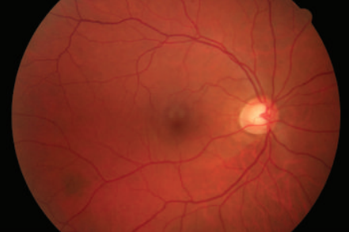
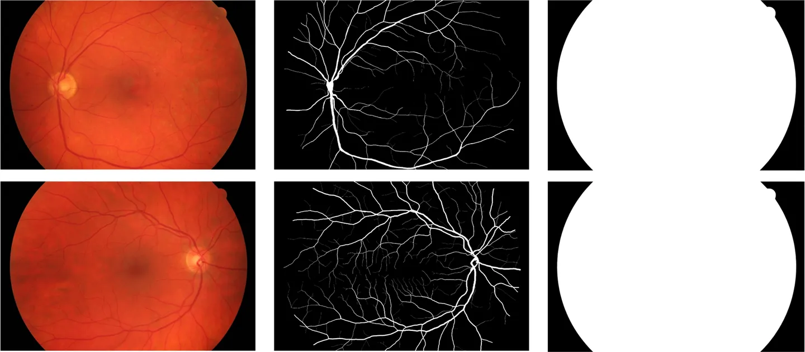

# HRF

<div align="center">
    <a href="https://github.com/openmedlab/"></a>
</div>
<p style="text-align:center;font-size:10px;"><em></em></p>

## Dataset Information

The **HRF** (High-Resolution Fundus) dataset is a high-resolution retinal image database specifically created for comparative studies of automatic retinal image segmentation algorithms. Currently, it includes 15 images of healthy patients, 15 images of patients with diabetic retinopathy, and 15 images of patients with glaucoma. Each image is accompanied by a corresponding binary gold standard vascular segmentation map. For specific datasets, masks that determine the field of view (FOV) are also provided. These segmentation annotations were generated collaboratively by experts in the field of retinal image analysis and clinical ophthalmologists from cooperating eye clinics, making it one of the most commonly used datasets in the field of fundus vascular segmentation.

## Dataset Meta Information

| Dimensions | Modality | Task Type | Anatomical Structures | Anatomical Area | Number of Categories | Data Volume | File Format |
|------------|----------|-----------|-----------------------|-----------------|----------------------|-------------|-------------|
| 2D         | Retinal Image       | Segmentation | Fundus blood vessels  | Eye             | 1                    | 45          | .jpg / .tif     |


### Resolution Details

| Dataset Statistics | size        |
|--------------------|-------------|
| min                | (2336, 3504)  |
| median             | (2336, 3504)  |
| max                | (2336, 3504)  |

## Label Information Statistics

| Category          | Retinal Vessel |
|-------------------|----------------|
| Number of Images  | 45             |
| Availability      | 100%           |
| Small Vessel Count| 13782690        |
| Medium Vessel Count| 27709964       |
| Large Vessel Count| 38887695        |

## Visualization

<div align="center">
    <a href="https://github.com/openmedlab/"></a>
</div>
<p style="text-align:center;font-size:10px;"><em>The first column is the original image, the second column is the vascular segmentation mask, and the third column is the field of view.</em></p>

## File Structure

``` 
HRF Dataset
├── images
│   ├── 01_dr.JPG
│   ├── 01_g.jpg
│   ├── 01_h.jpg
│   └── ...
├── manual1
│   ├── 01_dr.tif
│   ├── 01_g.tif
│   ├── 01_h.tif
│   └── ...
└── mask
    ├── 01_dr_mask.tif
    ├── 01_g_mask.tif
    ├── 01_h_mask.tif
    └── ...
```

## Authors and Institutions

Attila Budai (Pattern Recognition Lab, International Max Planck Research School for Optics and Imaging, Erlangen Graduate School in Advanced Optical Technologies, Friedrich-Alexander University, Germany)

Rüdiger Bock (Pattern Recognition Lab, Erlangen Graduate School in Advanced Optical Technologies, Friedrich-Alexander University, Germany)

Andreas Maier (Pattern Recognition Lab, Erlangen Graduate School in Advanced Optical Technologies, Friedrich-Alexander University, Germany)

Joachim Hornegger (Pattern Recognition Lab, Erlangen Graduate School in Advanced Optical Technologies, Friedrich-Alexander University, Germany)

Georg Michelson (Erlangen Graduate School in Advanced Optical Technologies, Department of Ophthalmology, Friedrich-Alexander University, Interdisciplinary Center for Ophthalmic Preventive Medicine and Imaging, Germany)


## Source Information

Official Website: https://www5.cs.fau.de/research/data/fundus-images/

Download Link: https://www5.cs.fau.de/research/data/fundus-images/

Article Address: https://www.hindawi.com/journals/ijbi/2013/154860/

Publication Date: 2013.12

## Citation

``` 
@article{budai2013robust,
  title={Robust vessel segmentation in fundus images},
  author={Budai, Attila and Bock, R{\"u}diger and Maier, Andreas and Hornegger, Joachim and Michelson, Georg and others},
  journal={International journal of biomedical imaging},
  volume={2013},
  year={2013},
  publisher={Hindawi}
}
```

Original introduction article is [here](https://zhuanlan.zhihu.com/p/663777789).