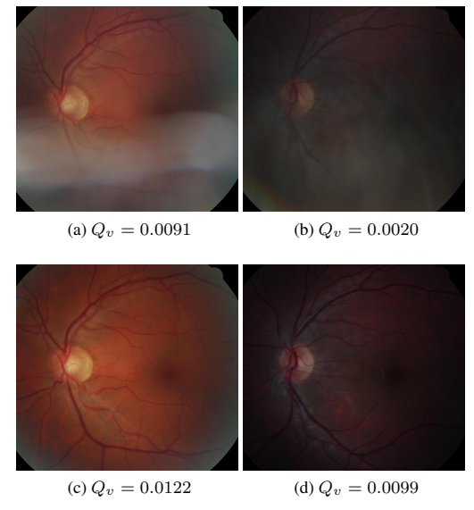
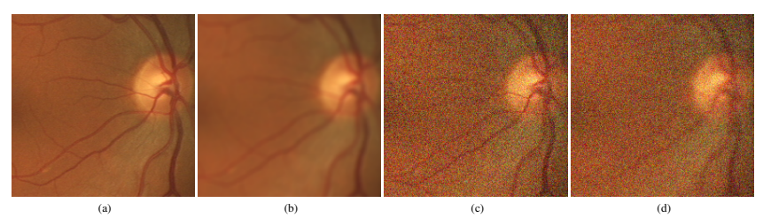

# HRF Image Quality Assessment Dataset

<div align="center">
    <a href="https://github.com/openmedlab/"></a>
</div>
<p style="text-align:center;font-size:10px;"><em></em></p>

## Dataset Information

This dataset includes 18 pairs of images captured from the same eye of 18 human subjects using a Canon CR-1 fundus camera with a 45° field of view under different acquisition settings. In each pair, the first image has poor quality, necessitating a repeated capture. Both images share approximately the same field of view, with slight shifts caused by eye movements between acquisitions. In the current version of this database, poor-quality images exhibit reduced sharpness (locally or globally), often due to camera defocus. Future versions may include other quality characteristics, such as image contrast or illumination conditions.

Fundus imaging is one of the most commonly used methods to collect information about the human eye’s background for diagnosing various retinal diseases, such as glaucoma or diabetic retinopathy. However, high-quality image data is crucial. Low-quality images must be identified by operators and retaken, a highly subjective and time-consuming process. Moreover, various image processing techniques, from autofocus to image deconvolution, have recently been applied to ophthalmic imaging, each yielding images of differing quality. These images must be quantitatively evaluated to detect the most reliable ones (e.g., for autofocus) or to assess the improvements achieved (e.g., through deconvolution).

## Dataset Meta Information

| Dimensions | Modality       | Task Type      | Anatomical Structures | Anatomical Area | Number of Categories | Data Volume | File Format |
|------------|----------------|----------------|-----------------------|-----------------|----------------------|-------------|-------------|
| 2D         | Retinal Image  | Classification | Eye                   | Eye             | 2                    | 36          | JPG         |


### Resolution Details

| Dataset Statistics  | size          |
|---------------------|---------------|
| min                 | [2592, 3888]  |
| median              | [2838, 4212]  |
| max                 | [5184, 5184]  |

## Label Information Statistics

| Label                   | Number |
|-------------------------|--------|
| image with bad quality  | 18     |
| image with good quality | 18     |


## Visualization

<div align="center">
    <a href="https://github.com/openmedlab/"></a>
</div>
<p style="text-align:center;font-size:10px;"><em>Paper Visualization: (a) Ground truth region of interest in the image, (b) Generated blurred image, (c) Generated noisy image, (d) Generated blurred and noisy image.</em></p>

<div align="center">
    <a href="https://github.com/openmedlab/"></a>
</div>
<p style="text-align:center;font-size:10px;"><em>Fundus images and their corresponding Qv scores: If the quality of the first captured image is too low (first row), a retake is performed (second row). Poor-quality images either suffer from localized clarity loss (a) or overall degradation (b).</em></p>

## File Structure

``` 
HRF Image Quality Assessment Dataset
├── images
├──—— train
│          ├── xxx.jpg
│          ├── xxx.jpg
│          │    ...
├──—— test
│          ├── xxx.jpg
│          ├── xxx.jpg
│          │    ...
├── train.txt
├── val.txt
```

## Authors and Institutions

Thomas Kohler (Pattern Recognition Lab, University of Erlangen-Nuremberg, Erlangen, Germany)

Attila Budai (Erlangen Graduate School in Advanced Optical Technologies (SAOT), Erlangen, Germany)

Martin F. Kraus (Erlangen Graduate School in Advanced Optical Technologies (SAOT), Erlangen, Germany)

Jan Odstrcilik (Department of Biomedical Engineering, Brno University of Technology, Brno, Czech Republic)

## Source Information

Official Website: https://www5.cs.fau.de/research/data/fundus-images/

Download Link: https://www5.cs.fau.de/research/data/fundus-images/

Article Address: https://ieeexplore.ieee.org/stamp/stamp.jsp?tp=&arnumber=6627771

Publication Date: 2013

## Citation

``` 
@inproceedings{kohler2013automatic,
  title={Automatic no-reference quality assessment for retinal fundus images using vessel segmentation},
  author={K{\"o}hler, Thomas and Budai, Attila and Kraus, Martin F and Odstr{\v{c}}ilik, Jan and Michelson, Georg and Hornegger, Joachim},
  booktitle={Proceedings of the 26th IEEE international symposium on computer-based medical systems},
  pages={95--100},
  year={2013},
  organization={IEEE}
}
```

Original introduction article is [here](https://zhuanlan.zhihu.com/p/721407424).