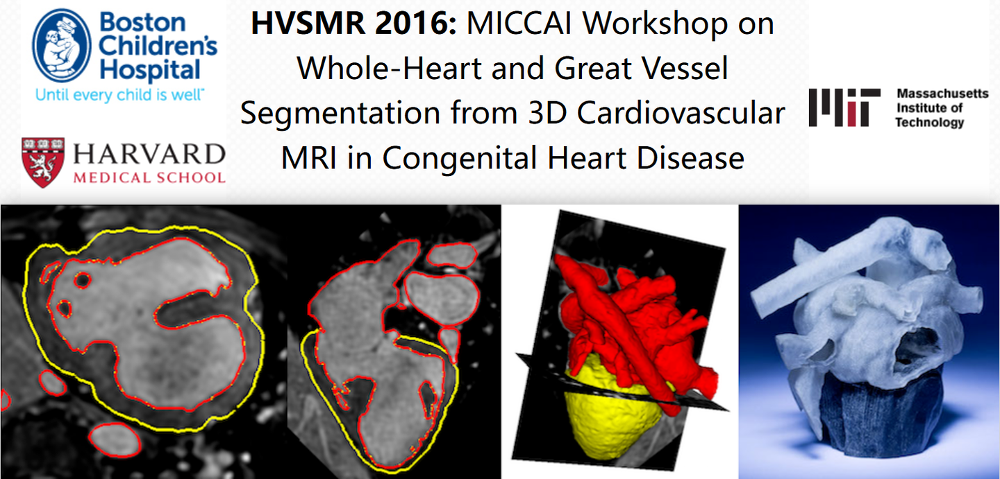
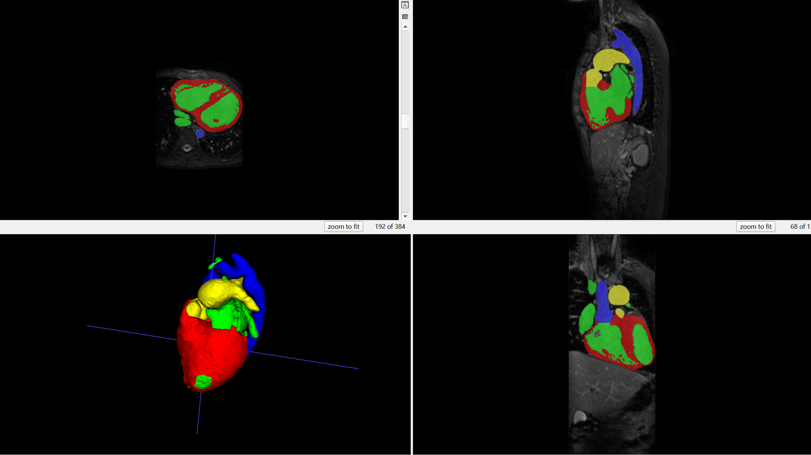

# HVSMR

<div align="center">
    <a href="https://github.com/openmedlab/"></a>
</div>
<p style="text-align:center;font-size:10px;"><em></em></p>

## Dataset Information

The HVSMR (Whole-Heart and Great Vessel Segmentation from 3D Cardiovascular MRI in Congenital Heart Disease) dataset is a dataset focused on segmenting cardiac anatomical structures from 3D cardiovascular magnetic resonance imaging (MRI). The MRI data, acquired from a 1.5T scanner (Phillips Achieva) without contrast agents using an axial view and steady-state free precession (SSFP) sequences, feature manually segmented heart blood pools and ventricular myocardium by trained evaluators, and validated by two clinical experts. The dataset comprises 19 cases, with the training set including 10 cases with corresponding annotations, and the test set consisting of 9 cases without annotations.

The HVSMR 2016 dataset advances the development of whole-heart segmentation techniques for preoperative planning in children with complex congenital heart disease (CHD). By providing standardized 3D cardiovascular MRI (CMR) image data, researchers can evaluate automated and semi-automated segmentation methods amidst challenges such as high anatomical variability and low signal-to-noise ratios, promoting the use of whole-heart segmentation technologies in personalized cardiac models, thus enhancing the precision and efficiency of preoperative planning and surgical interventions.

## Dataset Meta Information

| Dimensions | Modality | Task Type    | Anatomical Structures       | Anatomical Area | Number of Categories | Data Volume | File Format |
|------------|----------|--------------|-----------------------------|-----------------|----------------------|-------------|-------------|
| 3D         | MR       | Segmentation | Myocardium and Blood Pool   | Heart           | 4                    | 19          | .nii.gz     |


### Resolution Details

| Dataset Statistics | spacing (mm)         | size           |
|--------------------|----------------------|----------------|
| min                | (0.731,0.731,0.650)  | (256,256,140)  |
| median             | (0.885,0.885,0.860)  | (384,384,157)  |
| max                | (1.146,1.146,1.150)  | (528,528,200)  |

Number of 2D slices in the dataset: 1655.

## Label Information Statistics

| Anatomical Structure  | Cases | Percentage of Cases | Min Volume (cm³) | Median Volume (cm³) | Max Volume (cm³) |
|-----------------------|-------|---------------------|------------------|---------------------|------------------|
| Myocardium            | 10    | 100%                | 44.37            | 119.64              | 222.93           |
| Blood Pool            | 10    | 100%                | 78.85            | 287.43              | 591.8            |
| Aorta                 | 10    | 100%                | 18.18            | 54.58               | 132.59           |
| Pulmonary Artery      | 10    | 100%                | 1.22             | 32.82               | 112.7            |

## Visualization

The following figure shows the original image and related annotations. Among them

Red area - myocardium

Green area - blood pool

Blue area - aorta

Yellow area - pulmonary artery

<div align="center">
    <a href="https://github.com/openmedlab/"></a>
</div>
<p style="text-align:center;font-size:10px;"><em></em></p>

## File Structure

``` 
hvsmr_2016
├── hvsmr_2016_testing
│   ├── testing_axial_full_pat10.nii.gz
│   ├── testing_axial_full_pat11.nii.gz
│   └── ...
└── hvsmr_2016_training
    ├── training_axial_full_pat0.nii.gz
    ├── training_axial_full_pat0_label_A.nii.gz
    ├── training_axial_full_pat0_label_B.nii.gz
    ├── training_axial_full_pat1.nii.gz
    ├── training_axial_full_pat1_label_A.nii.gz
    ├── training_axial_full_pat1_label_B.nii.gz
    └── ...
```

## Authors and Institutions

Danielle F. Pace (Massachusetts Institute of Technology, USA)

Adrian V. Dalca (Massachusetts Institute of Technology, USA)

Tal Geva (Boston Children's Hospital, USA; Harvard Medical School, USA)

Andrew J. Powell (Boston Children's Hospital, USA; Harvard Medical School, USA)

Mehdi H. Moghari (Boston Children's Hospital, USA; Harvard Medical School, USA)

Polina Golland (Massachusetts Institute of Technology, USA)

## Source Information

Official Website: https://segchd.csail.mit.edu/

Download Link: https://github.com/scouvreur/WholeHeartMRISegmenter

Article Address: https://link.springer.com/chapter/10.1007/978-3-319-24574-4_10#page-1

Publication Date: 2016-03

## Citation

``` 
@inproceedings{pace2015interactive,
  title={Interactive whole-heart segmentation in congenital heart disease},
  author={Pace, Danielle F and Dalca, Adrian V and Geva, Tal and Powell, Andrew J and Moghari, Mehdi H and Golland, Polina},
  booktitle={Medical Image Computing and Computer-Assisted Intervention--MICCAI 2015: 18th International Conference, Munich, Germany, October 5-9, 2015, Proceedings, Part III 18},
  pages={80--88},
  year={2015},
  organization={Springer}
}
```

Original introduction article is [here](https://zhuanlan.zhihu.com/p/720841464).