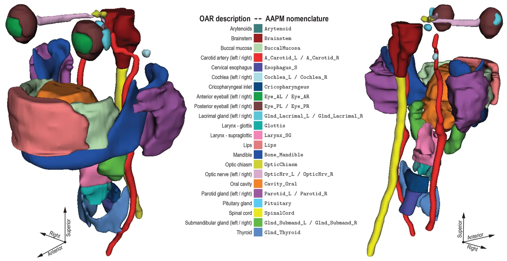

# HaN-Seg

## Dataset Information

HaN-Seg is a publicly available head and neck region organ-at-risk (OAR) image segmentation dataset, which contains head and neck (HaN) CT and MR images of 42 patients. These patients underwent CT scans and T1-weighted MR imaging to support image-guided radiation therapy planning. The dataset further includes labels for 30 risk organs, presented in the form of binary segmentation masks. These segmentation masks were obtained through careful curation of manual pixel-by-pixel expert image annotations. It is important to emphasize that these CT and MR images have not been registered with each other.

## Dataset Meta Information


| Dimensions | Modality | Task Type | Anatomical Structures      | Anatomical Area | Number of Categories | Data Volume | File Format |
|------------|----------|-----------|----------------------------|-----------------|----------------------|-------------|-------------|
| 3D         | CT & MR  | Segmentation | 37 organs in head and neck | Head and Neck   | 30                   | 42          | .nrrd       |

### Resolution Details

| Dataset Statistics | spacing (mm)     | size            |
|--------------------|------------------|-----------------|
| min                | (0.52,0.52,2.0)              | (512,512,116)     |
| median             | (0.64,0.64,2.0)           | (1024,1024,189) |
| max                | (1.56,1.56,3.0)              | (1024,1024,323) |

## Label Information Statistics

| Label | Anatomical Structure           | Cases | Coverage | Mean Volume (cm³) | Median Volume (cm³) | Max Volume (cm³) |
|-------|--------------------------------|-------|----------|-------------------|---------------------|------------------|
| 1     | carotid_artery_left            | 42    | 100.00%  | 14.32             | 3.9                 | 7.18             |
| 2     | carotid_artery_right           | 42    | 100.00%  | 11.71             | 3.56                | 5.94             |
| 3     | arytenoids                     | 42    | 100.00%  | 0.79              | 0.13                | 0.46             |
| 4     | mandible                       | 42    | 100.00%  | 89.08             | 40.38               | 64.6             |
| 5     | brainstem                      | 42    | 100.00%  | 29.71             | 14.62               | 22.68            |
| 6     | buccal_mucosa                  | 42    | 100.00%  | 21.38             | 4.43                | 12.83            |
| 7     | cavity_oral                    | 42    | 100.00%  | 161.34            | 52.94               | 99.82            |
| 8     | cochlea_left                   | 42    | 100.00%  | 0.26              | 0.06                | 0.16             |
| 9     | cochlea_right                  | 42    | 100.00%  | 0.26              | 0.06                | 0.16             |
| 10    | cricopharyngeus                | 42    | 100.00%  | 4.74              | 1.04                | 2.58             |
| 11    | esophagus                      | 42    | 100.00%  | 4.8               | 0.76                | 2.02             |
| 12    | Eye_AL (left eyeball)          | 42    | 100.00%  | 1.54              | 0.38                | 1.04             |
| 13    | Eye_AR (right eyeball)         | 42    | 100.00%  | 2.15              | 0.48                | 1.08             |
| 14    | Eye_PL (left eye lens)         | 42    | 100.00%  | 12.82             | 3.86                | 7.57             |
| 15    | Eye_PR (right eye lens)        | 42    | 100.00%  | 9.09              | 4.55                | 7.7              |
| 16    | Gland_Lacrimal_L (left lacrimal gland) | 42    | 100.00%  | 1.31              | 0.48                | 0.87             |
| 17    | Gland_Lacrimal_R (right lacrimal gland) | 42    | 100.00%  | 1.51              | 0.2                 | 0.55             |
| 18    | Gland_Submand_L (left submandibular gland) | 42    | 100.00%  | 16.89             | 2.88                | 8.2              |
| 19    | Gland_Submand_R (right submandibular gland) | 42    | 100.00%  | 16.92             | 3.57                | 7.74             |
| 20    | Gland_Thyroid (thyroid gland)  | 42    | 100.00%  | 45.95             | 14.2                | 14.4             |
| 21    | Glottis                        | 42    | 100.00%  | 5.54              | 1.34                | 3.28             |
| 22    | Larynx_SG (supraglottic larynx)| 42    | 100.00%  | 23.15             | 4.68                | 13.29            |
| 23    | Lips                           | 42    | 100.00%  | 47                | 5.14                | 23.44            |
| 24    | Optic_Chasm (optic chiasm)     | 42    | 100.00%  | 1.03              | 0.06                | 0.46             |
| 25    | OpticNrv_L (left optic nerve)  | 42    | 100.00%  | 1.21              | 0.17                | 0.71             |
| 26    | OpticNrv_R (right optic nerve) | 42    | 100.00%  | 55.19             | 9.81                | 27.27            |
| 27    | Parotid_L (left parotid gland) | 42    | 100.00%  | 55.75             | 11.29               | 26.89            |
| 28    | Parotid_R (right parotid gland)| 42    | 100.00%  | 45.06             | 10.24               | 28.33            |
| 29    | Pituitary (pituitary gland)    | 42    | 100.00%  | 13.87             | 7.44                | 10.46            |
| 30    | SpinalCord (spinal cord)       | 41    | 97.62%   | 0.72              | 0.17                | 0.34             |


## Visualization

<div align="center">
    <a href="https://github.com/openmedlab/"></a>
</div>
<p style="text-align:center;font-size:10px;"><em> Visualization from official website.</em></p>

## File Structure

The official file structure is as follows, divided into 42 subfolders, organized as follows:

``` 
Dataset
│
├── OAR_data.csv
├── patient_data.csv
├── case_xx
│   ├── case_XX_IMG_CT.nrrd
│   ├── case_XX_IMG_MR_T1.nrrd
│   ├── case_XX_OAR_Brainstem.seg.nrrd
│   ├── case_XX_OAR_OpticChiasm.seg.nrrd
│   ├── ...
├── case_xx
│   ├── ...
```

## Authors and Institutions

G. Podobnik (Faculty of Electrical Engineering, University of Ljubljana, Slovenia)

P. Strojan (Institute of Oncology Ljubljana, Slovenia)

P. Peterlin (Institute of Oncology Ljubljana, Slovenia)

B. Ibragimov (Faculty of Electrical Engineering, University of Ljubljana, Slovenia; Department of Computer Science, University of Copenhagen, Denmark)

T. Vrtovec (Faculty of Electrical Engineering, University of Ljubljana, Slovenia)


## Source Information

Official Website: https://han-seg2023.grand-challenge.org/

Download Link: https://zenodo.org/record/7442914#.ZBtfBHbMJaQ

Article Address: https://aapm.onlinelibrary.wiley.com/doi/10.1002/mp.16197

Publication Date: March 8th, 2017

## Citation

``` 
@article{podobnik2023han,
  title={HaN-Seg: The head and neck organ-at-risk CT and MR segmentation dataset},
  author={Podobnik, Ga{\v{s}}per and Strojan, Primo{\v{z}} and Peterlin, Primo{\v{z}} and Ibragimov, Bulat and Vrtovec, Toma{\v{z}}},
  journal={Medical physics},
  volume={50},
  number={3},
  pages={1917--1927},
  year={2023},
  publisher={Wiley Online Library}
}
```

Original introduction article is [here](https://zhuanlan.zhihu.com/p/660192823).