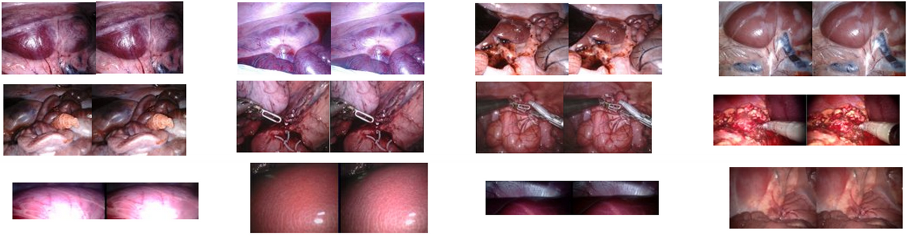

# Hamlyn Endoscopic Video Datasets

<div align="center">
    <a href="https://github.com/openmedlab/"></a>
</div>
<p style="text-align:center;font-size:10px;"><em></em></p>

## Dataset Information

The **Hamlyn Centre Laparoscopic/Endoscopic Video Dataset**, created by the Hamlyn Centre at Imperial College London, comprises a rich collection of laparoscopic and endoscopic video data. These datasets capture various complex surgical scenarios, including pig diaphragm dissection, lung lobectomy, and TECAB surgery, encompassing a variety of visual challenges such as tissue deformation, motion caused by respiration and heartbeat, smoke occlusion, and interactions between surgical instruments and tissues. The dataset includes a total of 38 videos and sub-datasets, offering researchers high-quality, real-world surgical video resources.

These datasets are well-suited for research in computer vision, deep learning, and medical image processing, particularly for applications such as region tracking, depth estimation, tissue deformation analysis, and 3D reconstruction in surgical environments. By leveraging these datasets, researchers can develop and validate deep learning-based models to enhance automation and precision during surgeries.

The release of this dataset provides significant support for research in medical imaging and computer-assisted surgery, contributing to advancements in surgical automation, augmented reality navigation, and robotic surgery technologies.

## Dataset Meta Information

| Dimensions | Modality   | Task Type                         | Anatomical Structures | Anatomical Area | Data Volume | File Format |
|------------|------------|-----------------------------------|-----------------------|-----------------|-------------|-------------|
| 2D         | Endoscopy  | Monocular/Stereo Depth Estimation | Abdominal cavity      | Abdomen         | 38          | .mp4        |

## Data Information Statistics

| Serial number | Video name                     | Duration  | Resolution | File size   | Description                                                                                                                                                                                                                                                                                                                   |
|---------------|--------------------------------|-----------|------------|-------------|-------------------------------------------------------------------------------------------------------------------------------------------------------------------------------------------------------------------------------------------------------------------------------------------------------------------------------|
| 1             | Video Dataset 1                | -         | -          | 2.5 GB      | The video dataset contains 10 in vivo sequences and ground truth datasets for region tracking and relocalization in gastrointestinal endoscopy. These videos are collected during standard gastrointestinal examinations involving difficult endoscopy issues such as tissue deformation and rapid movement of the endoscope. |
| 2             | Dataset 2                      | -         | -          | 9.3 GB      | This dataset contains approximately 40,000 pairs of rectified stereo images collected during da Vinci surgery partial nephrectomy, and its main purpose is to train and test deep learning networks for disparity estimation.                                                                                                 |
| 3             | Video 1                        | -         | -          | 1.4 GB      | In vivo porcine diaphragm dissection, including smoke blurring caused by electrocautery, significant deformation caused by cardiac motion, bleeding artifacts, specular reflections, and instrument occlusion.                                                                                                                |
| 4             | Video 2                        | -         | -          | 1.4 GB      | Live pig diaphragm dissection, including smoke blur caused by electrocautery, significant deformation caused by cardiac motion, etc.                                                                                                                                                                                          |
| 5             | Video 3                        | -         | -          | 141.1 MB    | In vivo TECAB surgery, including soft tissue deformation and lighting changes.                                                                                                                                                                                                                                                |
| 6             | Video 4                        | -         | -          | 1.0 GB      | In vivo lobectomy with significant breathing-induced deformations and instrument interactions.                                                                                                                                                                                                                                |
| 7             | Video 5                        | -         | -          | 1.3 GB      | Low-quality in vivo data, captured by a Medigus camera, including tissue deformation caused by breathing.                                                                                                                                                                                                                     | 
| 8             | Video 6                        | -         | -          | 244.3 MB    | Low-quality in vivo data, including scaling changes due to tissue movement.                                                                                                                                                                                                                                                   | 
| 9             | Video 7                        | -         | -          | 42.7 MB     | During surgery, saline cleansing causes significant environmental changes in the tissue surface.                                                                                                                                                                                                                              |
| 10            | Video 8                        | -         | -          | 79.2 MB     | During surgery, smoke blurs, occlusions, and tissue deformation caused by tissue-tool interaction.                                                                                                                                                                                                                            |
| 11            | Video 9                        | -         | -          | 75.4 MB     | Exploration of the abdominal cavity of living pigs, including changes in lighting conditions.                                                                                                                                                                                                                                 |
| 12            | Left and right stereo video 1  | 0.35 s    | 320x240    | 0.46 GB     | Slight deformation of the abdominal wall, static laparoscopic view.                                                                                                                                                                                                                                                           |
| 13            | Left and right stereo video 2  | 15 s      | 360x288    | 0.23 GB     | Static laparoscopic view, the liver deforms due to breathing.                                                                                                                                                                                                                                                                 |
| 14            | Single view video 3            | 120 s     | 720x576    | 3.4 GB      | No deformation of isolated pig liver, spleen and intestine.                                                                                                                                                                                                                                                                   |
| 15            | Left and right stereo video 4  | 62 s      | 360x288    | 0.23 GB     | Static laparoscopic view, the liver deforms due to breathing.                                                                                                                                                                                                                                                                 |
| 16            | Left and right stereo video 5  | 35 s      | 360x288    | 0.5 GB      | The heart's surface deforms with breathing and heartbeat.                                                                                                                                                                                                                                                                     |
| 17            | Left and right stereo video 6  | 41 s      | 640x480    | 0.2 GB * 2  | Changes in scale caused by movement around the optical axis.                                                                                                                                                                                                                                                                  |
| 18            | Left and right stereo video 7  | 23 s      | 640x480    | 0.15 GB * 2 | Change in scale caused by rotation around the optical axis.                                                                                                                                                                                                                                                                   |
| 19            | Left and right stereo video 8  | 8 mins    | 640x480    | 2.5 GB * 2  | Navigation to the uterine horns, resection and re-anastomosis.                                                                                                                                                                                                                                                                |
| 20            | Left and right stereo video 9  | 26 s      | 640x480    | 0.15 GB * 2 | Static laparoscopic view, the liver deforms due to breathing.                                                                                                                                                                                                                                                                 |
| 21            | Single view video 10           | 5.5 mins  | 720x576    | 1.19 GB     | In the ex vivo NOTES procedure, an endoscope is passed through the abdominal cavity.                                                                                                                                                                                                                                          |
| 22            | Left and right stereo video 11 | 1.5 mins  | 360x288    | 0.75 GB * 2 | Heart model deformation and CT scan verification data.                                                                                                                                                                                                                                                                        |
| 23            | Left and right stereo video 12 | 1.25 mins | 360x288    | 1.0 GB * 2  | Heart model deformation and CT scan verification data.                                                                                                                                                                                                                                                                        |
| 24            | Left and right stereo video 13 | 4 s       | 360x288    | 50 MB       | Demonstration of abdominal movement process.                                                                                                                                                                                                                                                                                  |
| 25            | Left and right stereo video 14 | 3.5 mins  | 720x288    | 0.36 GB     | Live pig experiment, liver and camera movement caused by breathing.                                                                                                                                                                                                                                                           |
| 26            | Left and right stereo video 15 | 2.45 mins | 720x288    | 0.3 GB      | Same as above, liver and camera movement caused by breathing.                                                                                                                                                                                                                                                                 |
| 27            | Left and right stereo video 16 | 2.45 mins | 720x288    | 0.26 GB     | Same as above, liver and camera movement caused by breathing.                                                                                                                                                                                                                                                                 |
| 28            | Left and right stereo video 17 | 2.26 mins | 720x288    | 0.19 GB     | Abdomen normal camera movement.                                                                                                                                                                                                                                                                                               |
| 29            | Left and right stereo video 18 | 3.45 mins | 720x288    | 0.31 GB     | Device-tissue interactions within the peritoneal cavity.                                                                                                                                                                                                                                                                      |
| 30            | Left and right stereo video 19 | 7.02 mins | 720x288    | 0.58 GB     | Device-tissue interactions within the peritoneal cavity.                                                                                                                                                                                                                                                                      |
| 31            | Left and right stereo video 20 | 1.44 mins | 720x288    | 0.18 GB     | Slight deformation of the abdominal tissue.                                                                                                                                                                                                                                                                                   |
| 32            | Left and right stereo video 21 | 3.34 mins | 720x288    | 0.37 GB     | Overall movement of the abdominal camera, breathing causes liver movement.                                                                                                                                                                                                                                                    |
| 33            | Left and right stereo video 22 | 1.20 mins | 720x288    | 0.11 GB     | Camera around the abdomen.                                                                                                                                                                                                                                                                                                    |
| 34            | Left and right stereo video 23 | 7.30 mins | 720x288    | 0.7 GB      | Deformation of abdominal tissues caused by tool interaction.                                                                                                                                                                                                                                                                  |
| 35            | Left and right stereo video 24 | 2.26 mins | 720x288    | 0.23 GB     | Tissue-Tool Interaction and Electrocautery.                                                                                                                                                                                                                                                                                   |
| 36            | Left and right stereo video 25 | 1.24 mins | 720x288    | 0.11 GB     | Static intra-abdominal exercise.                                                                                                                                                                                                                                                                                              |
| 37            | Left and right stereo video 26 | 2.10 mins | 720x288    | 0.21 GB     | Ex vivo pig experiments, conventional camera movements within the static abdominal cavity.                                                                                                                                                                                                                                    |
| 38            | Left and right stereo video 27 | 2.10 mins | 720x288    | 0.21 GB     | Visualization of the ureter and kidney in isolated pig experiments.                                                                                                                                                                                                                                                           |


## Visualization

<div align="center">
    <a href="https://github.com/openmedlab/"></a>
</div>
<p style="text-align:center;font-size:10px;"><em>Some data visualization, all of which are binocular camera data, with the left view and the right view on the left.</em></p>


## Authors and Institutions

- Stamatia Giannarou (Imperial College London)  
- Danail Stoyanov (Imperial College London)  
- David Noonan (Imperial College London)  
- George Mylonas (Imperial College London)  
- Jim Clark (Imperial College London)  
- Marco Visentini-Scarzanella (Imperial College London)  
- Pete Mountney (Imperial College London)  
- Guang-Zhong Yang (Shanghai Jiao Tong University Institute of Medical Robotics)  

## Source Information

Official Website: https://hamlyn.doc.ic.ac.uk/vision/

Download Link: https://hamlyn.doc.ic.ac.uk/vision/

Article Address: https://hamlyn.doc.ic.ac.uk/vision/ (8 papers totally)

Publication Date: 2010-07 till now.

## Citation

- Paper:

```
[1]	Peter Mountney, Danail Stoyanov and Guang-Zhong Yang: Three-Dimensional Tissue Deformation Recovery and Tracking: Introducing techniques based on laparoscopic or endoscopic images. IEEE Signal Processing Magazine. 2010 July. Volume: 27. Issue: 4. pp. 14-24.
[2]	Danail Stoyanov, George Mylonas, Fani Deligianni, Ara Darzi, Guang-Zhong Yang: Soft-tissue Motion Tracking and Structure Estimation for Robotic Assisted MIS Procedures. Medical Image Computing and Computer Assisted Interventions (MICCAI05), vol. 2, pp. 139-146, 2005
[3]	Mirna Lerotic, Adrian J. Chung, James Clark, Salman Valibeik and Guang-Zhong Yang: Dynamic View Expansion for Enhanced Navigation in Natural Orifice Transluminal Endoscopic Surgery Medical Image Computing and Computer Assisted Interventions. Medical Image Computing and Computer Assisted Interventions (MICCAI08), pp.467-475, 2008
[4]	Danail Stoyanov, Marco Visentini-Scarzanella, Philip Pratt and Guang-Zhong Yang: Real-Time Stereo Reconstruction in Robotic Assisted Minimally Invasive Surgery. Medical Image Computing and Computer Assisted Interventions (MICCAI10), to appear in 2010.
[5]	Philp Pratt, Danail Stoyanov, Marco Visentini-Scarzanella and Guang-Zhong Yang: Dynamic Guidance for Robotic Surgery using Image-Constrained Biomechanical Models. Medical Image Computing and Computer Assisted Interventions (MICCAI10), to appear in 2010.
[6]	Stamatia Giannarou, Marco Visentini-Scarzanella, Guang-Zhong Yang, "Probabilistic Tracking of Affine-Invariant Anisotropic Regions," IEEE Transactions on Pattern Analysis and Machine Intelligence, vol. 99, 2012
[7]	M. Ye, S. Giannarou, A. Meining, G.-Z. Yang. "Online Tracking and Retargeting with Applications to Optical Biopsy in Gastrointestinal Endoscopic Examinations". Medical Image Analysis. 2015.
[8]	M. Ye, E. Johns, A. Handa, L. Zhang, P. Pratt and G.-Z. Yang. "Self-Supervised Siamese Learning on Stereo Image Pairs for Depth Estimation in Robotic Surgery". Hamlyn Symposium on Medical Robotics. 2017.
```
- Dataset:

``` 
@misc{hamlyn_centre_vision,
  author       = {Stamatia Giannarou and Danail Stoyanov and David Noonan and George Mylonas and Jim Clark and Marco Visentini-Scarzanella and Pete Mountney and Guang-Zhong Yang},
  title        = {Hamlyn Centre Laparoscopic / Endoscopic Video Datasets},
  url          = {https://hamlyn.doc.ic.ac.uk/vision/},
  institution  = {Hamlyn Centre, Imperial College London}
}
```

Original introduction article is [here](https://zhuanlan.zhihu.com/p/3483571403).