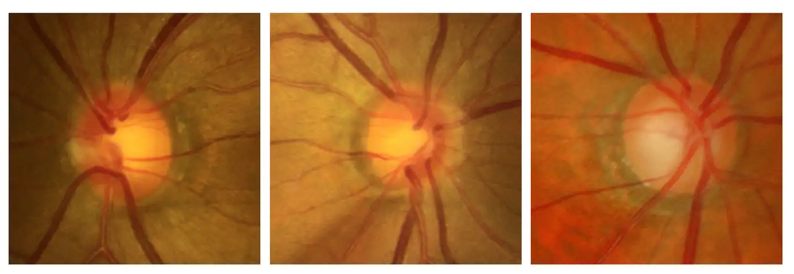

# Harvard Glaucoma Detection and Progression 

<div align="center">
    <a href="https://github.com/openmedlab/"></a>
</div>
<p style="text-align:center;font-size:10px;"><em></em></p>

## Dataset Information

The Harvard Glaucoma Detection and Progression (Harvard-GDP) dataset is a data collection aimed at predicting the presence and severity of glaucoma. It consists of 1,544 cases, categorized into three groups: normal, early-stage glaucoma, and moderate to advanced-stage glaucoma.

Glaucoma is one of the leading causes of irreversible vision loss, making early detection and progression prediction crucial for timely intervention and treatment. The Harvard-GDP dataset provides a wealth of imaging data that supports the development of more accurate algorithms for detecting and predicting the progression of glaucoma, thereby enhancing the precision of clinical diagnoses, reducing misdiagnosis rates, and optimizing treatment plans.

The dataset offers researchers a high-quality annotated resource for training and validating the performance of machine learning models. Through research on this dataset, researchers can develop more accurate and efficient algorithms for glaucoma detection and progression prediction. Ultimately, these efforts contribute to the development of smarter clinical decision-support systems, improving the diagnosis and management of glaucoma and enhancing patient quality of life.

## Dataset Meta Information

| Dimensions | Modality          | Task Type       | Anatomical Structures | Anatomical Area | Number of Categories | Data Volume  | File Format |
|------------|-------------------|-----------------|-----------------------|-----------------|----------------------|--------------|-------------|
| 2D         | Fundus photograph | Classification  | Fundus                | Eye             | 3                    | 1544         | PNG         |


### Resolution Details

| Dataset Statistics | size       |
|--------------------|------------|
| min                | (227, 240) |
| median             | (240, 240) |
| max                | (240, 240) |

## Label Information Statistics

| Category            | Normal | Early-stage Glaucoma  | Moderate to Advanced-stage Glaucoma |
|---------------------|--------|-----------------------|-------------------------------------|
| Number of Cases     | 467    | 289                   | 788                                 |
| Percentage of Total | 30.24% | 18.71%                | 51.03%                              |

## Visualization

<div align="center">
    <a href="https://github.com/openmedlab/"></a>
</div>
<p style="text-align:center;font-size:10px;"><em>From left to right, normal, early glaucoma, mid-late glaucoma.</em></p>

## File Structure

``` 
├── advanced_glaucoma
│   ├── 1.png
│   ├── 2.png
│   ├── ...
├── early_glaucoma
│   ├── 1.png
│   ├── 2.png
│   ├── ...
├── normal_control
│   ├── 1.png
│   ├── 2.png
│   ├── ...
```

## Authors and Institutions

Yan Luo (Harvard University Ophthalmic AI Lab)

Min Shi (Harvard University Ophthalmic AI Lab)

Yu Tian (Harvard University Ophthalmic AI Lab)

Tobias Elze (Harvard University Ophthalmic AI Lab)

Mengyu Wang (Harvard University Ophthalmic AI Lab)

## Source Information

Official Website: https://ophai.hms.harvard.edu/datasets/harvard-gdp1000

Download Link: https://ophai.hms.harvard.edu/datasets/harvard-gdp1000

Article Address: https://arxiv.org/abs/2308.13411

Publication Date: 2023-08

## Citation

``` 
@inproceedings{luo2023harvard,
  title={Harvard glaucoma detection and progression: A multimodal multitask dataset and generalization-reinforced semi-supervised learning},
  author={Luo, Yan and Shi, Min and Tian, Yu and Elze, Tobias and Wang, Mengyu},
  booktitle={Proceedings of the IEEE/CVF International Conference on Computer Vision},
  pages={20471--20482},
  year={2023}
}
```

Original introduction article is [here](https://zhuanlan.zhihu.com/p/710203197).