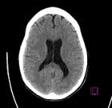

# Head CT-hemorrhage

<div align="center">
    <a href="https://github.com/openmedlab/"></a>
</div>
<p style="text-align:center;font-size:10px;"><em></em></p>

## Dataset Information

The Head CT-hemorrhage dataset, sourced from the Kaggle platform, includes two types of brain CT slice images: 100 images displaying normal brain structures and 100 images depicting brain hemorrhage, each from a different individual. This dataset was carefully selected and organized by the authors from publicly available online materials, and each image is equipped with a corresponding classification label. The purpose of creating this dataset is to leverage these limited image resources to advance artificial intelligence technologies in the medical imaging field, such as image enhancement and few-shot learning.

Brain hemorrhage is a clinical emergency that requires immediate attention, typically caused by high blood pressure, head trauma, or vascular problems, with symptoms such as headaches, consciousness disturbances, and neurological deficits. In such urgent cases, CT scans are crucial as they can quickly and accurately identify the specific location and extent of bleeding within the brain. This makes CT scans an indispensable tool for diagnosing and managing cases of brain hemorrhage. Therefore, the significance of the Head CT-hemorrhage dataset lies in providing a valuable resource to improve the processing techniques of such imaging and the accuracy of clinical diagnoses.

## Dataset Meta Information

| Dimensions | Modality | Task Type      | Anatomical Structures | Anatomical Area | Number of Categories | Data Volume | File Format |
|------------|----------|----------------|-----------------------|-----------------|----------------------|-------------|-------------|
| 2D         | CT       | Classification | Brain                 | Head            | 2                    | 200         | .png     |


### Resolution Details

| Dataset Statistics  | size      |
|---------------------|-----------|
| min                 | [140,135] |
| median              | [326,461] |
| max                 | [821,957] |

## Label Information Statistics


| Metric         | Number |
|----------------|--------|
| Normal Brain   | 100    |
| Brain Bleeding | 100    |


## Visualization

<div align="center">
    <a href="https://github.com/openmedlab/"></a>
</div>
<p style="text-align:center;font-size:10px;"><em> Normal brain CT example pictures.</em></p>


<div align="center">
    <a href="https://github.com/openmedlab/"></a>
</div>
<p style="text-align:center;font-size:10px;"><em> Brain hemorrhage CT example pictures.</em></p>


## File Structure

The file structure of the dataset is as follows, containing 1 .csv file providing labels for all images, and 1 folder containing all images.

``` 
Head CT-hemorrhaget
├── head_ct
│   ├── 000.png
│   ├── 001.png
│   │    ...
├── labels.csv
```

## Authors and Institutions

Felipe Campos Kitamura（DASA Laboratory，Brazil）

## Source Information

Official Website: https://www.kaggle.com/datasets/felipekitamura/head-ct-hemorrhage

Download Link: https://www.kaggle.com/datasets/felipekitamura/head-ct-hemorrhage, https://www.heywhale.com/mw/dataset/5d7213eb8499bc002c0af1e8/content

Article Address: None

Publication Date: 2019-09-06

## Citation

``` 
@dataset{Head CT-hemorrhage,
  author       = {Felipe Campos Kitamura},
  title        = {{Head CT-hemorrhage}},
  year         = {2019},
  publisher    = {Kaggle},
  version      = {1.0},
  url          = {https://www.kaggle.com/datasets/felipekitamura/head-ct-hemorrhage},
}

@misc{headct3995,
    title = { 头部CT图像数据 },
    author = { 隔壁小胖 },
    howpublished = { \url{https://www.heywhale.com/mw/dataset/5d7213eb8499bc002c0af1e8} },
    year = { 2019 },
}
```

Original introduction article is [here](https://zhuanlan.zhihu.com/p/678695338).