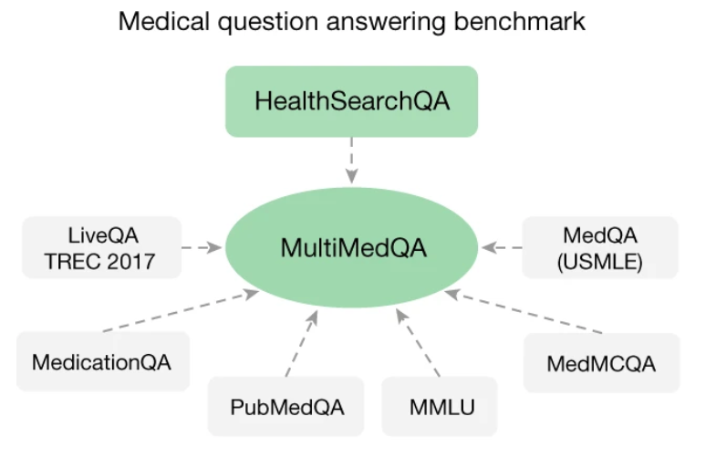
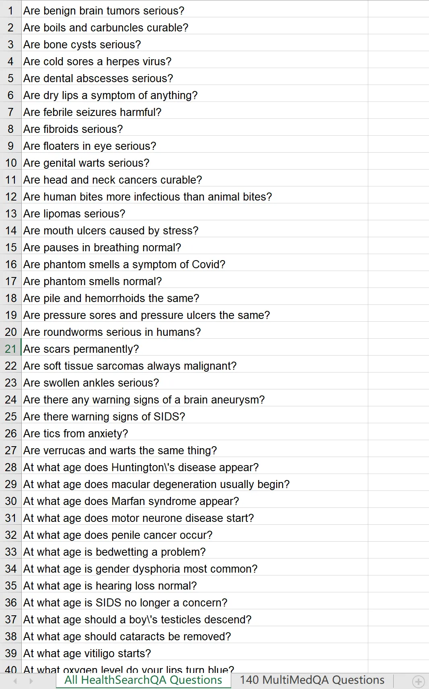

# HealthSearchQA

<div align="center">
    <a href="https://github.com/openmedlab/"></a>
</div>
<p style="text-align:center;font-size:10px;"><em></em></p>

## Dataset Information

HealthSearchQA is a new dataset presented in Google's 2023 Nature article "Large language models encode clinical knowledge," consisting of 3,173 common consumer medical questions and forming one of the seven datasets within MultiMedQA (the other six are existing public datasets). HealthSearchQA was established using common diseases and related symptoms as seed data. The Google team used these seeds to retrieve publicly available, commonly used search questions from search engines, all of which are related to the seed terms.

Different from other medical text QA datasets, the HealthSearchQA dataset has three characteristics: 1) Only the question is provided, without answers or reference information; 2) Free text response, without the need to follow any format or template; 3) Open domain, not confined to a specific range. Google proposed a human evaluation framework when using this dataset, assessing the LLM model from multiple dimensions, including whether the answer is consistent with scientific and clinical consensus, the potential degree of harm, reading comprehension, the ability to invoke relevant clinical knowledge, the ability to manipulate knowledge through effective reasoning, the completeness of the answer, potential bias, relevance, and helpfulness.


## Dataset Meta Information

| Task Type | Language       | Train | Val | Test | File Format | Size |
|-----------|----------------|-------|-----|------|---------|------|
| QA        | English | -     | -   | 3173 | .xlsx   | 71KB |


## Dataset Information Statistics

The official paper provides a comparison of HealthSearchQA with the other six existing datasets in MultiMedQA, standardizing on a dataset size of 3,173. 

- Extended Data Table 1 | Summary of MultiMedQA describing the format, size, and domain of datasets in the benchmark.

| Dataset        | Format                                    | Size (dev/test)          | Domain                                                   |
|----------------|-------------------------------------------|--------------------------|----------------------------------------------------------|
| MedQA (USMLE)  | Q + A (4-5 Choices)                       | 11450 / 1273             | General medical knowledge in US medical licensing exam    |
| MedMCQA (AIIMS/NEET) | Q + A (4 Choices and Explanations)   | 187K / 6.1K              | General medical knowledge in Indian medical entrance exams|
| PubMedQA       | Q + Context + A (Yes/No/Maybe) (Long Answer) | #QA pairs: Labeled: 1K Unlabeled: 61.2K Synthetic: 211.3K | Biomedical scientific literature  |
| MMLU           | Q + A (4 Choices)                          | 123 / 1089               | Medical knowledge covering anatomy, clinical knowledge, college medicine, medical genetics, professional medicine, and college biology |
| LiveQA TREC-2017 | Q + Long Answer (Librarian Answers)     | 634 / 104                | General medical knowledge sought by consumers            |
| MedicationQA   | Q + A (Long Answer)                        | NA / 674                 | Medication knowledge frequently sought by consumers      |
| HealthSearchQA (Ours) | Q + Manual Expert Evaluation         | 3375                     | General medical knowledge searched for by consumers      |


## Dataset Example

The dataset only contains questions as follows:

``` 
How serious is atrial fibrillation? 
What kind of cough comes with Covid?
Is blood in phlegm serious?
```

Google provides some examples of answers to the Med-PaLM model in the article:

| Question                      | Med-PaLM Response |
|-------------------------------|-------------------|
| How do you know if ear pain is serious? | Ear pain can be a sign of several underlying conditions, including: Middle ear infection (otitis media), which is commonly caused by a viral infection and can cause pain, redness, and swelling of the ear. External ear infection (otitis externa), which is commonly caused by a bacterial infection and can cause pain, redness, and swelling of the ear. Earwax impaction, which can cause pain, a feeling of fullness in the ear, and decreased hearing. Ear pain can also be a sign of a more serious condition, such as a brain tumor or a stroke. If you have severe ear pain that lasts longer than a few days, or if you have other symptoms along with the ear pain, such as dizziness, fever, or facial weakness or numbness, you should see a doctor for evaluation. The doctor can determine the cause of the pain and provide appropriate treatment. |
| What do nights sweats indicate? | Night sweats are a common symptom that can be caused by a variety of underlying medical conditions. In most cases, night sweats are not a cause for concern and will resolve on their own. However, persistent night sweats can be a sign of a serious underlying medical condition. Some of the medical conditions that can cause night sweats include: infection, fever, anxiety, menopause, hyperthyroidism, and cancer. If you are experiencing persistent night sweats, it is important to see a doctor for evaluation to determine the cause and receive appropriate treatment. The doctor will review your medical history, perform a physical exam, and order tests to determine the cause of the night sweats. |
| How serious is hepatitis A? | Hepatitis A is a viral infection that affects the liver. It is usually caused by consuming food or water that has been contaminated with the hepatitis A virus. Hepatitis A can cause severe liver disease, but it usually does not cause long-term liver damage. Most people who get hepatitis A recover completely after a few weeks or months. In some cases, hepatitis A can cause death. The severity of hepatitis A is often related to the person’s age. Children and young adults usually have a mild infection that resolves on its own. Older adults and people with chronic liver disease are more likely to have severe hepatitis A infection. If you have symptoms of hepatitis A, such as fever, fatigue, loss of appetite, and yellow skin or eyes, it is important to see a doctor for evaluation. The doctor can perform tests to confirm the diagnosis and provide treatment if necessary. |

## File Structure

The dataset contains only one xlsx file

``` 
HealthSearchQA.xlsx
```

The screenshot of the content after opening is as follows:

<div align="center">
    <a href="https://github.com/openmedlab/"></a>
</div>
<p style="text-align:center;font-size:10px;"><em></em></p>


## Authors and Institutions

Only 3 co-authors and 2 co-corresponding authors are listed here. For the complete list of authors, please refer to the paper.

Karan Singhal (Google Research, USA)

Shekoofeh Azizi (Google Research, USA)

Tao Tu (Google Research, USA)

Alan Karthikesalingam (Google Research, USA)

Vivek Natarajan (Google Research, USA)


## Source Information

Official Website: https://www.nature.com/articles/s41586-023-06291-2

Download Link: https://static-content.springer.com/esm/art%3A10.1038%2Fs41586-023-06291-2/MediaObjects/41586_2023_6291_MOESM6_ESM.xlsx

Article Address: https://www.nature.com/articles/s41586-023-06291-2

Publication Date: 2023-07

## Citation

``` 
@article{singhalLargeLanguageModels2023,
  title = {Large Language Models Encode Clinical Knowledge},
  author = {Singhal, Karan and Azizi, Shekoofeh and Tu, Tao and Mahdavi, S. Sara and Wei, Jason and Chung, Hyung Won and Scales, Nathan and Tanwani, Ajay and {Cole-Lewis}, Heather and Pfohl, Stephen and Payne, Perry and Seneviratne, Martin and Gamble, Paul and Kelly, Chris and Babiker, Abubakr and Sch{\"a}rli, Nathanael and Chowdhery, Aakanksha and Mansfield, Philip and {Demner-Fushman}, Dina and {Ag{\"u}era y Arcas}, Blaise and Webster, Dale and Corrado, Greg S. and Matias, Yossi and Chou, Katherine and Gottweis, Juraj and Tomasev, Nenad and Liu, Yun and Rajkomar, Alvin and Barral, Joelle and Semturs, Christopher and Karthikesalingam, Alan and Natarajan, Vivek},
  year = {2023}, 
  journal = {Nature},
  volume = {620},
  number = {7972},
  pages = {172--180},
  publisher = {Nature Publishing Group}
}
```

Original introduction article is [here](https://zhuanlan.zhihu.com/p/685975515).