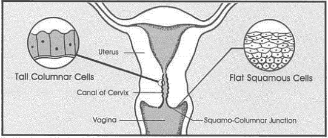

# Herlev

<div align="center">
    <a href="https://github.com/openmedlab/"></a>
</div>
<p style="text-align:center;font-size:10px;"><em></em></p>

## Dataset Information

The Cervical Smear Benchmark Database provides data for comparing classification methods. This data consists of 917 cervical smear cell images, which have been carefully classified by cytotechnologists and doctors. Each cell is manually divided into 7 categories: 1. Superficial squamous epithelium; 2. Intermediate squamous epithelium; 3. Columnar epithelium; 4. Mild squamous non-keratinizing dysplasia; 5. Moderate squamous non-keratinizing dysplasia; 6. Severe squamous non-keratinizing dysplasia; 7. Moderate squamous cell carcinoma in situ, where categories {1-3} indicate normal cells, and {4-7} indicate abnormal cells.

Cervical smears are a crucial component of cervical cancer screening. By providing standardized cell images and classification information, this dataset helps advance the automation and intelligence of cervical cancer screening technology. Utilizing advanced classification algorithms and artificial intelligence, it is possible to achieve rapid and accurate classification of cervical smear cells, thereby enhancing the efficiency and accuracy of cervical cancer screening.

## Dataset Meta Information

| Dimensions | Modality        | Task Type       | Anatomical Structures | Anatomical Area | Number of Categories | Data Volume | File Format |
|------------|-----------------|-----------------|-----------------------|-----------------|----------------------|-------------|-------------|
| 2D         | Histopathology  | Classification  | Cervix                | Cell            | 7                    | 917         | .bmp        |


### Resolution Details

| Dataset Statistics | size       |
|--------------------|------------|
| min                | (32, 103)  |
| median             | (135, 151) |
| max                | (280, 355) |

## Label Information Statistics

| ID  | Category     | Cell Type                                    | Number |
|-----|--------------|----------------------------------------------|--------|
| 1   | 正常: Normal   | Superficial squamous epithelial              | 74     |
| 2   | 正常: Normal   | Intermediate squamous epithelial             | 70     |
| 3   | 正常: Normal   | Columnar epithelial                          | 98     |
| 4   | 异常: Abnormal | Mild squamous non-keratinizing dysplasia     | 182    |
| 5   | 异常: Abnormal | Moderate squamous non-keratinizing dysplasia | 146    |
| 6   | 异常: Abnormal | Severe squamous non-keratinizing dysplasia   | 197    |
| 7   | 异常: Abnormal | Squamous cell carcinoma in situ intermediate | 150    |


## Visualization

<div align="center">
    <a href="https://github.com/openmedlab/"></a>
</div>
<p style="text-align:center;font-size:10px;"><em> Local Visualization.</em></p>

## File Structure

``` 
Herlev
├── images
│   ├── Superficial squamous epithelial
│   │   ├── xxxx.png
│   │   ├── .....png
│   │   ├── xxxx.png
│   ├── Intermediate squamous epithelial
│   │   ├── xxxx.png
│   │   ├── .....png
│   │   ├── xxxx.png
│   ├── Columnar epithelial
│   │   ├── xxxx.png
│   │   ├── .....png
│   │   ├── xxxx.png
│   ├── Mild squamous non-keratinizing dysplasia
│   │   ├── xxxx.png
│   │   ├── .....png
│   │   ├── xxxx.png
│   ├── Moderate squamous non-keratinizing dysplasia
│   │   ├── xxxx.png
│   │   ├── .....png
│   │   ├── xxxx.png
│   ├── Severe squamous non-keratinizing dysplasia
│   │   ├── xxxx.png
│   │   ├── .....png
│   │   ├── xxxx.png
│   ├── Squamous cell carcinoma in situ intermediate
│   │   ├── xxxx.png
│   │   ├── .....png
│   │   ├── xxxx.png
├── README.md
```

## Authors and Institutions

Jan Jantzen ( Technical University of Denmark)

George Dounias ( University of the Aegean)

## Source Information

Official Website: https://mde-lab.aegean.gr/index.php/downloads/

Download Link: https://mde-lab.aegean.gr/index.php/downloads/

Article Address: https://www.researchgate.net/profile/Jan-Jantzen/publication/282157686_The_Pap_Smear_Benchmark/links/582ae2fe08ae102f071ff4bb/The-Pap-Smear-Benchmark.pdf

Publication Date: 2003

## Citation

``` 
@article{jantzen2005pap,
  title={Pap-smear benchmark data for pattern classification},
  author={Jantzen, Jan and Norup, Jonas and Dounias, Georgios and Bjerregaard, Beth},
  journal={Nature inspired smart information systems (NiSIS 2005)},
  pages={1--9},
  year={2005}
}
```

Original introduction article is [here](https://zhuanlan.zhihu.com/p/717464169).