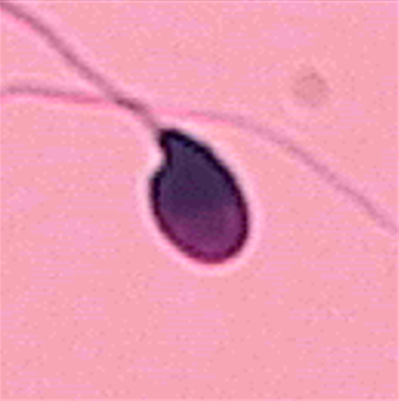
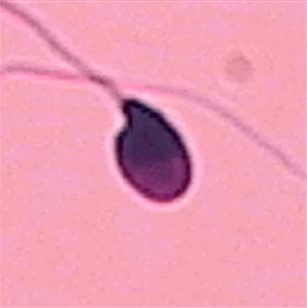
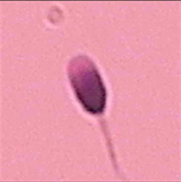
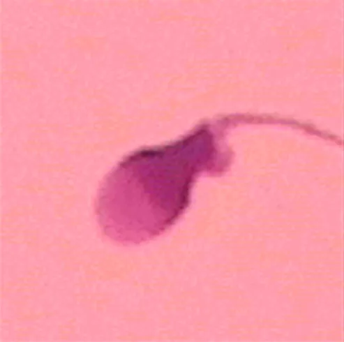
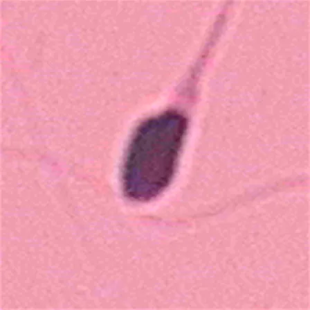

# HuSHeM

<div align="center">
    <a href="https://github.com/openmedlab/"></a>
</div>
<p style="text-align:center;font-size:10px;"><em> ITK-SNAP Visualization.</em></p>

## Dataset Information

The HuSHeM (Human Sperm Head Morphology) dataset consists of 216 microscopic images featuring human sperm head morphology, which is a crucial diagnostic criterion for male infertility. At the Isfahan Fertility and Infertility Center, researchers collected semen samples from 15 subjects. After fixing and staining the samples, 725 images were captured using an Olympus CX21 microscope with a ×100 objective lens and a ×10 ocular lens, and a Sony color camera (model SSC-DC58AP). Each image has a resolution of 576×720 pixels. Three experts cropped the sperm head regions from these images and classified them into five categories: Normal, Pyriform, Tapered, Amorphous, and Others. Only samples that all experts agreed on their classification were retained in the dataset. Eventually, the dataset includes four categories: Normal, Pyriform, Tapered, and Amorphous, with 54, 53, 57, and 52 images respectively, and each image resolution is 131×131. Due to significant intra-class variation and minimal inter-class differences, assessing sperm head morphology is a challenging task clinically. The current method of manual evaluation is time-consuming and subjective. Thus, the release of this dataset promotes research on relevant algorithms for efficient and accurate automatic classification assessments.

## Dataset Meta Information

| Dimensions | Modality | Task Type        | Anatomical Area | Number of Categories | Data Volume | File Format |
|------------|----------|-----------------|-----------------|----------------------|-------------|-------------|
| 2D         | Microscopy Images       | Classification  | Pelvic cavity   | 4                    | 216         | .bmp         |


### Resolution Details

| Dataset Statistics | size        |
|--------------------|-------------|
| min                | [131,131]  |
| median             | [131,131]  |
| max                | [131,131]  |

## Label Information Statistics

|              | Image Count |
|--------------|-------------|
| Normal       | 54          |
| Pyriform     | 53          |
| Tapered      | 57          |
| Amorphous    | 52          |


## Visualization

<div align="center">
    <a href="https://github.com/openmedlab/"></a>
</div>
<p style="text-align:center;font-size:10px;"><em>Normal Example.</em></p>

<div align="center">
    <a href="https://github.com/openmedlab/"></a>
</div>
<p style="text-align:center;font-size:10px;"><em>Pyriform Example.</em></p>

<div align="center">
    <a href="https://github.com/openmedlab/"></a>
</div>
<p style="text-align:center;font-size:10px;"><em>Tapered Example.</em></p>

<div align="center">
    <a href="https://github.com/openmedlab/"></a>
</div>
<p style="text-align:center;font-size:10px;"><em>Amorphous Example.</em></p>

## File Structure

The file structure of the data set is as follows, including folders that save images of 4 categories.

``` 
HuSHeM Dataset
├── 01_Normal
│   ├── image_001.BMP
│   ├── image_002.BMP
│   │    ...
├── 02_Tapered
│   ├── image_001.BMP
│   ├── image_002.BMP
│   ├── ...
├── 03_Pyriform
│   ├── image_001.BMP
│   ├── image_002.BMP
│   ├── ...
├── 04_Amorphous
│   ├── image_001.BMP
│   ├── image_002.BMP
│   ├── ...
```

## Authors and Institutions

Fariba Shaker (University of Isfahan, Iran)

S. Amirhassan Monadjemi (University of Isfahan, Iran)

Javad Alirezaie (Ryerson University, Canada)

Ahmad Reza Naghsh-Nilchi (University of Isfahan, Iran)


## Source Information

Official Website: https://data.mendeley.com/datasets/tt3yj2pf38/3

Download Link: https://opendatalab.com/OpenDataLab/HuSHeM/tree/main

Article Address: https://www.sciencedirect.com/science/article/pii/S0010482517303293?via%3Dihub

Publication Date: 2017-06-24

## Citation

``` 
 @article{shaker2017dictionary,
  title={A dictionary learning approach for human sperm heads classification},
  author={Shaker, Fariba and Monadjemi, S Amirhassan and Alirezaie, Javad and Naghsh-Nilchi, Ahmad Reza},
  journal={Computers in biology and medicine},
  volume={91},
  pages={181--190},
  year={2017},
  publisher={Elsevier}
 }
```

Original introduction article is [here](https://zhuanlan.zhihu.com/p/670972135).