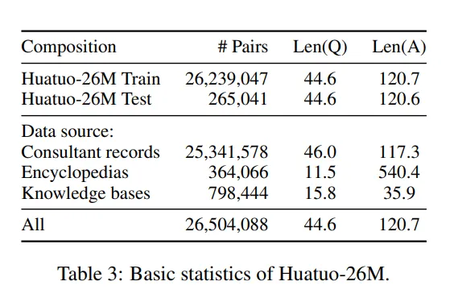
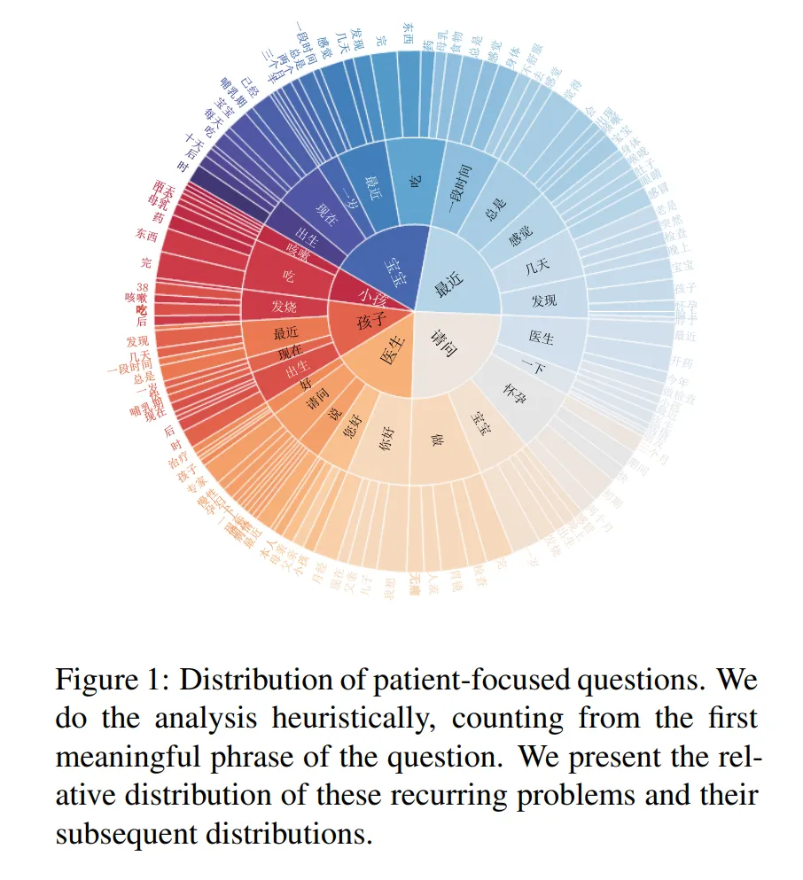

# Huatuo-26M

<div align="center">
    <a href="https://github.com/openmedlab/"></a>
</div>
<p style="text-align:center;font-size:10px;"><em></em></p>

## Dataset Information

Named after Huatuo, a great ancient Chinese physician, the Huatuo-26M dataset is currently the largest Chinese medical question and answer dataset, containing 26 million QA pairs. These pairs are meticulously compiled from multiple sources, including online medical consultation websites, medical encyclopedias, and medical knowledge bases, through text cleaning and data deduplication methods, covering a wide range of medical knowledge. The creation of this dataset has significantly expanded the scale of the medical field Q&A dataset and provided an unprecedented resource for research in natural language processing and artificial intelligence in the Chinese medical domain.

The launch of Huatuo-26M not only commemorates Huatuo's contributions but also provides robust support for the development of large medical models. By offering a vast number of authentic and diverse medical QA pairs, it aids in enhancing the performance of medical question-answering systems and strengthens the models' understanding and generative capabilities. Moreover, the dataset has proven its value in various applications, including zero-shot learning, retrieval-enhanced generation, and serving as pre-training corpora to improve the performance of pre-trained language models. Thus, Huatuo-26M provides a valuable resource for researchers and developers in building more efficient and accurate medical consultation and auxiliary diagnosis systems. It poses challenges to existing models while making significant contributions to AI development in medical research and healthcare.

## Dataset Meta Information

| Task Type | Language | Train                                               | Val | Test | File Format | Size |
|-----------|----------|-----------------------------------------------------|-----|------|---------|------|
| QA        | Chinese  | 26,239,047 | -   | 264,041  | .json   | 5.3GB |


## Dataset Information Statistics

<div align="center">
    <a href="https://github.com/openmedlab/"></a>
</div>
<p style="text-align:center;font-size:10px;"><em></em></p>

<div align="center">
    <a href="https://github.com/openmedlab/"></a>
</div>
<p style="text-align:center;font-size:10px;"><em></em></p>

## Dataset Example

[huatuo_encyclopedia_qa](https://huggingface.co/datasets/FreedomIntelligence/huatuo_encyclopedia_qa) example:

``` 
{
'question': [ [ "曲匹地尔片的用法用量" ] ],
'answer': [ "注意：同种药品可由于不同的包装规格有不同的用法或用量。本文只供参考。如果不确定，请参看药品随带的说明书或向医生询问。口服。一次50～100mg（1-2片），3次/日，或遵医嘱。" ]
}
```

[huatuo_knowledge_graph_qa](https://huggingface.co/datasets/FreedomIntelligence/huatuo_knowledge_graph_qa) example:

``` 
{
‘question’: [ "颜面部凹陷的手术治疗有些什么？" ],
‘answer’: [ "自体颗粒脂肪移植；自体脂肪移植；自体脂肪干细胞移植；自体脂肪颗粒移植" ]
}
```

[huatuo_consultation_qa](https://huggingface.co/datasets/FreedomIntelligence/huatuo_consultation_qa) example:

```
{
'question': [ "你好！请问睡觉睡到半夜总是口干舌干的、影响休息、是..." ],
'answer': [ "https://www.51zyzy.com/question/detail/10391424.html" ]
}
```

Huatuo-Lite example:

``` 
{
'id': 22,647,835,
'answer': '治疗鼻中隔偏曲的方法有手术和非手术治疗两种，手术治疗是通过手术矫正鼻中隔偏曲，非手术治疗则是通过药物治疗和物理治疗来缓解症状。手术治疗是治疗鼻中隔偏曲的最有效方法，手术后需要注意休息，避免剧烈运动和低头工作，同时也要注意饮食，少吃辛辣食物和不喝酒。手术后两周内鼻涕或痰中出现血水或血块是正常现象，若出现大量出血、发烧、剧烈疼痛时请尽速就医。',
'score': 5,
'label': '眼耳鼻喉科',
'question': '上个月感冒了，也没有用药，感冒好了以后就觉得鼻子经常不通畅，鼻子还经常晦气红皮、发痒、而且还会有头晕，一直都以为是上次感冒留下的后遗症，去医院检查，检查结果出来以后说是鼻中隔偏曲。请问如何治疗鼻中隔偏曲？',
'related_diseases': '鼻中隔偏曲'
}
```

## File Structure

The Huatuo-26M dataset primarily includes:

- Online medical encyclopedia: [huatuo_encyclopedia_qa](https://huggingface.co/datasets/FreedomIntelligence/huatuo_encyclopedia_qa)
- Medical knowledge graph: [huatuo_knowledge_graph_qa](https://huggingface.co/datasets/FreedomIntelligence/huatuo_knowledge_graph_qa)
- Public medical Q&A forums on the internet (with answers in the form of URLs): [huatuo_consultation_qa](https://huggingface.co/datasets/FreedomIntelligence/huatuo_consultation_qa)
- A simplified version: Huatuo-Lite

For each of these four parts, the file structure is as follows:

``` 
# huatuo_encyclopedia_qa
.
├── train_datasets.jsonl
├── validation_datasets.jsonl
└── test_datasets,jsonl

# huatuo_knowledge_graph_qa
.
├── train_datasets.jsonl
├── validation_datasets.jsonl
└── test_datasets,jsonl

# huatuo_consultation_qa
.
├── train_datasets.jsonl
├── validation_datasets.jsonl
└── test_datasets,jsonl

# Huatuo-Lite
. format_data.jsonl
```

## Authors and Institutions

Jianquan Li (The Chinese University of Hong Kong, Shenzhen)

Xidong Wang (The Chinese University of Hong Kong, Shenzhen)

Xiangbo Wu (The Chinese University of Hong Kong, Shenzhen)

Zhiyi Zhang (The Chinese University of Hong Kong, Shenzhen)

Xiaolong Xu (The Chinese University of Hong Kong, Shenzhen)

Jie Fu (Beijing Academy of Artificial Intelligence)

Xiang Wan (Shenzhen Institute of Big Data)

Benyou Wang (Shenzhen Institute of Big Data)

## Source Information

Official Website: https://github.com/FreedomIntelligence/Huatuo-26M

Download Link: https://github.com/FreedomIntelligence/Huatuo-26M

Article Address: https://arxiv.org/pdf/2305.01526v1.pdf

Publication Date: 2023.5

## Citation

``` 
@misc{li2023huatuo26m,
      title={Huatuo-26M, a Large-scale Chinese Medical QA Dataset}, 
      author={Jianquan Li and Xidong Wang and Xiangbo Wu and Zhiyi Zhang and Xiaolong Xu and Jie Fu and Prayag Tiwari and Xiang Wan and Benyou Wang},
      year={2023},
      eprint={2305.01526},
      archivePrefix={arXiv},
      primaryClass={cs.CL}
}
```

Original introduction article is [here](https://zhuanlan.zhihu.com/p/684831046).