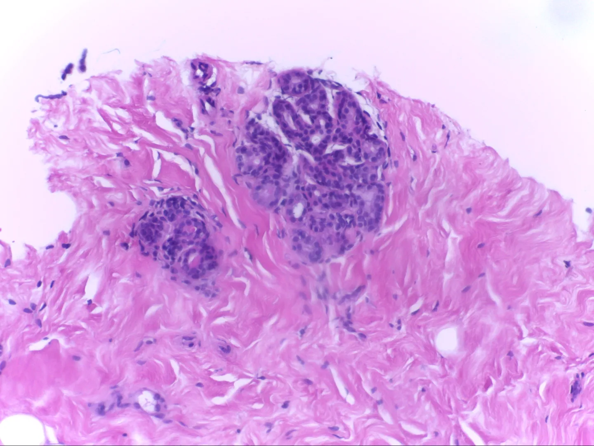
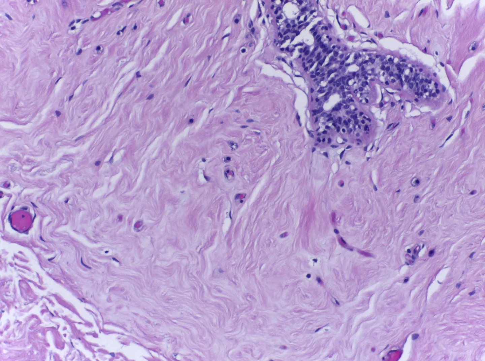
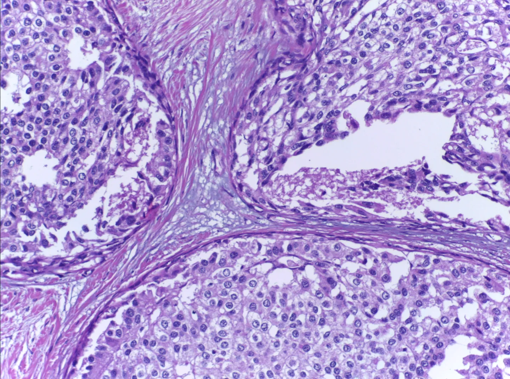
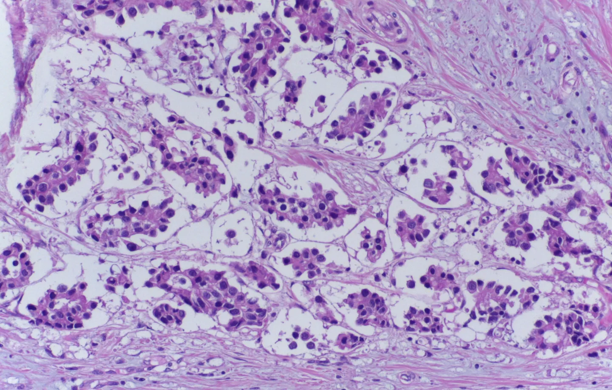

# ICIAR 2018 BACH Task1

<div align="center">
    <a href="https://github.com/openmedlab/"></a>
</div>
<p style="text-align:center;font-size:10px;"><em></em></p>

## Dataset Information

To advance the state of the art in automated classification, the BACH challenge, held at the 15th International Conference on Image Analysis and Recognition (ICIAR 2018), aimed to categorize and localize clinically relevant histopathology in microscopic examination and whole slide images from a large annotated dataset, which was specifically made public for this purpose. The challenge comprised two sub-tasks, with Sub-task 1 involving the classification of microscopic images, which were labeled as **normal**, **benign**, **in situ carcinoma**, or **invasive carcinoma** based on the predominant cancer type in each image. Annotations were made by two medical experts, and images with disagreements were discarded. Sub-task 2 involved the segmentation of microscopic images. This article primarily introduces the Task 1 data.

Breast cancer is one of the leading causes of cancer-related deaths worldwide, particularly among women. However, early diagnosis can significantly increase the chances of successful treatment. To achieve early diagnosis, correct analysis of histology images is indispensable. Specifically, during the diagnostic process, experts evaluate both the overall and local tissue through whole slide and microscopic images. Nevertheless, the abundance of data and the complexity of images make this task very time-consuming and crucial. Therefore, the development of automated detection and diagnostic tools is challenging but essential for the field.

## Dataset Meta Information

| Dimensions | Modality | Task Type       | Anatomical Structures | Anatomical Area | Number of Categories | Data Volume | File Format |
|------------|----------|-----------------|-----------------------|-----------------|----------------------|-------------|-------------|
| 2D         | Microscopy images       | Classification  | Cell                  | Chest           | 4                    | 400         | .tif        |


### Resolution Details

| Category | Size          | Pixel Scale     |
|----------|---------------|-----------------|
| Min      | [2048, 1536]  | 0.42 um x 0.42 um |
| Medium   | [2048, 1536]  | 0.42 um x 0.42 um |
| Max      | [2048, 1536]  | 0.42 um x 0.42 um |


## Label Information Statistics

| Category        | Number of Images | Percentage |
|-----------------|------------------|------------|
| Normal          | 100              | 25%        |
| Benign          | 100              | 25%        |
| In Situ Carcinoma | 100              | 25%        |
| Invasive Carcinoma | 100              | 25%        |


## Visualization

<div align="center">
    <a href="https://github.com/openmedlab/"></a>
</div>
<p style="text-align:center;font-size:10px;"><em> Normal example.</em></p>

<div align="center">
    <a href="https://github.com/openmedlab/"></a>
</div>
<p style="text-align:center;font-size:10px;"><em> Benign example.</em></p>

<div align="center">
    <a href="https://github.com/openmedlab/"></a>
</div>
<p style="text-align:center;font-size:10px;"><em> In Situ Carcinoma example.</em></p>

<div align="center">
    <a href="https://github.com/openmedlab/"></a>
</div>
<p style="text-align:center;font-size:10px;"><em> Invasive Carcinoma example.</em></p>

## File Structure

The file structure of the dataset is shown below. Under 'Photos', there are four categories, each category folder contains tif image files corresponding to different classification folders.

``` 
Photos
├── Benign
│   ├── b001.tif
│   ├── b002.tif
│   ├── ...
├── InSitu
│   ├── is001.tif
│   ├── is002.tif
│   ├── ...
├── Invasive
│   ├── iv001.tif
│   ├── iv002.tif
│   ├── ...
├── Normal
│   ├── n001.tif
│   ├── n002.tif
│   ├── ...
```

## Authors and Institutions

Guilherme Aresta (Institute of Systems and Computer Engineering, Science and Technology, Portugal; Faculty of Engineering, University of Porto, Portugal)

Teresa Araujo (Institute of Systems and Computer Engineering, Science and Technology, Portugal; Faculty of Engineering, University of Porto, Portugal)

Scotty Kwok (Seek AI Limited, Hong Kong, China)

Sai Saketh Chennamsetty (Bangalore, India)

Mohammed Safwan (Gurgaon, India)

Varghese Alex (Chennai, India)

Bahram Marami (Center for Computational and Systems Pathology, Mount Sinai Icahn School of Medicine and Mount Sinai Hospital, USA)


## Source Information

Official Website: https://iciar2018-challenge.grand-challenge.org/Dataset/

Download Link: https://iciar2018-challenge.grand-challenge.org/Download/

Article Address: https://arxiv.org/pdf/1808.04277.pdf

Publication Date: 2018-08-13

## Citation

``` 
@article{aresta2019bach,
  title={Bach: Grand challenge on breast cancer histology images},
  author={Aresta, Guilherme and Ara{\'u}jo, Teresa and Kwok, Scotty and Chennamsetty, Sai Saketh and Safwan, Mohammed and Alex, Varghese and Marami, Bahram and Prastawa, Marcel and Chan, Monica and Donovan, Michael and others},
  journal={Medical image analysis},
  volume={56},
  pages={122--139},
  year={2019},
  publisher={Elsevier}
}
```

Original introduction article is [here](https://zhuanlan.zhihu.com/p/683205621).