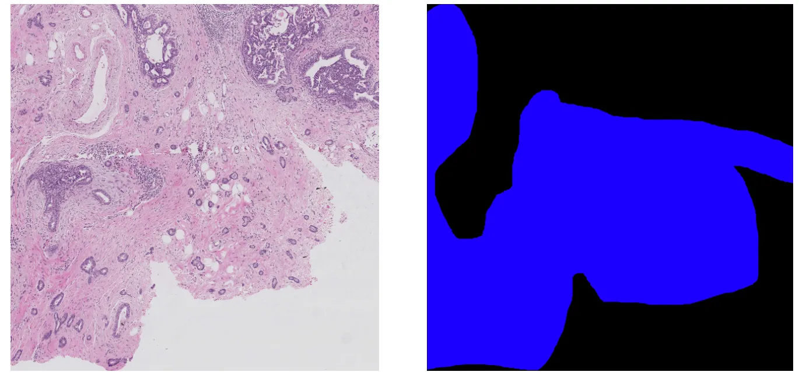
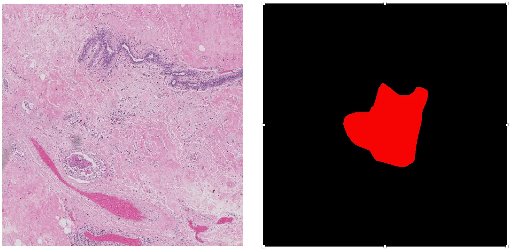
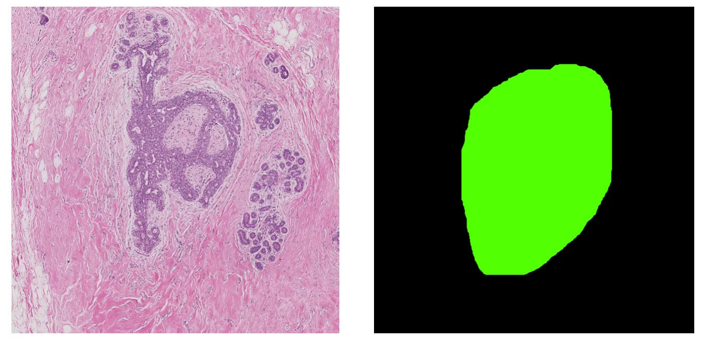

# ICIAR 2018 BACH Task2

<div align="center">
    <a href="https://github.com/openmedlab/"></a>
</div>
<p style="text-align:center;font-size:10px;"><em></em></p>

## Dataset Information

The BACH Challenge is aimed at the classification and localization of clinically relevant histopathology in microscope and whole slide images. The challenge includes two subtasks: Subtask 1 involves classifying microscope images according to the main cancer type present in each image, with images being labeled as normal, benign, in situ carcinoma, or invasive carcinoma. The annotation was carried out by two medical experts, and images with disagreements were discarded. Subtask 1 has been introduced in a previous article. Subtask 2 involves performing pixel-wise labeling within the same four categories for the entire microscope image. **For Task 2, officials provide 10 pixel-labeled and 20 unlabeled whole microscope images. This article mainly introduces Task 2 data.**

Breast cancer is one of the leading causes of cancer-related deaths worldwide, especially among women. However, early diagnosis can significantly improve the success rate of treatment. To achieve the purpose of early diagnosis, correct analysis of histology images is essential. Specifically, during the diagnostic process, experts assess the overall and local tissue through whole slide and microscope images. However, the abundance of data and the complexity of images make this task very time-consuming and important. Therefore, the development of automatic detection and diagnostic tools is challenging but essential for the field.

## Dataset Meta Information

| Dimensions | Modality | Task Type    | Anatomical Structures | Anatomical Area | Number of Categories | Data Volume | File Format |
|------------|----------|--------------|-----------------------|-----------------|----------------------|-------------|------------|
| 2D         | Microscopy images       | Segmentation | Cell                  | Chest           | 3                    | 30          | .svs, .xml        |


### Resolution Details

|                 | size            | pixel scale | Memory space                 |
|-----------------|-----------------|-------------|------------------------------|
| Minimum value of each dimension | [42113, 362625] | 0.467 μ/pixel | 8 GB (approx.) when in numpy array (python), 200-250 MB (approx.) in .svs |

The original image size is as above, but it is difficult to directly read the entire svs file into memory and then save it as png (due to memory constraints). Therefore, the method used by this library is to divide one very large svs image into multiple patches, with each patch generating its corresponding label through xml. The size of each patch is a hyperparameter, hence the size of each png produced in this dataset is a hyperparameter that can be manually set.

## Label Information Statistics

Since there are ten svs files, each being a very large whole-slide image containing every type of cell, the coverage for each is 100%.

| Category        | Number of Images |
|-----------------|------------------|
| Normal          | 100              | 
| Benign          | 100              |
| In Situ Carcinoma | 100              | 
| Invasive Carcinoma | 100              |

## Visualization

The visual content includes png images that are patches created from the svs files.

color = [0, 255, 0] Pure green for the Benign category
color = [0, 0, 255] Pure blue for the Invasive cancer category
color = [255, 0, 0] Pure red for the In situ cancer category

<div align="center">
    <a href="https://github.com/openmedlab/"></a>
</div>
<p style="text-align:center;font-size:10px;"><em> Benign Visualization.</em></p>

<div align="center">
    <a href="https://github.com/openmedlab/"></a>
</div>
<p style="text-align:center;font-size:10px;"><em> Invasive cancer Visualization.</em></p>

<div align="center">
    <a href="https://github.com/openmedlab/"></a>
</div>
<p style="text-align:center;font-size:10px;"><em> In situ cancer Visualization.</em></p>

## File Structure

The file structure of the dataset is as follows: svs and xml with the same name constitute a pair of supervised data.

``` 
WSI
├── A01.svs
├── A01.xml
├── A02.svs
├── A02.xml
├── A03.svs
├── A03.xml
├── ...
```

## Authors and Institutions

Guilherme Aresta (Institute for Systems and Computer Engineering, Science and Technology, Portugal; Faculty of Engineering, University of Porto, Portugal)

Teresa Araujo (Institute for Systems and Computer Engineering, Science and Technology, Portugal; Faculty of Engineering, University of Porto, Portugal)

Scotty Kwok (Seek AI Limited, Hong Kong, China)

Sai Saketh Chennamsetty (Bangalore, India)

Mohammed Safwan (Gurgaon, India)

Varghese Alex (Chennai, India)

Bahram Marami (Center for Computational and Systems Pathology, Mount Sinai School of Medicine and Mount Sinai Hospital, USA)


## Source Information

Official Website: https://iciar2018-challenge.grand-challenge.org/Dataset/

Download Link: https://iciar2018-challenge.grand-challenge.org/Download/

Article Address: https://arxiv.org/pdf/1808.04277.pdf

Publication Date: 2018-08-13

## Citation

``` 
@article{aresta2019bach,
  title={Bach: Grand challenge on breast cancer histology images},
  author={Aresta, Guilherme and Ara{\'u}jo, Teresa and Kwok, Scotty and Chennamsetty, Sai Saketh and Safwan, Mohammed and Alex, Varghese and Marami, Bahram and Prastawa, Marcel and Chan, Monica and Donovan, Michael and others},
  journal={Medical image analysis},
  volume={56},
  pages={122--139},
  year={2019},
  publisher={Elsevier}
}
```

Original introduction article is [here](https://zhuanlan.zhihu.com/p/683216353).