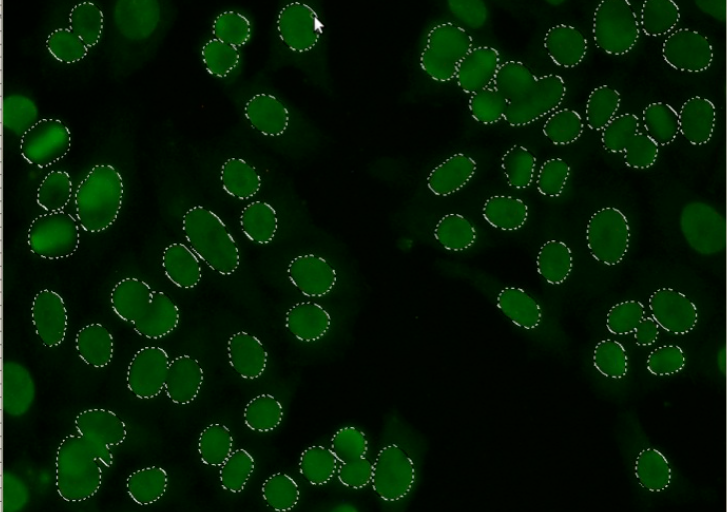
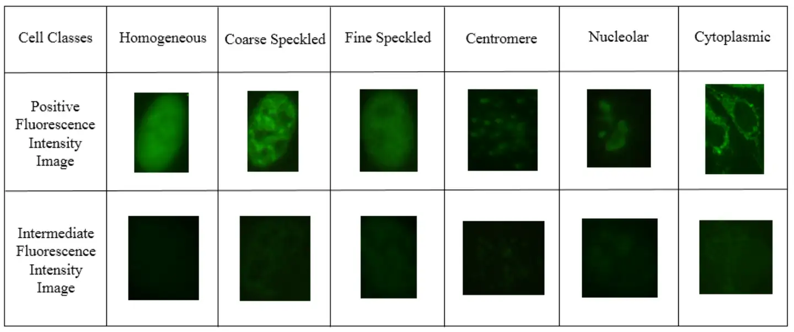
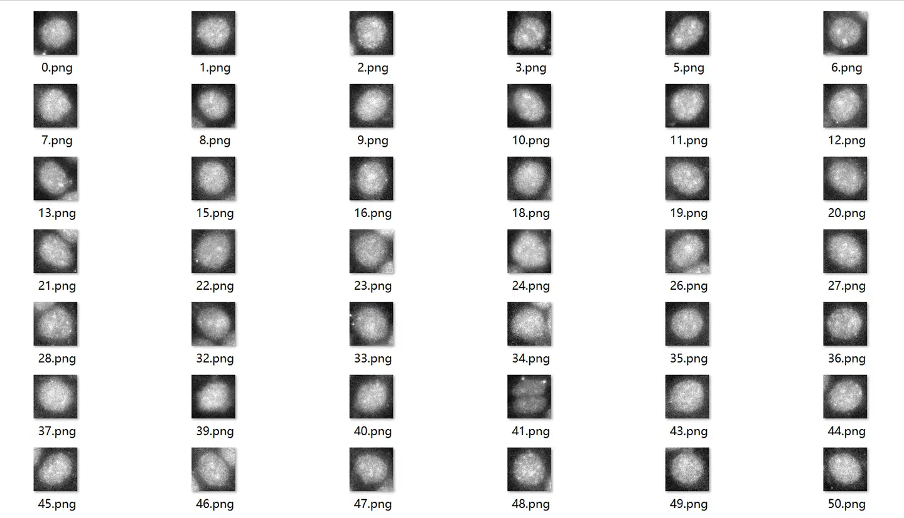

# ICPR-HEp-2

<div align="center">
    <a href="https://github.com/openmedlab/"></a>
</div>
<p style="text-align:center;font-size:10px;"><em></em></p>

## Dataset Information

Indirect immunofluorescence (IIF) is a technique that indirectly detects autologous antibodies to specific antigens in a patient's serum through the use of fluorescently labeled secondary antibodies. It is widely used in the diagnosis of autoimmune diseases such as systemic lupus erythematosus. HEp-2 cells, due to their expression of a variety of nuclear antigens, have become the ideal substrate for IIF experiments, although their origin is controversial; they are now considered to be human cervical adenocarcinoma cells related to the human papillomavirus. The dataset provided by the University of Salerno contains polymorphic HEp-2 cell fluorescence microscopy images, aimed at improving diagnostic accuracy through computer-aided diagnostic systems and reducing the workload on healthcare staff. This dataset has been used in the ICPR12 and ICPR14 competitions and provides cropped and labeled single-cell images to support research in biomedical image analysis.

Bioinformatics and cell segmentation have always been important aspects of biomedical research, with segmentation and classification of target cells under specific imaging methods being one of the most familiar tasks of computer-aided diagnosis (CAD) for traditional biomedical researchers. However, in practical applications, image classification using deep learning methods is often not the research challenge; the real difficulties lie in cleaning sufficient training data, designing appropriate preprocessing schemes, and selectively choosing networks for specific tasks. These challenges stem from the lack of uniform standards for cell images, and there is hope that in the era of foundational models, work can be done to better address these issues.

## Dataset Meta Information

| Dimensions | Modality | Task Type | Anatomical Structures | Anatomical Area | Number of Categories | Data Volume | File Format |
|------------|---------|-----------|-----------------------|-----------------|----------------------|-------------|-------------|
| 2D         | Pathology        | Classification | Cell                  | Cell            | 6                    | 14K	        | PNG         |


### Resolution Details

| Dataset Statistics | size     |
|--------------------|----------|
| min                | (78, 78) |
| median             | (78, 79) |
| max                | (78, 80) |

## Label Information Statistics

| Anatomical Structure | Occurrences     | Percentage  |
|----------------------|-----------------|-------------|
| Homogeneous          | 2495            | 18.35%      |
| Speckled             | 2831            | 20.82%      |
| Nucleolar            | 2598            | 19.11%      |
| Centromere         | 2741            | 20.16%      |
| NuMem               | 2208            | 16.24%      |
| Golgi              | 724             | 5.32%       |


## Visualization

The official visualization of the different types of cells is as follows:

<div align="center">
    <a href="https://github.com/openmedlab/"></a>
</div>
<p style="text-align:center;font-size:10px;"><em> ITK-SNAP Visualization.</em></p>

The specific data visualization is as follows, all of which are 78x78 resolution cell pictures.

<div align="center">
    <a href="https://github.com/openmedlab/"></a>
</div>
<p style="text-align:center;font-size:10px;"><em> ITK-SNAP Visualization.</em></p>

## File Structure

The data set file structure is as follows. The downloaded version is the processed version. It is divided into two folders, `train`/`test`, to store the corresponding png files respectively. The `csv` saves the label information.

``` 
├─ HEp-2
    └─ train
    └─ test
    └─ train.csv
    └─ test.csv
```

## Authors and Institutions

Gennaro Percannella (University of Salerno)

Pasquale Foggia (University of Salerno)

Paolo Soda (University "Campus Bio-Medico" of Roma)


## Source Information

Official Website: https://github.com/KaikaiZhao/HEp-2_cell_classification (expired)

Download Link: https://www.heywhale.com/mw/dataset/5ec3c6883241a100378d5d4a

Article Address: TBD

Publication Date: 2018-02

## Citation

``` 
TBD
```

Original introduction article is [here](https://zhuanlan.zhihu.com/p/688110459).
