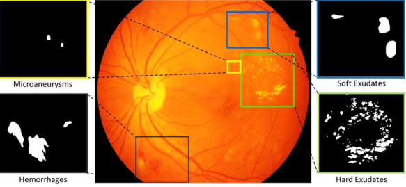
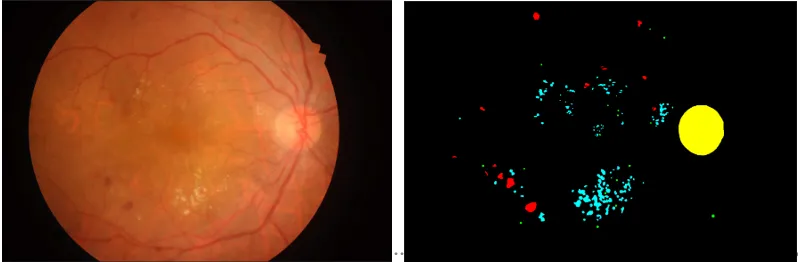

# IDRID

<div align="center">
    <a href="https://github.com/openmedlab/"></a>
</div>
<p style="text-align:center;font-size:10px;"><em></em></p>

## Dataset Information

The retinal images in the IDRiD dataset were captured by retinal specialists at an ophthalmology clinic in Nanded, Maharashtra, India. From thousands of examinations, we have extracted 516 images to form our dataset. The experts have confirmed that all images are of sufficient quality, have clinical relevance, no duplicate images, and there is a reasonable mix of disease stratification representing Diabetic Retinopathy (DR) and Diabetic Macular Edema (DME). The images were captured using a Kowa VX-10 alpha digital fundus camera with a 50-degree field of view (FOV), and all images are located near the macula. The images have a resolution of 2848×4288 pixels and are stored in jpg file format. Each image is approximately 800 KB in size. The dataset consists of 81 color fundus images with signs of DR, with precise pixel-level annotations for DR-related anomalies (such as Microaneurysms (MA), Soft Exudates (SE), Hard Exudates (EX), and Hemorrhages (HE)) provided as binary masks for the performance evaluation of individual lesion segmentation techniques. It includes color fundus images (.jpg files) and binary masks composed of lesions (.tif files).

Diabetic Retinopathy is a leading cause of vision impairment. Recent research has spurred the need for better methods of identifying, managing, and treating retinal diseases in clinical eye care. Given the importance and cost issues of Diabetic Retinopathy screening programs, the development of computer-aided diagnostic tools is particularly important. It can simplify large-scale screening and support the work of doctors. The latest AI technology offers opportunities for this. IDRiD is currently the only retinal image dataset representing the Indian population, containing typical diabetic retinopathy and normal structural annotations, and provides information on the severity of lesions, making it highly suitable for developing and evaluating early detection algorithms.

## Dataset Meta Information

| Dimensions | Modality | Task Type | Anatomical Structures | Anatomical Area | Number of Categories | Data Volume | File Format            |
|------------|----------|-----------|-----------------------|-----------------|----------------------|-------------|------------------------|
| 2D         | Retinal Image       | Segmentation | Lesion                | Eye             | 5                    | 81          | image：.jpg, mask: .tif |


### Resolution Details

| Dataset Statistics | size        |
|--------------------|-------------|
| min                | (2848, 4288)  |
| median             | (2848, 4288)  |
| max                | (2848, 4288)  |

## Label Information Statistics

| Category          | Lesion   |
|-------------------|----------|
| Number of Images  | 81       |
| Availability      | 100%     |
| Small Vessel Count| 162833 |
| Medium Vessel Count| 381509 |
| Large Vessel Count| 2285305 |

## Visualization

<div align="center">
    <a href="https://github.com/openmedlab/"></a>
</div>
<p style="text-align:center;font-size:10px;"><em> Local Visualization.</em></p>

## File Structure


This dataset is a hierarchical structure for ophthalmic images and corresponding mask data. It contains a root directory named `IDRiD`, which includes two subdirectories: `images` and `masks`. The `images` directory is used to store the ophthalmic image data, while the `masks` directory is used to store the corresponding mask data.

``` 
IDRID
│
├── images
│       ├─train
│            ├── IDRiD_01.jpg
│            ├── IDRiD_02.jpg
│            ├── ...
│            ├── IDRiD_54.jpg
│       ├─test
│            ├── IDRiD_55.jpg
│            ├── IDRiD_56.jpg
│            ├── ...
│            ├── IDRiD_81.jpg
│
├── masks
│       ├─train
│            ├── IDRiD_01.tif
│            ├── IDRiD_02.tif
│            ├── ...
│            ├── IDRiD_54.tif
│       ├─test
│            ├── IDRiD_55.tif
│            ├── IDRiD_56.tif
│            ├── ...
│            ├── IDRiD_81.tif
```

## Authors and Institutions

Prasanna Porwal, Shri Guru Gobind Singhji Institute of Engineering and Technology (India)

Samiksha Pachade, Shri Guru Gobind Singhji Institute of Engineering and Technology (India)

Ravi Kamble, Shri Guru Gobind Singhji Institute of Engineering and Technology (India)

Manesh Kokare, Shri Guru Gobind Singhji Institute of Engineering and Technology (India)

Girish Deshmukh, Eye Clinic, Sushrusha Hospital, Nanded, Maharashtra (India)

Vivek Sahasrabuddhe, Shankarrao Chavan Government Medical College (India)

Tom MacGillivray, University of Edinburgh (University of Edinburgh, Scotland)

Désiré Sidibé, University of Texas Health Science Center at Houston (USA)

Gwenolé Quellec, INSERM, UMR 1101, Brest, France (France)

Fabrice Meriaudeau, Universiti Teknologi Petronas (Malaysia)


## Source Information

Official Website: https://idrid.grand-challenge.org/Home/

Download Link: https://idrid.grand-challenge.org/Data_Download/

Article Address: https://www.mdpi.com/2306-5729/3/3/25

Publication Date: 2018-07

## Citation

``` 
@article{porwal2018indian,
  title={Indian diabetic retinopathy image dataset (IDRiD): a database for diabetic retinopathy screening research},
  author={Porwal, Prasanna and Pachade, Samiksha and Kamble, Ravi and Kokare, Manesh and Deshmukh, Girish and Sahasrabuddhe, Vivek and Meriaudeau, Fabrice},
  journal={Data},
  volume={3},
  number={3},
  pages={25},
  year={2018},
  publisher={MDPI}
}
```

Original introduction article is [here](https://zhuanlan.zhihu.com/p/671165240).