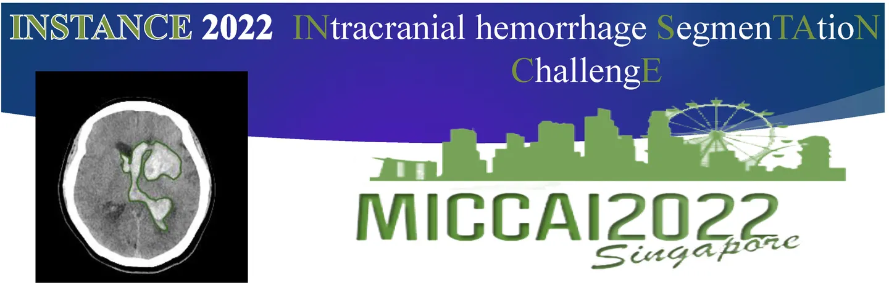
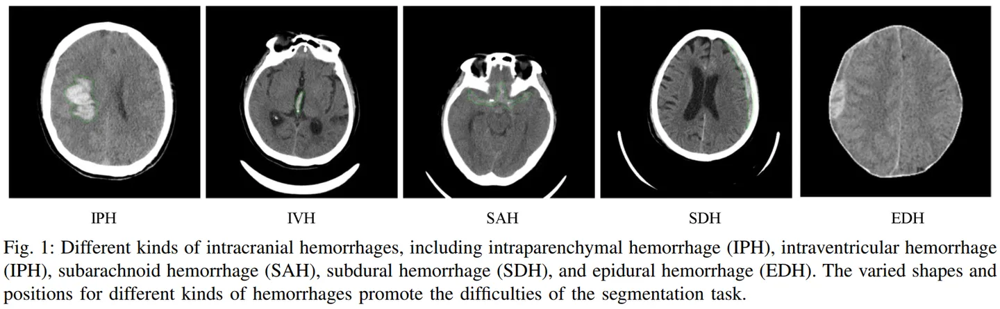
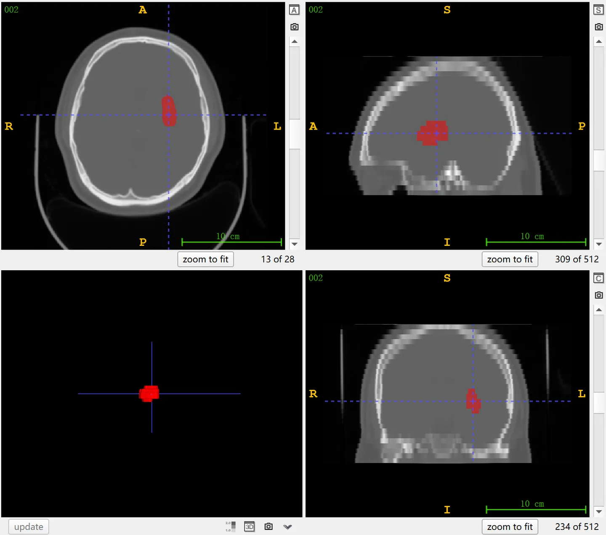

# INSTANCE 2022

<div align="center">
    <a href="https://github.com/openmedlab/"></a>
</div>
<p style="text-align:center;font-size:10px;"><em></em></p>

## Dataset Information

**INSTANCE 2022** (**IN**tracranial Hemorrhage **S**egmen**TA**tion **C**halleng**E**) is a brain CT dataset for the segmentation of intracranial hemorrhage (ICH) and is a challenge at MICCAI 2022. Intracranial hemorrhage (ICH) is a severe brain condition and a major cause of stroke. Non-contrast head computed tomography (NCCT) is the primary imaging method for diagnosing ICH, and estimation of hematoma volume is crucial for the prognosis and treatment decisions for ICH patients. The dataset includes a training set of 100 cases with ground truth labels and a validation set of 30 cases without ground truth labels for participants to use, which can be validated online via the official website submission. Additionally, a test set of 70 cases is used for the final evaluation and ranking.

## Dataset Meta Information

| Dimensions | Modality | Task Type | Anatomical Structures | Anatomical Area | Number of Categories | Data Volume                                       | File Format |
|------------|----------|-----------|-----------------------|-----------------|----------------------|---------------------------------------------------|-------------|
| 3D         | CT       | Segmentation | Cerebral hemorrhage   | Head            | 1                    | 100 for training, 30 for validation, 70 for test. | .nii.gz     |

Number of 2D slices: 2,993 (based on the calculation of 100 training cases).

### Resolution Details

| Dataset Statistics | spacing (mm)    | size            |
|--------------------|-----------------|-----------------|
| min                | (0.37, 0.37, 4.4)              | (430, 512, 24)     |
| median             | (0.45, 0.45, 5.0)          | (512, 512, 29) |
| max                | (0.60, 0.60, 10.0)             | (512, 560, 40) |

## Label Information Statistics

| Segmentation Class | ICH (Intracranial Hemorrhage) |
|--------------------|-------------------------------|
| Case Count         | 100                           |
| Detection Rate     | 100%                          |
| Min Volume (cm³)   | 0.2                           |
| Median Volume (cm³)| 11.46                         |
| Max Volume (cm³)   | 155.11                        |

## Visualization

<div align="center">
    <a href="https://github.com/openmedlab/"></a>
</div>
<p style="text-align:center;font-size:10px;"><em> Official paper visualizations for five different types of ICH.</em></p>

<div align="center">
    <a href="https://github.com/openmedlab/"></a>
</div>
<p style="text-align:center;font-size:10px;"><em> ITK-SNAP Visualization.</em></p>

## File Structure

The official file structure of the INSTANCE 2022 dataset includes two main folders: `train` and `evaluation`. The `train/data/` and `train/label/` folders respectively contain the training data with ground truth labels and corresponding labels, ranging from 001.nii.gz to 100.nii.gz. The `evaluation/` folder contains the validation data without ground truth labels, ranging from 101.nii.gz to 130.nii.gz.

``` 
INSTANCE 2022
│
├── train
│   ├── data
│   │   ├── 001.nii.gz
│   │   ├── 002.nii.gz
│   │   └── ...
│   │
│   ├── label
│       ├── 001.nii.gz
│       ├── 002.nii.gz
│       └── ...
│
├── evaluation
    ├── 101.nii.gz
    ├── 102.nii.gz
    └── ...
```

## Authors and Institutions

Xiangyu Li (School of Computer Science and Technology, Harbin Institute of Technology)

Gongning Luo (School of Computer Science and Technology, Harbin Institute of Technology)

Kuanquan Wang (Director of the Perception Computing Research Center, School of Computer Science and Technology, Harbin Institute of Technology)

Jinbo Liu (Peking University Shougang Hospital)

Hongyu Wang (Peking University Shougang Hospital)

Mingwang Xu (School of Computer Science and Technology, Harbin Institute of Technology)

Xinjie Liang (School of Computer Science and Technology, Harbin Institute of Technology)

Zhenghao Song (School of Computer Science and Technology, Harbin Institute of Technology)

Haokai Chi (School of Computer Science and Technology, Harbin Institute of Technology)

Chunyue Zheng (School of Computer Science and Technology, Harbin Institute of Technology)

Xinghua Ma (School of Computer Science and Technology, Harbin Institute of Technology)

Jinwen Guo (School of Computer Science and Technology, Harbin Institute of Technology)


## Source Information

Official Website: https://instance.grand-challenge.org/

Download Link: https://instance.grand-challenge.org/Dataset/

Article Address: https://arxiv.org/abs/2301.03281, https://ieeexplore.ieee.org/document/9511297

Publication Date: April, 2022.

## Citation

``` 
@misc{li2023stateoftheart,
      title={The state-of-the-art 3D anisotropic intracranial hemorrhage segmentation on non-contrast head CT: The INSTANCE challenge}, 
      author={Xiangyu Li and Gongning Luo and Kuanquan Wang and Hongyu Wang and Jun Liu and Xinjie Liang and Jie Jiang and Zhenghao Song and Chunyue Zheng and Haokai Chi and Mingwang Xu and Yingte He and Xinghua Ma and Jingwen Guo and Yifan Liu and Chuanpu Li and Zeli Chen and Md Mahfuzur Rahman Siddiquee and Andriy Myronenko and Antoine P. Sanner and Anirban Mukhopadhyay and Ahmed E. Othman and Xingyu Zhao and Weiping Liu and Jinhuang Zhang and Xiangyuan Ma and Qinghui Liu and Bradley J. MacIntosh and Wei Liang and Moona Mazher and Abdul Qayyum and Valeriia Abramova and Xavier Lladó and Shuo Li},
      year={2023},
      eprint={2301.03281},
      archivePrefix={arXiv},
      primaryClass={eess.IV}
}
 
@ARTICLE{9511297,
  author={Li, Xiangyu and Luo, Gongning and Wang, Wei and Wang, Kuanquan and Gao, Yue and Li, Shuo},
  journal={IEEE Journal of Biomedical and Health Informatics}, 
  title={Hematoma Expansion Context Guided Intracranial Hemorrhage Segmentation and Uncertainty Estimation}, 
  year={2022},
  volume={26},
  number={3},
  pages={1140-1151},
  doi={10.1109/JBHI.2021.3103850}}
```

Original introduction article is [here](https://zhuanlan.zhihu.com/p/658740176).