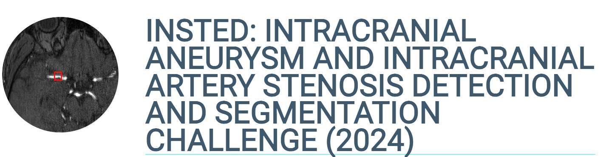
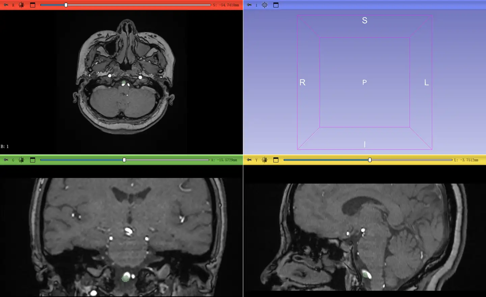
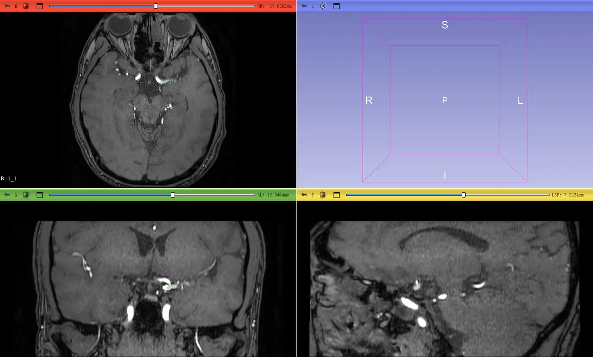

# INSTED

<div align="center">
    <a href="https://github.com/openmedlab/"></a>
</div>
<p style="text-align:center;font-size:10px;"><em></em></p>

## Dataset Information

Stroke, including ischemic and hemorrhagic types, is a prevalent and life-threatening cerebrovascular disease, with intracranial aneurysms and arterial stenosis being primary causes. Magnetic Resonance Angiography (MRA) is widely used to visualize the cerebral arterial tree, especially for screening intracranial atherosclerosis and aneurysms. Accurate lesion detection and segmentation are crucial for quantitative analyses, such as assessing the degree of intraluminal stenosis and the size of aneurysms, but manual operations are highly challenging due to the complexity of the cerebral arterial network and individual differences.

Time-of-Flight (TOF) MRA, known for its non-invasiveness and lack of ionizing radiation, is extensively used in the clinical screening of cerebrovascular diseases. However, publicly available large-scale TOF-MRA datasets are scarce, limiting the development of automated detection and segmentation algorithms. The challenge in this competition is to detect and segment lesions from 3D TOF-MRA images, helping to identify and quantify intracranial arterial stenosis and aneurysms, which is significant for clinical practice.

## Dataset Meta Information

| Dimensions | Modality | Task Type    | Anatomical Structures | Anatomical Area | Number of Categories | Data Volume | File Format |
|------------|----------|--------------|-----------------------|-----------------|----------------------|-------------|-------------|
| 3D         | MR       | Segmentation | Brain                 | Head and Neck   | 3                    | 191         | .nii.gz     |


### Resolution Details

| Dataset Statistics | size            |
|--------------------|-----------------|
| min                | (147, 143, 5)   |
| median             | (442, 455, 137) |
| max                | (248, 273, 61)  |

## Label Information Statistics

| Condition                    | Number of Cases | Percentage | Minimum Volume (cm³) | Median Volume (cm³) | Maximum Volume (cm³) |
|------------------------------|-----------------|------------|----------------------|---------------------|----------------------|
| Intracranial Aneurysms       | 82              | 42.9%      | (147, 143, 5)        | (393, 455, 137)     | (246, 276, 61)       |
| Intracranial Artery Stenosis | 71              | 37.2%      | (164, 149, 17)       | (442, 360, 92)      | (307, 229, 66)       |
| Healthy                      | 38              | 19.9%      | Unavailable          | Unavailable         | Unavailable          |


## Visualization

<div align="center">
    <a href="https://github.com/openmedlab/"></a>
</div>
<p style="text-align:center;font-size:10px;"><em>The green part is the segmentation of intracranial aneurysm.</em></p>

<div align="center">
    <a href="https://github.com/openmedlab/"></a>
</div>
<p style="text-align:center;font-size:10px;"><em>The green part is the segmentation of intracranial artery stenosis.</em></p>

## File Structure

```
healthy_training  // 38 cases in total
├── 1.nii.gz
├── ...
IA_training  // 82 cases in total
├── 1.nii.gz
├── ...
IA_training_seg
├── 1seg.nii.gz  // segmentation mask of 1.nii.gz of IA
├── ...
stenosis_training  // 71 cases in total
├── 1.nii.gz
├── ...
stenosis_training_seg
├── 1seg.nii.gz  // segmentation mask of 1.nii.gz of stenosis
├── ...
bbox_IA_train.pkl 
bbox_stenosis_train.pkl
```

## Authors and Institutions

Huijun Chen (Tsinghua University)  

Xihai Zhao (Tsinghua University)  

Rui Li (Tsinghua University)  

Haokun Li (Tsinghua University)  

Haozhong Sun (Tsinghua University)  

Ziming Xu (Tsinghua University)  

Haining Wei (Tsinghua University)  

Yan Li (Tsinghua University)  

Jiaqi Dou (Tsinghua University)  

Xueyan Li (Tsinghua University)  

Xiaoming Liu (Union Hospital, Tongji Medical College, Huazhong University of Science and Technology)

## Source Information

Official Website: https://www.codabench.org/competitions/2139/#/pages-tab

Download Link: https://www.codabench.org/competitions/2139/#/pages-tab

Article Address: TBD

Publication Date: 2024-01

## Citation

``` 
TBD
```

Original introduction article is [here](https://zhuanlan.zhihu.com/p/715295602).