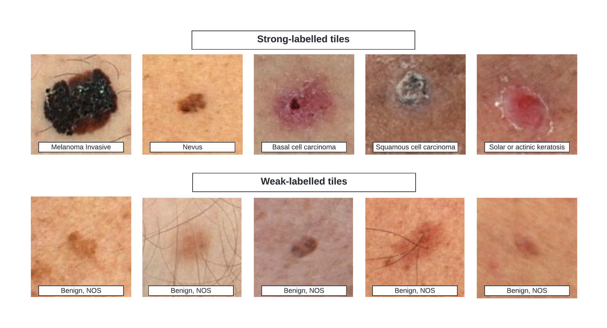

# ISIC-2024

<div align="center">
    <a href="https://github.com/openmedlab/"></a>
</div>
<p style="text-align:center;font-size:10px;"><em></em></p>

## Dataset Information

**ISIC 2024** is a large-scale dermoscopic image classification dataset released by the International Skin Imaging Collaboration (ISIC) and is also part of a workshop for MICCAI 2024. Compared to ISIC 2020, this dataset includes a greater number of images and provides more detailed annotations. The data were collected from nine institutions worldwide and include images from 5,349 patients.

The **ISIC 2024 dataset** serves as a valuable resource for developing automated skin lesion diagnosis systems and plays a crucial role in the early detection of skin cancer. With its diverse sources covering multiple institutions and a large number of patients globally, the dataset better represents the characteristics of skin lesions across different ethnicities and regions. This diversity helps improve the generalizability and accuracy of AI models. Beyond supporting medical diagnosis, the dataset may also facilitate the development of personal skin health assessment tools, thereby promoting the early detection and timely treatment of skin cancer, ultimately improving patient outcomes.

## Dataset Meta Information

| Dimensions | Modality     | Task Type      | Anatomical Area | Number of Categories    | Data Volume | File Format |
|------------|--------------|----------------|-----------------|-------------------------|-------------|-------------|
| 2D         | dermoscopic  | Classification | Skin            | 6 or 33                 | 81722        | JPG         |


### Resolution Details

| Dataset Statistics | size          |
|--------------------|---------------|
| min                | (85, 85)      |
| median             | (2268, 1984)  |
| max                | (7360, 4912)  |

## Label Information Statistics

### Weak Label

Weak label refers to only labeling benign/malignant.

| Label                          | Malignant (恶性) | Benign (良性) | Indeterminate (无法确定) | Indeterminate/Benign (无法确定/良性) | Indeterminate/Malignant (无法确定/恶性) | Unlabeled (未标注) |
|--------------------------------|------------------|---------------|---------------------------|--------------------------------------|---------------------------------------|-------------------|
| Occurrences                    | 9,239           | 64,047        | 150                       | 67                                   | 85                                   | 8,134             |
| Percentage                     | 11.31%          | 78.37%        | 0.18%                     | 0.08%                                | 0.10%                                | 9.95%             |


### Strong Label

Strong label refers to the detailed disease type.

| Label                                           | Occurrences | Percentage |
|------------------------------------------------|-------------|------------|
| nevus (痣)                                     | 32,697      | 39.98%     |
| Unlabeled (未标注)                             | 27,896      | 34.11%     |
| melanoma (黑色素瘤)                            | 7,349       | 8.98%      |
| basal cell carcinoma (基底细胞癌)              | 4,921       | 6.02%      |
| seborrheic keratosis (脂溢性角化病)            | 1,926       | 2.36%      |
| squamous cell carcinoma (鳞状细胞癌)           | 1,372       | 1.68%      |
| actinic keratosis (日光性角化病)               | 1,367       | 1.67%      |
| pigmented benign keratosis (色素性良性角化病)  | 1,339       | 1.64%      |
| solar lentigo (日光性雀斑)                     | 562         | 0.69%      |
| dermatofibroma (皮肤纤维瘤)                   | 420         | 0.51%      |
| vascular lesion (血管病变)                    | 348         | 0.43%      |
| lichenoid keratosis (苔藓样角化病)            | 312         | 0.38%      |
| acrochordon (皮赘)                             | 301         | 0.37%      |
| lentigo NOS (未特指的雀斑)                    | 241         | 0.29%      |
| atypical melanocytic proliferation (非典型黑素细胞增生) | 143         | 0.17%      |
| AIMP (非典型不确定黑素细胞增生)              | 121         | 0.15%      |
| verruca (疣)                                   | 119         | 0.15%      |
| angioma (血管瘤)                               | 71          | 0.09%      |
| lentigo simplex (单纯性雀斑)                  | 43          | 0.05%      |
| melanoma metastasis (黑色素瘤转移)            | 39          | 0.05%      |
| other (其他)                                   | 33          | 0.04%      |
| scar (瘢痕)                                    | 31          | 0.04%      |
| neurofibroma (神经纤维瘤)                     | 26          | 0.03%      |
| angiokeratoma (血管角化瘤)                    | 13          | 0.02%      |
| sebaceous hyperplasia (皮脂腺增生)            | 7           | 0.01%      |
| clear cell acanthoma (透明细胞棘皮瘤)         | 6           | 0.01%      |
| atypical spitz tumor (非典型Spitz瘤)          | 5           | 0.01%      |
| atypical fibroma or fibrous papule (血管纤维瘤或纤维性丘疹) | 4           | 0.00%      |
| pyogenic granuloma (化脓性肉芽肿)             | 3           | 0.00%      |
| cafe-au-lait macule (咖啡斑)                  | 2           | 0.00%      |
| sebaceous adenoma (皮脂腺腺瘤)                | 2           | 0.00%      |
| mucosal melanosis (粘膜黑斑)                  | 2           | 0.00%      |
| nevus spilus (斑痣)                            | 1           | 0.00%      |


## Visualization

<div align="center">
    <a href="https://github.com/openmedlab/"></a>
</div>
<p style="text-align:center;font-size:10px;"><em>The first row is the strong label, and the second row is the week label.</em></p>

## File Structure

The ISIC2024 dataset contains a `train` directory for storing training images, and a `metadata.csv` file that lists the patient information and diagnosis results corresponding to each image.

``` 
ISIC2024
│
├── images
│   ├── ISIC_7559201.jpg
│   └── ...
└── licenses
│   └── attribution.txt
│   └── image.hdf5
│   └── image_256sq.hdf5
│   └──metadata.csv
```

## Authors and Institutions

The datasets come from 9 different institutions:

- Memorial Sloan Kettering Cancer Center, New York, USA 

- Dermatology Service, Melanoma Unit, Hospital Clínic de Barcelona, IDIBAPS, Universitat de Barcelona, Barcelona, Spain, ITOBOS 

- The University of Queensland, Brisbane, Australia 

- FNQH Cairns, Westcourt, Australia

- Melanoma Institute Australia, Sydney, Australia 

- Department of Dermatology at the University Hospital of Basel, Basel, Switzerland 

- Department of Dermatology, Medical University of Vienna, Vienna, Austria 

- Department of Dermatology, University of Athens Medical School, Athens, Greece 

- Monash University at the Alfred Hospital, Melbourne, Australia

## Source Information

Official Website: https://www.kaggle.com/competitions/isic-2024-challenge

Download Link: https://www.kaggle.com/datasets/tomooinubushi/all-isic-data-20240629/data

Article Address: TBD

Publication Date: 2024-06

## Citation

``` 
@misc{isic-2024-challenge,
    author = {Nicholas Kurtansky, Veronica Rotemberg, Maura Gillis, Kivanc Kose, Walter Reade, Ashley Chow},
    title = {ISIC 2024 - Skin Cancer Detection with 3D-TBP},
    publisher = {Kaggle},
    year = {2024},
    url = {https://kaggle.com/competitions/isic-2024-challenge}
}
```

Original introduction article is [here](https://zhuanlan.zhihu.com/p/740355817).