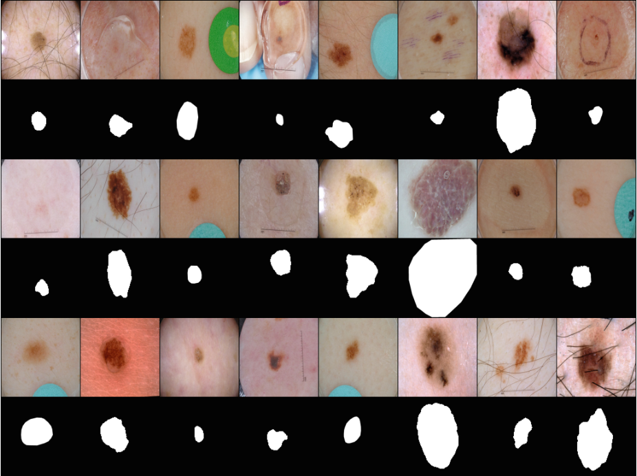

# ISIC 2017

<div align="center">
    <a href="https://github.com/openmedlab/"></a>
</div>
<p style="text-align:center;font-size:10px;"><em></em></p>

## Dataset Information

The ISIC 2017 dataset, released by the International Skin Imaging Collaboration (ISIC), is a large-scale dermoscopy image dataset. It comprises 2000 training images, 150 validation images, and 600 test images, each accompanied by corresponding ground truth data. The aim of this dataset is to assist participants in developing image analysis tools capable of diagnosing melanoma automatically from dermoscopy images.

## Dataset Meta Information

| Dimensions | Modality   | Task Type | Anatomical Structures | Anatomical Area | Number of Categories | Data Volume                                      | File Format |
|------------|------------|-----------|-----------------------|-----------------|----------------------|--------------------------------------------------|-------------|
| 2D         | dermoscopic | Segmentation | Skin                  | Melanoma        | 1                    | 2000 for train, 150 for validation, 600 for test | PNG, JPG    |


### Resolution Details

| Dataset Statistics | size         |
|--------------------|--------------|
| min                | (540, 576)   |
| median             | (2000, 3008)   |
| max                | (4499, 6748)   |

## Label Information Statistics

| Category          | Retinal Vessel |
|-------------------|----------------|
| Number of Images  | 2000           |
| Availability      | 100%           |
| Small Vessel Count| 9,132           |
| Medium Vessel Count| 341,472          |
| Large Vessel Count| 22,013,098         |

## Visualization

<div align="center">
    <a href="https://github.com/openmedlab/"></a>
</div>
<p style="text-align:center;font-size:10px;"><em> ITK-SNAP Visualization.</em></p>

## File Structure

``` 
ISIC2017 Dataset
|
|-- Images Folder
|   |-- image1.jpg
|   |-- image2.jpg
|   |-- ...
|
|-- Masks Folder
|   |-- mask1_segmentation.png
|   |-- mask2_segmentation.png
|   |-- ...
|
```

## Authors and Institutions

Noel C. F. Codella (IBM T. J. Watson Research Center, Yorktown Heights, NY, USA)

David Gutman (Emory University, Atlanta, GA, USA)

M. Emre Celebi (University of Central Arkansas, Conway, AR, USA)


## Source Information

Official Website: https://challenge.isic-archive.com/data/#2017

Download Link: https://challenge.isic-archive.com/data/#2017

Article Address: https://ieeexplore.ieee.org/document/8363547

Publication Date: 2017

## Citation

``` 
@INPROCEEDINGS{8363547,
  author={Codella, Noel C. F. and Gutman, David and Celebi, M. Emre and Helba, Brian and Marchetti, Michael A. and Dusza, Stephen W. and Kalloo, Aadi and Liopyris, Konstantinos and Mishra, Nabin and Kittler, Harald and Halpern, Allan},
  booktitle={2018 IEEE 15th International Symposium on Biomedical Imaging (ISBI 2018)}, 
  title={Skin lesion analysis toward melanoma detection: A challenge at the 2017 International symposium on biomedical imaging (ISBI), hosted by the international skin imaging collaboration (ISIC)}, 
  year={2018},
  volume={},
  number={},
  pages={168-172},
  doi={10.1109/ISBI.2018.8363547}}
```

Original introduction article is [here](https://zhuanlan.zhihu.com/p/655175280).