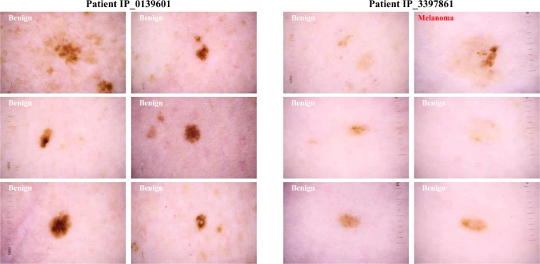
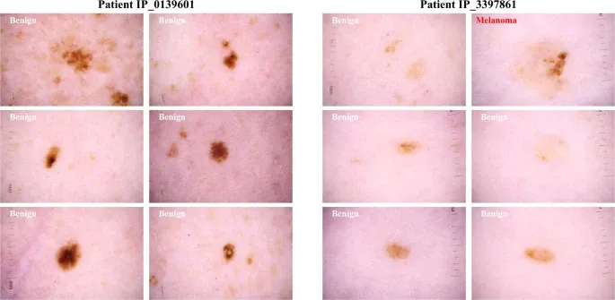

# ISIC 2020

<div align="center">
    <a href="https://github.com/openmedlab/"></a>
</div>
<p style="text-align:center;font-size:10px;"><em></em></p>

## Dataset Information

The ISIC 2020 dataset, provided by the International Skin Imaging Collaboration (ISIC), is a large-scale dermoscopy image classification dataset. It consists of 33,126 images of benign and malignant skin lesions from 2,056 patients. The images have been sourced from 6 medical institutions across the globe. Unlike previous datasets, ISIC 2020 emphasizes the importance of patient-level information, which is particularly crucial in clinical practice. Each image comes with a unique patient identifier, aiding in more accurate melanoma diagnosis and reducing false positives. All malignant diagnoses have been confirmed through histopathology, while benign diagnoses have also been reliably verified.

## Dataset Meta Information

| Dimensions | Modality   | Task Type      | Anatomical Structures | Anatomical Area | Number of Categories | Data Volume                                      | File Format |
|------------|------------|----------------|-----------------------|-----------------|----------------------|--------------------------------------------------|-------------|
| 2D         | dermoscopic | Classification | Skin                  | Melanoma        | 2                    | 33,126 | DICOM, JPG  |


### Resolution Details

| Dataset Statistics | size         |
|--------------------|--------------|
| min                | (640, 480)   |
| median             | (5184, 3456)  |
| max                | (6000, 6000)  |

## Label Information Statistics

| Category    | Malignant (malignant) | Benign (benign) |
|-------------|-----------------------|-----------------|
| Image Count | 584                   | 32542           |
| Percentage  | 1.8%                  | 98.2%           |

## Visualization

<div align="center">
    <a href="https://github.com/openmedlab/"></a>
</div>
<p style="text-align:center;font-size:10px;"><em> Paper Visualization.</em></p>

## File Structure


The ISIC2020 dataset includes a `train` directory for storing training images, and an `ISIC_2020_Training_GroundTruth.csv` file, which lists patient information and diagnosis results corresponding to each image.

``` 
ISIC2020
│
├── train
│   ├── ISIC_0015719.jpg
│   └── ...
└── ISIC_2020_Training_GroundTruth.csv
```

## Authors and Institutions

Peter Soyer (The University of Queensland, Dermatology Research Centre, Australia)

Allan Halpern (Memorial Sloan Kettering Cancer Center, USA)

Pascale Guitera (Melanoma Institute Australia, Australia)


## Source Information

Official Website: https://challenge2020.isic-archive.com/

Download Link: https://challenge2020.isic-archive.com/

Article Address: https://www.nature.com/articles/s41597-021-00815-z

Publication Date: 2020

## Citation

``` 
@article{rotemberg2021patient,
  title={A patient-centric dataset of images and metadata for identifying melanomas using clinical context},
  author={Rotemberg, Veronica and Kurtansky, Nicholas and Betz-Stablein, Brigid and Caffery, Liam and Chousakos, Emmanouil and Codella, Noel and Combalia, Marc and Dusza, Stephen and Guitera, Pascale and Gutman, David and others},
  journal={Scientific data},
  volume={8},
  number={1},
  pages={34},
  year={2021},
  publisher={Nature Publishing Group UK London}
}
```

Original introduction article is [here](https://zhuanlan.zhihu.com/p/657188878).